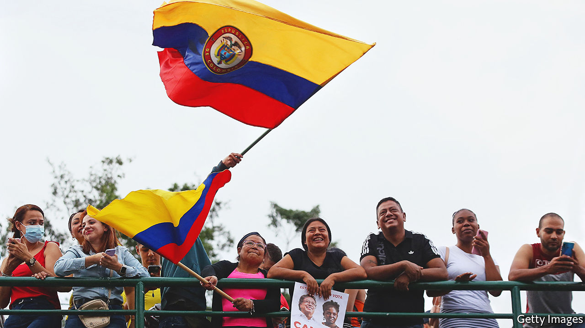
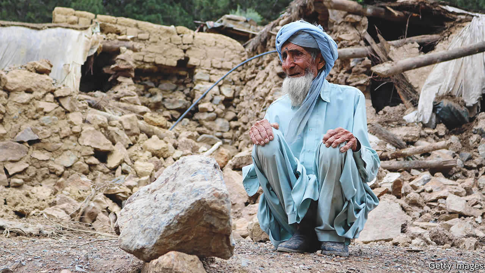

###### The world this week

# Politics 

#####  

 

> Jun 23rd 2022 

Gustavo Petro, a former leftist guerrilla, won  election. Mr Petro, an ex-mayor of Bogotá, will become the country’s first left-wing president in August. He won 50.4% of the vote to 47.3% for Rodolfo Hernández, a populist property tycoon. Investors are nervous; Mr Petro has sought to reassure them by suggesting he would appoint a centrist finance minister. But he still plans to ban oil exploration, open-pit mining and fracking, and give all persistently unemployed people a government job. Colombia’s currency and stockmarket wobbled after the result was announced. 

No majority for Macron

 suffered a serious political reverse when his electoral grouping, Ensemble, lost its majority in  parliamentary election. Only recently re-elected as president, Mr Macron faces the prospect of a second term in which he will find it hard to advance his legislative agenda. Some analysts think he may have to call a fresh election. His prime minister, Elisabeth Borne, offered her resignation, but Mr Macron has so far not accepted it. 

 ruling party, , also suffered an election reverse when they lost control of the assembly in Andalucía, Spain’s most populous region, and normally a Socialist stronghold. 

 awaited the result of an eu summit that will confirm that it be formally recognised as a candidate for membership of the club (membership is still years away). Moldova got the same recommendation, but Georgia was told it had more work to do. 

 threatened  with “seriously negative” consequences for blocking rail shipments of goods subject to sanctions from Russia to the Russian exclave of Kaliningrad. Lithuania says it is enforcing eu rules.

The  government said it would need to burn more coal. This reversal of previous green policies was part of a package of measures to avert an energy crisis caused by a reduction in gas flows from Russia. Households’ heating usage could also be capped. 

A bill that would enhance background checks for people under the age of 21 who try to buy a  advanced in the United States Senate. The bill has enough Republican support to overcome a filibuster. By global standards it is the mildest of gun-control bills, but John Cornyn, a Republican from , was booed at his party’s state convention for supporting it. The same convention rejected the election of Joe Biden in 2020 as illegitimate and vowed to abolish the Federal Reserve.

 unwieldy eight-party coalition government collapsed, paving the way to the country’s fifth election in four years. Under a prior arrangement Yair Lapid, who has been serving as foreign minister, will take over as a caretaker prime minister from Naftali Bennett. Binyamin Netanyahu, who was prime minister for 12 years before he was ousted by the coalition, will try to win back the top job. 

Muhammad bin Salman,  de facto ruler, visited  for the first time in years, hoping to normalise relations that were damaged when a Saudi journalist was murdered in 2018 at the kingdom’s consulate in Istanbul. He met President Recep Tayyip Erdogan, who would welcome Saudi cash to prop up a tottering economy.

Jihadists killed at least 130 civilians in  central Mopti region. The military government blamed the atrocities on a group linked to al-Qaeda.

A meeting of leaders of Commonwealth countries opened in , the club’s newest member. Press coverage focused on the host’s dismal human-rights record, which has come under renewed scrutiny because Britain’s government is trying to deport asylum-seekers to Rwanda.

 


 south-east, near the border with Pakistan, killed at least 1,000 people. The Taliban government asked aid agencies to send teams to the area. 

Dozens of people died and hundreds of thousands lost their homes in floods across north-eastern  and . Authorities in Assam, a state in India’s north-east, said the flooding may have set back infrastructure development in the hill areas by a decade. 

A court in  dismissed a challenge to the country’s ban on same-sex marriage. Three gay couples had argued that the ban was unconstitutional. Some parts of Japan, including Tokyo, offer something akin to civil partnership to same-sex couples. Most Japanese favour allowing gay marriage, but national law does not.

 launched satellites into orbit using its own rocket for the first time, a big advance in its ambition to become a space power. The first test of the Nuri rocket ended in failure last October when an engine burned out. 

 launched a new , its first to be locally designed and third overall (America, by comparison, has 11). The ship, which will use electromagnetic catapults to launch planes into the air, is still years away from active service. Days after its launch, 29 Chinese military aircraft, including fighters and bombers, flew near the airspace of Taiwan, which scrambled jets to shoo them away. Such incidents are becoming more common.

The British government gave its formal assent to the extradition to America of , who has been charged under America’s Espionage Act for publishing classified material on WikiLeaks. Mr Assange will appeal against the decision. 

A  that would, among other things, mean British judges are not bound by decisions from the European Court of Human Rights, a non-eu body based in Strasbourg, was introduced in the British Parliament. The government disliked the court’s recent, last-minute intervention to stop the deportation of some asylum-seekers to Rwanda. Britain wants to remain a party to the European Convention on Human Rights.

A level playing field

fina, the global body that regulates competitive swimming, voted to bar  from competing in top-flight women’s races if they have undergone any phase of male puberty. It will create an “open” category, in which anyone can compete. It joins a small but growing number of sporting bodies with similar policies, including rugby union and usa Powerlifting. fifa, football’s governing body, and World Athletics are to review their polices on transgender competitors. Rugby league has banned transgender women from international women’s tournaments. 

