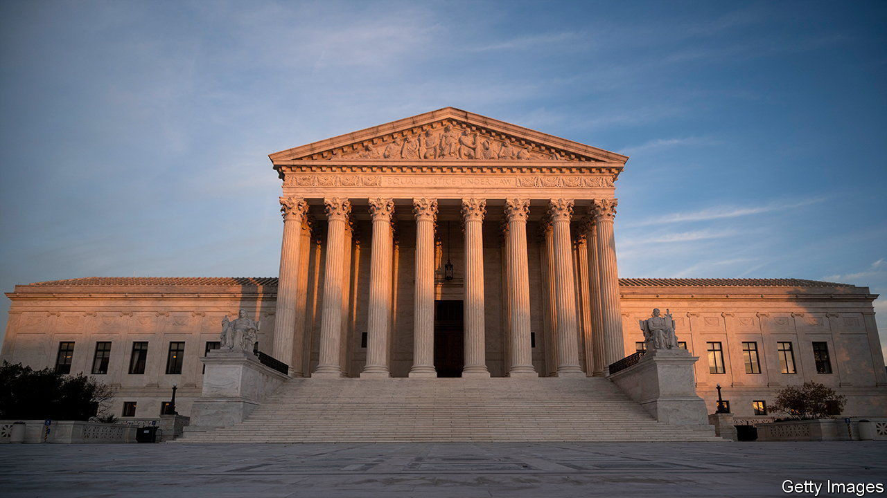

###### A victory for God

# America’s Supreme Court requires Maine to include religious schools in a tuition programme 

##### The justices are eroding the separation between church and state 

 

> Jun 21st 2022 

In 1785 james madison warned against taxing Virginians to pay salaries for teachers of Christianity. Requiring citizens to hand over just “three pence” to fund religious instruction, he admonished, is a dangerous “experiment on our liberties”. On June 21st, 237 years later, the  has come out against the chief author of the Bill of Rights—and Thomas Jefferson’s vision of a “wall of separation between church and state”—in a dispute over a tuition-assistance programme in Maine.

The result in is no surprise. The writing has been on the wall since 2017, when the Supreme Court ruled that public grants for cushier playgrounds must be open to secular and church-based preschools alike. Three years later, the justices said states may not exclude schools from an aid programme just because they have a religious affiliation. But in , the court . As fewer than half of Maine’s school districts operate a public high school, the state offers tuition assistance to parents who wish to educate their children in private—but not sectarian—schools. requires Maine to scrap that caveat and extend the offer to schools with religious missions and curriculums.

In his majority opinion for every Republican-appointed justice, Chief Justice John Roberts presented this as “unremarkable”. Maine’s scheme “penalises the free exercise of religion” by denying parents the option of drawing on state funds to send their children to schools that teach their faith. Such funding does not violate the bar on an “establishment of religion”.

Justice Stephen Breyer’s dissent, joined by Justices Elena Kagan and Sonia Sotomayor, lamented the imbalance in the majority’s treatment of the First Amendment’s twin religion clauses. Free exercise and nonestablishment exert “conflicting pressures” on states seeking to respect individual belief while not unduly merging religion and state, Justice Breyer wrote. But the  majority “pays almost no attention” to the latter while “giving almost exclusive attention” to the former.

In 2004 Chief Justice Roberts’s predecessor, William Rehnquist, held that states have flexibility when navigating the two principles. In  Rehnquist found “play in the joints” between free-exercise and nonestablishment wide enough to allow Washington state to give scholarship funds for all courses except “devotional theology”. The constitution might permit funding of pastoral studies, the court ruled then, but it does not compel it. 

Chief Justice Roberts tried to distinguish from yet did not explain why it is fine to bar funding of “vocational religious degrees” but not to withhold money for lessons on atmospheric layers as “evidence of God’s good design”. “The Court today”, Justice Breyer wrote, “nowhere mentions, and I fear effectively abandons”, the “long-standing doctrine” that states may erect a taller church-state wall than the constitution requires.

Justice Sotomayor’s solo dissent added a touch of “I told you so”. The court “should not have started down this path five years ago”, she wrote, reflecting on her dissenting vote in the 2017 case. The ensuing “rapid transformation” of religious liberty, she concluded, has led America to a point where “separation of church and state becomes a constitutional violation”. ■


