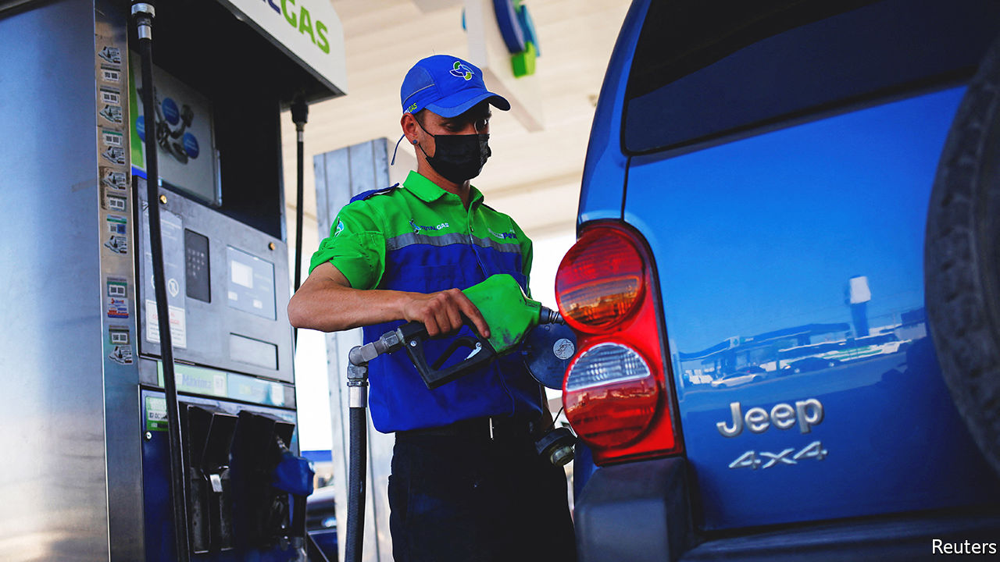

###### Petrol-tax holiday

# Biden’s gas-tax break is tempting politically but it’s a bad idea 

##### It would do little for consumers. Thankfully, it is unlikely to get through Congress 

 

> Jun 23rd 2022 

Americans are mad about soaring petrol prices. Joe Biden’s administration has tried to pin the blame on one man, calling it “Putin’s price hike”. Analytically, it is true that Russia’s invasion of Ukraine is the main reason for the global energy crisis. Politically, though, that has not given much cover to Mr Biden, whose popularity has sagged. On June 22nd the president tried a different form of politicking: he called for a gas-tax holiday for three months.

For the tax break to work, it would have to deliver much lower prices at the pumps. That is unlikely for three reasons. First, the root cause of high prices is an imbalance between buoyant demand for oil and constrained supply. If the tax holiday were to encourage Americans to hit the road, it could backfire, revving up consumption without solving production bottlenecks.

A second snag is the matter of who benefits. Although the break is directed at consumers, producers can respond by raising pre-tax prices. A recent study by the Penn Wharton Budget Model, a research initiative, found that when Connecticut, Georgia and Maryland implemented petrol-tax holidays earlier this year, consumers captured as little as 58% of savings.

A final weakness is that there simply is not much fat to cut. The federal tax on petrol is just 18.4 cents a gallon. With prices at around $5 a gallon, a tax holiday would equate to a discount of less than 4%. State taxes are generally low, too. Average petrol taxes in the oecd, a club of mostly rich countries, are nearly five times higher than in America.

There is also concern about the fiscal downside. The petrol tax helps pay for America’s highways. Mr Biden has pledged to plug the gap with other revenues, but that would take about $2bn a month. Perhaps the best thing that can be said about the tax holiday is that it is unlikely to get through Congress. Joe Manchin, a Democratic senator from West Virginia who has doomed other spending ideas liked by Mr Biden, has already signalled his displeasure. 

Given all the flaws, why is Mr Biden bothering with it? In calling for the tax holiday, he said it would at least provide families with “a little bit of breathing room”. Perhaps he hopes it would provide the same for his presidency.


