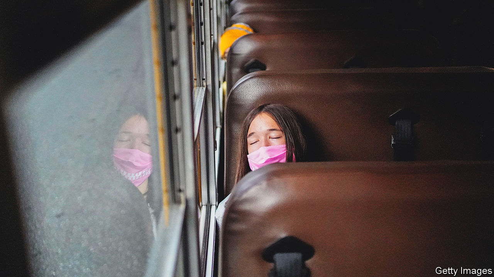

###### Lie in a little longer

# California pushes back public-school start times 

##### For teens the extra rest should come as a relief 

 

> Jun 23rd 2022 

California’s teens can hit the snooze button a few extra times from July 1st. A new law requires all public high schools to start no earlier than 8:30am, half an hour later than the American average. Middle schools (ages 11-14) must start at 8am or later. California is the first state to require later start times for public schools. For 3.3m children, this will be a welcome relief.

Since the 1950s Americans have been moving away from cities to sprawling suburbs with limited public transport. Families became car-dependent and buses were used to get pupils to school. But to save money schools often have to share bus fleets. High-schoolers are usually picked up first, then middle school, to prevent elementary pupils from waiting in the morning darkness. The new law responds to research showing the effects of early starts and sleep deprivation on teens. 

Poor sleep is associated with several woes. Physical-health problems can include insulin resistance and obesity. As for mental health, studies have found a link between lack of sleep and feelings of hopelessness, anxiety, depression and suicide. Sleep deprivation also seems to increase risky behaviours among teens, such as use of alcohol, tobacco and other drugs.

Concentration suffers. A county in Kentucky that pushed back its school-start time found that car-crash rates among teen drivers fell by nearly 17% (the rest of the state experienced an increase). More sleep boosts academic performance. A study of 29 schools in seven states found that attendance and graduation rates improved after start times were moved to after 8:30am. 

Lack of sleep is widespread among teens. According to the Centres for Disease Control and Prevention, seven out of ten high-schoolers and six out of ten middle-schoolers do not get enough sleep. The Academy of American Paediatrics (aap) recommends that schools start after 8:30am to minimise negative impacts on teen sleep. Yet only 17% of schools do so. 

So why don’t the teens just go to bed earlier? During puberty, adolescents’ sleep cycle changes. They begin to go to sleep later (by about two hours) and wake up later as well. But they still require a full night’s rest—8.5 to 9.5 hours, according to the aap. Early school-start times disrupt this. 

Sceptics worry that delaying school starts will not result in more sleep because teens will only go to bed even later. But this does not seem to happen. A meta-analysis (of 20 studies) found that later school-start times do indeed lead to more sleep.

California’s bill has its critics. They point to logistical issues. The later start times could mess with parents’ schedules. In winter the end of school could occur during dusk, pushing after-school activities later into the evening. The law also upset the teachers’ union. The California Teachers Association argued that start times should be decided at the local level. The new law will not apply to rural districts, but all others will have to follow it.

Advocates say this change is all for the better. Developing proper sleep habits is imperative for a healthy lifestyle as a teen and into adulthood. Poor sleep in adulthood is linked with a litany of chronic illnesses: diabetes, Alzheimer’s, hypertension and more. Teens need to sleep longer now, so they can be healthy later. ■


