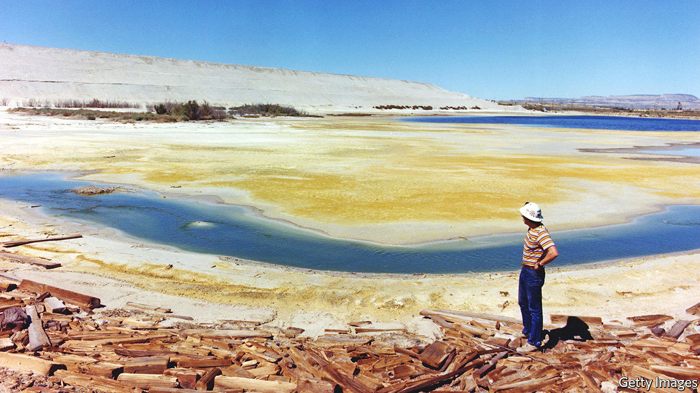
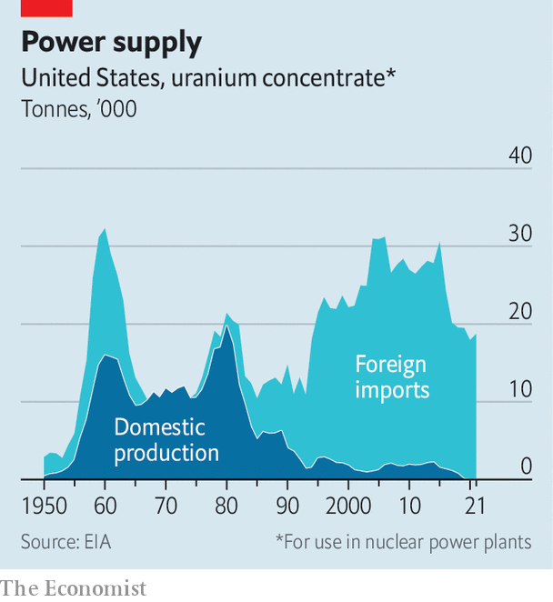
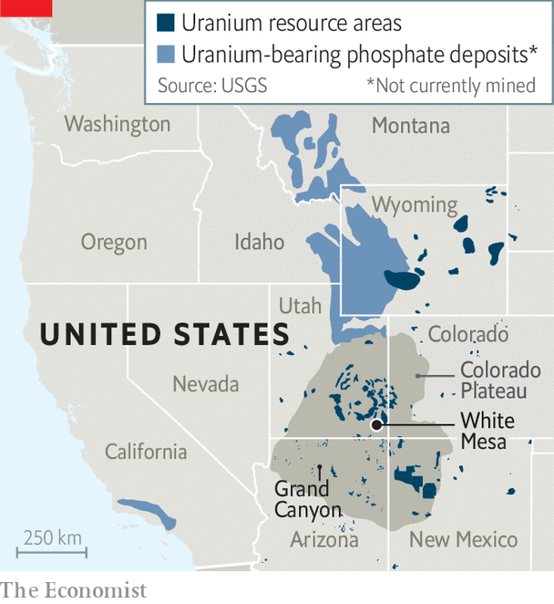

###### Fission impossible?

# How Russia’s war could revive America’s uranium industry 

##### The climate crisis and invasion of Ukraine are transforming the politics of nuclear power 

 

> Jun 23rd 2022 

Edward abbey, an author, national-park ranger and relentless curmudgeon, once described south-eastern Utah as the “most arid, most hostile, most lonesome…quarter of the state”, and “the best part by far.” Abbey’s favourite bit of Utah is home to red sandstone canyons, sacred tribal lands, all manner of desert critters—and America’s only operating uranium mill. 

 


Uranium prospecting surged during the cold war as America built its nuclear arsenal. Low-enriched uranium fuels most nuclear reactors; very highly enriched uranium is used in bombs. Most mining took place on the Colorado Plateau, an area spanning swathes of Arizona, New Mexico, Utah and Colorado. At the industry’s peak in 1980 it produced nearly 43.7m pounds (19.8m kg) of the stuff. Then things went downhill. American firms couldn’t compete with cheap uranium imports from Canada and Australia, and, later, from former Soviet states. American companies produced just 21,000 pounds of uranium last year (see chart). 

Yet the White Mesa mill in southern Utah is still converting uranium ore into yellowcake, a condensed powder. For decades the facility has seemed a relic of the region’s boom times. But two things have conspired to breathe new life into America’s uranium industry. 

First, climate concern has begun to change the politics around nuclear power, which does not emit carbon. Roughly 20% of the power produced by American utilities comes from nuclear, making it the country’s largest source of clean energy. To speed decarbonisation, the Biden administration wants to prop up America’s existing nuclear plants and incentivise the development of new advanced reactors. Proponents of nuclear power argue that its steady, baseload power will be needed to keep the lights on when the sun doesn’t shine or wind doesn’t blow. There are signs that this argument is catching on. California is considering delaying the closure of its last nuclear plant, which is the state’s largest single source of electricity. 

Second, Russia’s war in Ukraine has many countries squirming over their reliance on Russian energy. According to the Energy Information Administration, a government agency, 14% of America’s uranium imports in 2021 came from Russia (and a further 43% from Kazakhstan and Uzbekistan). Russia is the only commercial supplier of the type of uranium needed to fuel new reactor designs, which aim to reduce costs and safety concerns. 

 


John Barrasso, a Republican senator for Wyoming who has long wanted to prop up his state’s uranium industry (see map), has introduced a bill that would ban imports of Russian uranium. “We stopped oil, gas and coal,” says Mr Barrasso. “There’s no reason that we continue to import uranium when we have such an abundance in the United States.” That feeling is bipartisan. Jennifer Granholm, Joe Biden’s energy secretary, says the Department of Energy (doe) is developing a national “uranium strategy”. TerraPower, a firm co-founded by Bill Gates, initially planned to buy Russian uranium to power the reactor it is building in Wyoming. But even without a ban, it says it is no longer interested in Russian supplies. 

The politics of disavowing Russian uranium may look good on paper, but they could leave utilities and innovators like TerraPower in the lurch. Andrew Griffith, who works on nuclear-fuel supply chains at the doe, likens the nuclear industry’s woes to a chicken-and-egg dilemma. “The advanced reactors are going to have a hard time attracting investment when there’s no fuel supply,” he says, “and it’s hard to attract investment in the fuel supply if there are no customers to purchase the fuel.” 

To jump-start things, the doe is scrambling to ramp up mining and enrichment, in three ways. First, the department is powering up a small enrichment facility in Ohio, to demonstrate the technology. Second, some weapons-grade uranium can be “downblended” to create the lower-enriched stuff needed for reactors. Third, the department wants to incentivise the private sector, which is pushing for the creation of a Strategic Uranium Reserve similar to the petroleum stockpiles kept in underground caverns along the Gulf Coast. 

America’s uranium firms are salivating over the potential revival of their industry. Uranium sales are negotiated through long-term contracts rather than in an open market, given the element’s use in nuclear weapons. So it is hard to get a pure price signal, says Ian Lange, an economist at the Colorado School of Mines. Cameco, a uranium producer, estimates that the price per pound was about $48 in May. Scott Melbye, the president of Uranium Producers of America, a trade group, says that is nearly the level firms would need in order to justify restarting long-dormant mines. 

Should you choose to accept it

Tricky economics is not the only problem America’s uranium industry faces. In many western communities uranium mining is unpopular at best, and considered criminal at worst. The Environmental Protection Agency estimates that there are more than 500 abandoned uranium mines on Navajo Nation lands alone. The Ute Mountain Ute tribe in White Mesa worries that the mill may be affecting their water and air quality. Development of a dormant mine about ten miles south of the Grand Canyon is vehemently opposed by environmentalists and tribes in Arizona. 

The opposition to a uranium boom resembles the environmental-justice concerns that have doomed existing nuclear power plants. Mr Barrasso says shunning nuclear power in favour of a grid dominated by renewables would be foolish. You can’t “power the world on the sun, the wind and wishful thinking”, he says wryly. But the nuclear industry’s utter dependence on government aid requires its boosters to engage in some wishful thinking of their own. ■


