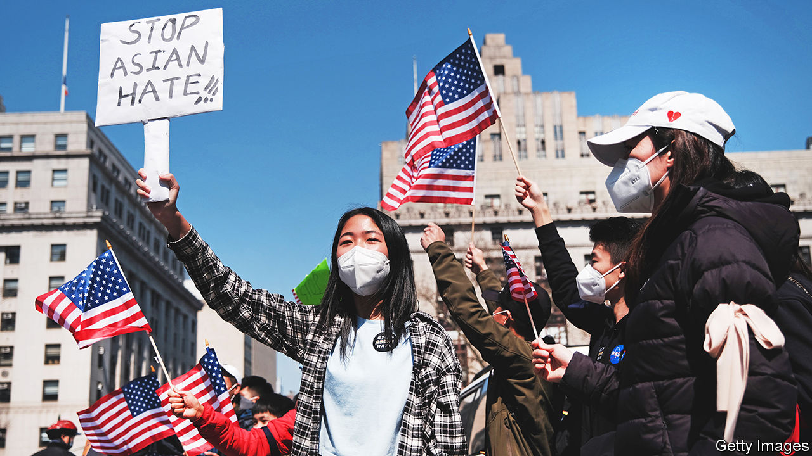
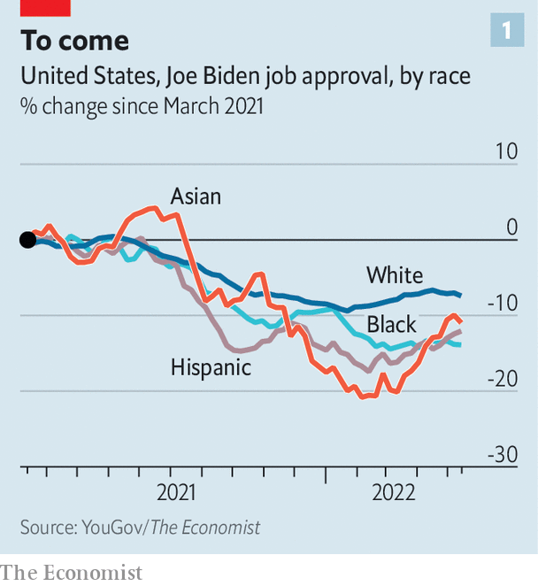
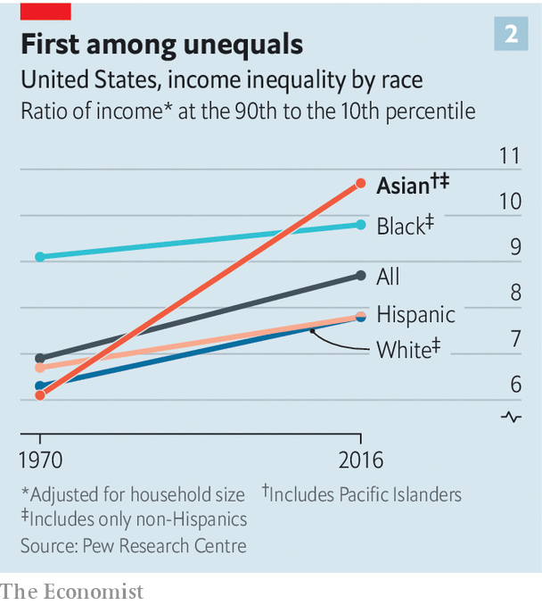
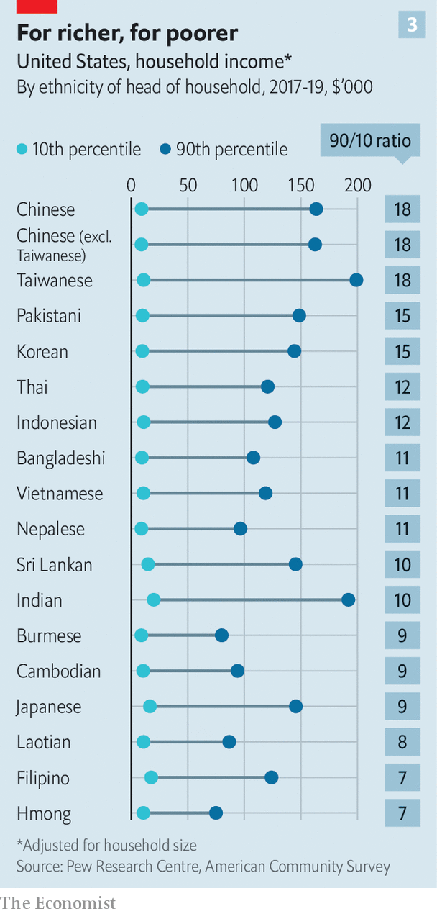
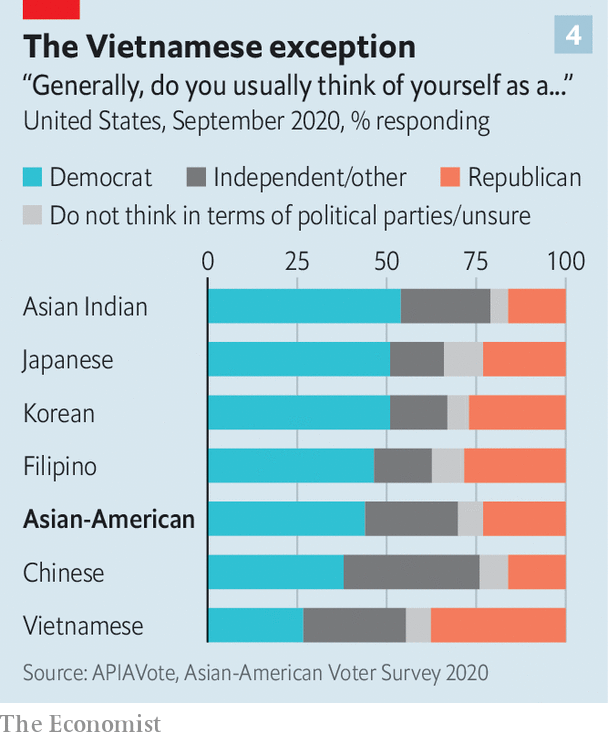
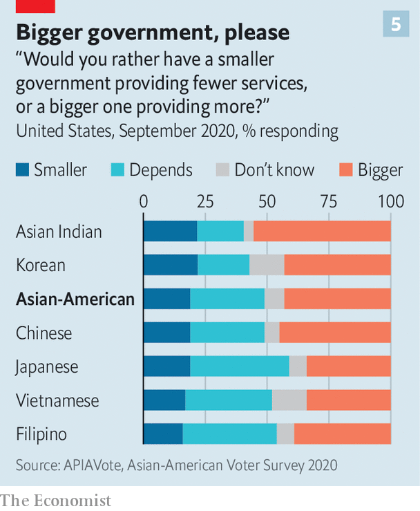

###### Pivot to Asia

# Inside the battle for Asian-American votes 

##### How Republicans hope to grab a bigger share of America’s fastest-growing voting block 

 

> Jun 20th 2022 

Lanhee chen is a sort of unTrump (he was chief policy adviser to Mitt Romney’s presidential bid in 2012). He is running to be elected California’s state controller in November, a technocratic post designed to ensure money approved by the state assembly is spent properly. “I’ve got a record of working with Democrats,” he says, “and my arguments for this post are non-ideological” (not something many movement conservatives would say). If he were to win, he would become the first Republican to hold statewide office in California since 2006. A second-generation Taiwanese-American, Mr Chen also represents one of the Republican Party’s more audacious ambitions: to win the Asian-American vote.

Asian-Americans (often referred to as Asian-American/Pacific islanders, or aapi) are blue. They voted for Joe Biden by two to one. That makes them more Democratic than , whose support for the party’s presidential candidate dropped by more than ten points between 2012 and 2020. 

With more than 11m eligible voters (nearly 5% of the total), Asian-Americans are the fastest-growing of all the country’s main ethnic or racial voting groups. Once concentrated in New York and California, they now live in some of the country’s most competitive districts. Central Ohio contains the largest Bhutanese community outside South Asia. Around 600,000 Asian-Americans live in and around Houston, another 600,000 in Dallas and 400,000 in the suburbs of Atlanta. In Georgia, according to TargetSmart, a data firm, the increase in Asian votes in 2020 over 2016 was more than five times Mr Biden’s margin of victory in the state. The Democrats won both of Georgia’s Senate seats, so the party’s capture of the presidency and upper house might not have been possible without the surge in Asian votes. 

Turnout of Asian-American voters rose by 50% between the mid-term polls of 2014 and 2018, and by as much as a third from 2016 to 2020. This was the largest increase of any ethnic group’s votes and proved vital to Democratic victories. “We’ve gone from the margins”, says Judy Chu, a Democratic congresswoman from California, “to the margin of victory.”

But 2020 was an unusual year. The race took place amid  against Asian-Americans. Between March 2020 and December 2021, according to an advocacy group, Stop aapi Hate, nearly 11,000 “hate incidents” against Asian-Americans were reported to the group. Shocking shootings have included one at a hair salon in Dallas’s Koreatown, and another at spas in Atlanta (where six of the eight victims were of Asian descent). Many Asian-Americans think Donald Trump’s insistent references to “the Chinese virus” stirred up anti-Asian sentiment. “It made us realise that our vote was our voice,” says Stephanie Murphy, who was born in Vietnam and represents a Florida district in Congress. The racism continues but Mr Trump is not on the ballot in 2022. 

Asian voters are blue in another way. They share the national malaise about the current president’s performance. Polling by /YouGov finds that Mr Biden’s approval rating among Asian voters fell from 66% in July 2021 to 42% in March 2022, before recovering somewhat. The decline was steeper than among blacks or Latinos. The share of Asian-Americans saying America is on the wrong track rose by more than among other groups during the period, too.

Polls fluctuate but several elections in the past year point the same way. In November 2021  won the governorship of Virginia for the Republicans. His campaign managers attributed this, in part, to aapi worries about the economy. In February 2022 voters in San Francisco forced the recall of three progressive school-board members, reflecting aapi frustration at positive-discrimination policies in schools which help black and Latino pupils but disadvantage high-scoring Asian-American ones. And in deep-blue New York City in 2021 a Republican ran for mayor on a tough-on-crime ticket. He lost easily yet won four wards with large concentrations of Asian-Americans. “Our party better start giving more of a shit about #aapi voters”, tweeted Grace Meng, a Democratic congresswoman from Queens. 

If these indications are any guide, Asian-Americans will swing back a few points towards Republicans in 2022. The question is whether marginal gains presage a broader shift. Will Asian-Americans be like Jewish-Americans, a reliable part of the Democratic coalition, or, like Italian-Americans, swing towards Republicans?

AAPI ever after?

There are two reasons to think the Republican Party could make big gains. First, Asian-Americans are a very varied lot. They come from a score of countries, speak over 100 languages and espouse different religions. Until recently, they barely recognised the term “Asian-American” except as a census category. People thought of themselves as Japanese-Americans, Korean-Americans or Vietnamese-Americans; these last make up a Republican-leaning subgroup, like Cubans among Latinos. 

 


According to the Pew Research Centre, a think-tank, the richest 10% of Asian-Americans are richer than the wealthiest decile in any other group. Migrants from India and China account for a disproportionate share of tech workers; they include the bosses of Adobe, Google, Microsoft and Zoom. But the poorest aapi tenth are slightly poorer than average and the gap between richest and poorest Asian-Americans has been growing faster than among Americans as a whole (see chart 1). The income gaps are even wider among Chinese-Americans (see chart 2). If they just voted their socioeconomic interests, Asian-Americans would split their votes. In 1992, a slim majority voted for George H.W. Bush.

 


Second, and uniquely among America’s largest racial groups, Asian-Americans are immigrants. More than six in ten were born abroad (compared with 35% of Hispanics, 12% of African-Americans and 4% of white people). At current rates there will be 46m Asian-Americans by 2060, more than there are African-Americans today. Republicans would seem to have a plausible chance of attracting many newcomers.

 


In practice, however, new arrivals tend to engage politically with the party to which their family and neighbours belong (or else do not engage at all). This gives Democrats a first-mover advantage. As Asians poured in during 2000-20, the party of minorities reached out to them more than did Republicans, constrained by a strand of anti-immigrant nativism in their ranks. According to aapi Data, a polling firm, Democrats outnumber Republicans among every group except Vietnamese-Americans. Overall, Asian-Americans identify with Democrats over Republicans by two to one (see chart 3). 

 


The Asian-American shift to the left since 1996, argues Karthick Ramakrishnan, of the University of California, Riverside, constitutes the biggest political swing of any racial group in America. According to aapi Data, 43% of Asian-Americans support bigger government with more services; only 19% say they want smaller government and fewer services. More than three-quarters want more federal action to combat climate change; four-fifths support stricter gun laws. Varun Nikore of aapi Victory Fund, a political fundraising group, argues that, though Asian-Americans may be the most heterogeneous of America’s ethnic groups, they vote and organise homogeneously, as a Democratic block. 

 


Other features suggest that Republicans will find the block hard to split. Asian-Americans are better educated than average: over half have at least a graduate degree; among Indian-Americans the share is 75% (the national average is 38%). Having a degree is one of the surest predictors of voting Democratic. 

Asian-Americans are slightly younger than average—and the median age of us-born aapi is only 19, compared with 36 for all us-born people—and younger voters tend to lean to the left. A poll by circle, a research group attached to Tufts University, found that a staggering 78% of Asian-Americans aged between 18 and 29 supported Mr Biden in 2020, 20 points more than young voters nationally. And aapi people born in America are more Democratic than new arrivals; they are likely to increase as a share of the total over time.

So, as the political significance of Asian-Americans rises, both parties have work to do. “We have to meet them where they are on their issues, not rely on identity politics,” says Mrs Murphy. “The Republican Party has not always been welcoming to people of every colour,” admits Mr Chen, sheepishly. Republicans are chipping away at the Asian-American block. They are not yet able to crack it open. ■


