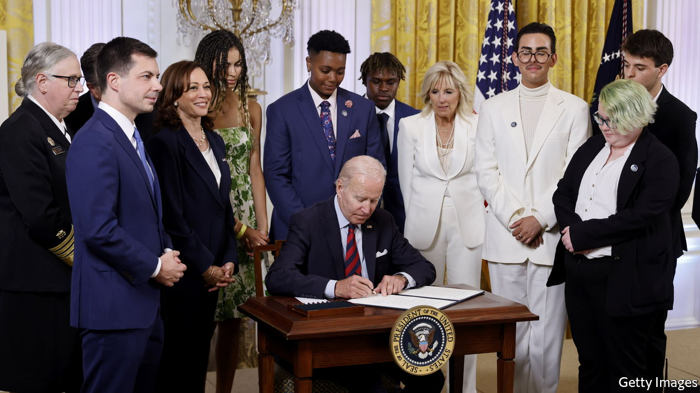

###### Lost in conversion

# The Biden administration’s confused embrace of trans rights 

##### Its muddling of terms is a real mess 

 

> Jun 23rd 2022 

Until recently the term “conversion therapy” was used to refer to the barbaric and pointless practice of trying to turn a gay person straight. Of late it has been widened to include talking therapy that explores why a person’s gender identity is at odds with their biological sex. President Joe Biden used that broader meaning in an executive order “advancing equality for lgbtqi+ Individuals”, on June 15th. The order is designed to tackle discrimination suffered by “lgbtqi+” young people, which is laudable. But it refers to them as a single group (offering no definition of “queer” or “intersex”), which raises problems. It describes conversion therapy as “a discredited practice that research indicates can cause significant harm”, yet fails to specify what it means when applied to trans-identifying children.

Some therapists who work with children with gender dysphoria worry that this could be interpreted to mean therapists should not investigate why someone feels distressed about their biological sex. This is not the same as trying to convince someone they are not gay. Sexual orientation and gender identity are different. Sexual orientation tends to be innate and fixed; gender identity can be nebulous and changeable. It also, increasingly, prompts medical interventions that can have irreversible, harmful effects. It has long been held that people with gender dysphoria should have therapy before drugs.

Increasingly, however, such talking therapy has clashed with “gender-affirmative” care, which accepts patients’ self-diagnosis that they are trans. That is now considered best practice in America’s booming trans health-care field. Therapy has been dismissed as “gatekeeping”, even when applied to trans-identifying minors for whom gender-affirming drugs can be particularly harmful. There is growing evidence that puberty blockers given to trans-identifying children from the age of nine, and the cross-sex hormones that often follow, lead to sterility and inorgasmia. Finland and Sweden have mostly stopped prescribing blockers to under-18s in favour of talking therapy, because the evidence base for them is thin. Mr Biden’s order, by contrast, asks federal departments to expand access to “gender-affirming care”.

The order does not impose an outright ban on therapy for gender-dysphoric youth. But it will have a “chilling effect”, says Lisa Marchiano, a Jungian therapist and a co-founder of the Gender Exploratory Therapy Association. Most decent therapists should be able to help people with gender dysphoria, she says. Yet America’s focus on affirmation means many are wary of doing so. Instead, they refer children to gender therapists, who are likely to affirm a trans identity and suggest drugs. Some gay adults who struggled with gender nonconformity in adolescence say they believe that encouraging children with gender dysphoria to consider themselves trans is in effect conversion therapy.

This is not the first time the administration has muddled its terms in an effort to embrace trans rights. It has done so over sex and gender identity too. The Biden administration has suggested it is considering changing Title IX, an amendment made to the Civil Rights Act, to include “gender identity” alongside “sex”. When Title IX banned discrimination “on the basis of sex” in federally funded educational institutions in 1972, it resulted in the provision of separate programmes for girls. The lost ground this enabled women to make up in sport was one of the biggest achievements in the battle for sexual equality in America. If female sports teams are forced to allow trans girls to join them, the era of female-only sports will be over.

On June 19th the International Swimming Federation voted to restrict transgender athletes from competing in elite women’s competitions (unless they took blockers as children). Sensible policymaking like that seems a long way off in America.■


