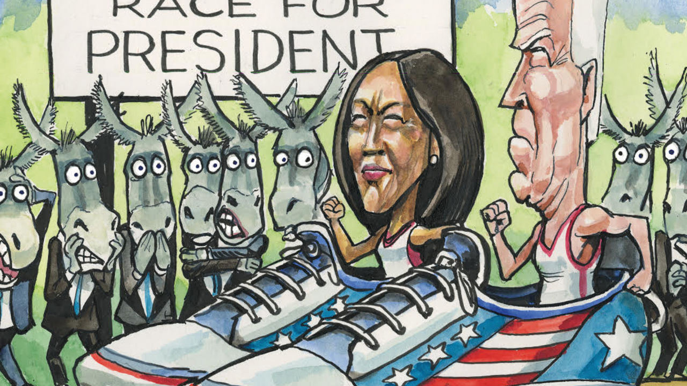

###### Lexington

# The Biden-Harris problem 

##### Democrats face the fact that they need a better candidate for 2024 than Joe Biden or his deputy 

 

> Jun 23rd 2022 

Nothing raises the political stakes like an insurrection. As the House of Representatives’ January 6th committee publicises yet more details of Donald Trump’s scheme to steal the 2020 election, Republicans are doubling down against democracy. New Mexico’s Supreme Court last week had to compel conservatives in rural Otero County to certify an election they had refused to because, conned by one of Mr Trump’s conspiracy theories, they mistrusted vote-counting machines. In Nevada, Republicans elected as their candidate for secretary of state, the office that certifies elections, a man who says he would not have recognised Joe Biden’s victory in the state. And on June 19th Texas’s state Republican Party declared Mr Trump the rightful president, Mr Biden an impostor, and vowed to abolish the 1965 Voting Rights Act that enfranchised black Americans in the South. Mr Trump, maddened by the hearings, is said to be considering announcing his next presidential run within weeks.

For Democrats, the hearings and the Republican response to them make it all the more imperative that they retain the White House in 2024. Which turns their anxious minds to its current occupant. Mr Biden is even more unpopular than his twice-impeached predecessor. Only 39% of voters think he is doing a good job, and his chances of recovery look slim. Mr Biden’s troubles are mostly attributable to a horrendous set of socioeconomic and political circumstances (including high inflation, the lingering covid-19 pandemic and the hyper-partisan furies Mr Trump unleashed on the right), most of which are getting worse.

With interest rates climbing, a recession and job losses look likely next year. By which time the Republicans, having won back the House at least in the mid-terms, will be heaping fresh troubles on the president’s 80-year-old head. They may impeach him. They will certainly launch investigations into his son, Hunter Biden, whose dissolute lifestyle and lobbying are considered a much bigger scandal on the right than the Capitol riot.

To rise above this would take a politician of genius, which the president wasn’t even before he started visibly slowing. Though nothing like the dribbling senile that right-wing commentators portray (people who have discussed policy with Mr Biden found him alert and well-briefed), he lacks energy and grip. This has probably contributed to his administration’s missteps. It over-promised legislatively, given the Democrats’ bare-minimum majority in the Senate, then under-delivered. Its staff of former Clintonites have proved bafflingly supine towards their party’s electoral albatross, the activist left. Mr Biden’s public speaking has meanwhile gone from gaffe-prone to often excruciating. He is rarely permitted to take off-the-cuff questions. Even his set pieces are white-knuckle affairs. The fact that his fall from a bicycle this week was a one-day headline showed how bad his press is: Mr Biden landing in a heap was a dog-bites-man story. No Democrat relishes the idea of him fighting another presidential campaign.

Yet his aides have described plans for one—because if Mr Trump runs again, it seems Mr Biden wants to. He rightly fears a second Trump term would be calamitous; yet the fact that he thinks he is the likeliest impediment to that points to another Democratic problem. If Mr Biden steps aside, the vice-president, Kamala Harris, is expected to be the Democratic nominee. And many fear she would lose to Mr Trump or one of his imitators, because of another combination of dire fundamentals and poor political skills. If America was not ready for a woman president in 2016, it is probably no readier for a black woman now. And Ms Harris, a Californian progressive unused to competitive elections, was exposed during her brief primary tilt in 2019 as an awkward campaigner with few fixed views. Mr Biden shone by comparison.

The question, then, is can Democrats bypass them both? “Literally every conversation I’ve had with a Democrat over the past three months has started with this,” says a veteran activist. The conventional wisdom is, no. The diversity of the Democratic coalition makes its members cling to protocols, such as the vice-president’s claim to be next in line, as a defence against schism. And bypassing a black woman would outrage the identitarian left. Yet a growing sense of panic is challenging that view. A flurry of recent reports in the and elsewhere feature quotes from unnamed Democrats calling on Mr Biden not to run and for a competitive primary, in which Ms Harris could participate (and show off the skills her supporters will say she has acquired in the West Wing) if she wished. 

Expect such whispering to increase. Mr Biden is too old to run again. Ms Harris seems too flawed. Moreover, her claim on the nomination is hardly democratic. And there is no evidence that black voters would rally to her, as her defenders will also claim. African-Americans want the candidate likeliest to win, which is why they usually choose a moderate white man, as they did in 2020.

For what it is worth, your columnist expects the whispering campaign to succeed. Hillary Clinton’s failure and Mr Trump’s awfulness have made Democrats suspicious of coronations and above all fearful of a Republican presidency. All that is needed is an opportunity for them to air those sentiments—and the left, predictably unimpressed by Mr Biden, will probably provide one.

Third time lucky, Uncle Bernie?

A leftist challenge to him or to Ms Harris could crack open the nomination process just as Eugene McCarthy did in 1968, when his anti-war protest against an unpopular incumbent, President Lyndon Johnson, drew in more powerful challengers. If the indefatigable Bernie Sanders (who is a year older than Mr Biden), Ro Khanna or another left-winger looked able to win the ticket, more compelling centre-left candidates, such as Amy Klobuchar, Cory Booker or Pete Buttigieg, would surely pile in. It could be the activist left’s single great contribution.■


