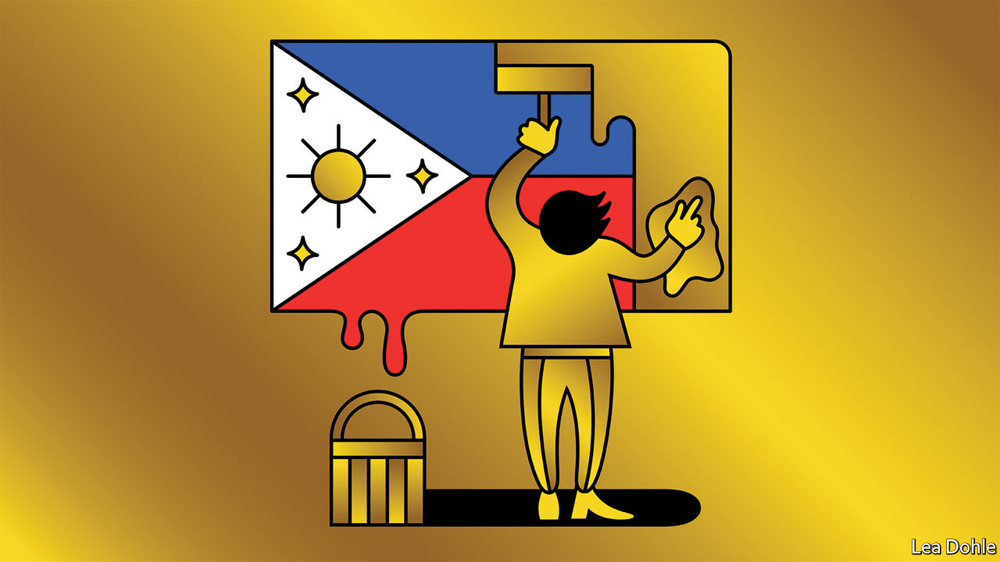

###### Banyan

# By electing another Marcos, Filipinos show they have forgotten history 

##### The son of a brutal kleptocrat took over his dad’s old job on June 30th 

 

> Jun 29th 2022 

The first republic of the Philippines, established after the Americans booted out the Spanish, lasted just over two years. The second, under Japanese rule during the second world war, did not even make it that long. The third was created at the country’s independence from the United States in 1946 and survived until 1973, by when , had declared martial law. A fourth one came into being when martial law was lifted in 1981 and collapsed with the peaceful revolution that forced Marcos and his family to flee in 1986. Thus began the Fifth Republic. At noon local time on June 30th,  became its seventh president.

For a noisy minority of Filipinos, the simple fact of another Ferdinand Marcos in the presidential palace is horrifying. His father, after all, was a murderous dictator who stole billions from the state and remained unrepentant to the end. His mother, Imelda, spent extravagantly and is best known for a collection of designer shoes so monumental that she could have worn a different pair every day for more than eight years. For Bongbong’s detractors, his election can only result in a return to kleptocracy. Those who forget the past are doomed to repeat it, they intone gravely.

Forgetting, however, is precisely what Filipinos have done. Bongbong won the presidency with 59% of the vote. His closest rival, Leni Robredo, mustered only 28%. One explanation for Bongbong’s triumph is that most voters are too young to remember the first Marcos era, with its mass arrests of dissidents and its inventive torture techniques, from rubbing hot peppers into victims’ genitals to half-drowning them in buckets of excrement. Another is that Philippine school curriculums devote little time to the dictatorship. A third is that Bongbong’s flacks mounted a successful social-media campaign to paint his father’s rule as a time of prosperity and stability. 

But forgetting is not all new, nor all social-media magic. Filipinos were forgetting as early as 1995, barely a decade after Marcos senior was deposed. In May 1986, three months after the revolution, 41% of those surveyed by Social Weather Stations, a respected pollster, thought he had been “true to the duties of a patriotic president”. By October 1995 the number was 57%. In 1986, 44% agreed that he was a “severe, brutal or oppressive president”, and the same proportion disagreed. A decade later just 38% agreed while 60% disagreed. “Not many of us would care to hold a grudge against someone long dead, not even someone like Ferdinand Marcos,” reckoned the pollsters. 

If the forgetting has come to pass, might the repetition of history, too? Bongbong is, in many ways, a fairly standard figure. Like two of his three immediate predecessors, he is the offspring of a former president. Like every president of the Fifth Republic bar one, he represents a political dynasty. His cabinet appointments, like those of Rodrigo Duterte, the outgoing president, are heavy on technocrats. The economic team is headed by Benjamin Diokno, plucked from running the central bank. His defence chief is a former army general. His pick for transport used to be the boss of the national airline. The business crowd is delighted with the shape of the cabinet so far. 

Yet space for criticism is already being constricted. On June 23rd the telecoms regulator curbed broadcasters’ habit of airing outside programming for a fee, a practice often exploited by those with a political point to make. A few days earlier Solita “Winnie” Monsod, a prominent columnist who is no fan of Bongbong (and who, as it turns out, privately tutored the new president in economics while he was at Oxford), was fired by her newspaper for sitting on the board of Rappler, a campaigning news website whose co-founder won the Nobel Peace prize in 2021. On June 29th Rappler itself was ordered by the country’s Securities and Exchange Commission to shut down for violating foreign-ownership rules. 

The Fifth Republic was founded to be the antithesis of Marcos’s rule. A new constitution was framed to keep another Marcos-like figure out of power. Some in Manila’s political circles argue that the rise of Bongbong marks the end of that era and the rise of a sixth republic. 

Others, such as Manuel Quezon III, a columnist (and grandson of a former president), say the values of the Fifth Republic were lost much earlier, with the election of Mr Duterte, who openly urged the murder of criminal suspects. Either way, the era defined by the idealistic revolution of 1986 has come to an end. 


