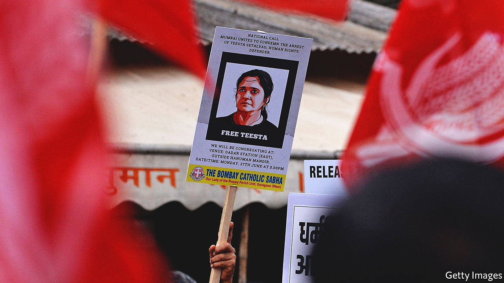

###### Feeling the chill

# India arrests two opponents of the government 

##### Meanwhile Narendra Modi celebrates democracy at the G7 

 

> Jun 30th 2022 

Before hobnobbing with other world leaders at the g7 summit in southern Germany on June 26th Narendra Modi, India’s prime minister, stopped in Munich to address members of the Indian diaspora. He reminded them that the Emergency, a 21-month-long dictatorship imposed on India by Indira Gandhi on June 25th 1975, remained a “black spot” on India’s “vibrant democracy”. But efforts to crush that democracy, he went on to imply, were a thing of the past: “Today, we can proudly say that India is the mother of democracy.”

As Mr Modi was giving his speech Teesta Setalvad, an Indian human-rights activist, appeared before a court in Ahmedabad in the western state of Gujarat. She was charged with, among other things, fabricating evidence and committing criminal conspiracy against Mr Modi. A squad of Gujarat’s anti-terror police had arrested her at her home in Mumbai, India’s commercial capital, the day before.

Ms Setalvad’s arrest is yet another sign of the shrinking space for dissent and the erosion of the separation of powers in India’s “vibrant democracy”. It followed a decision by the Supreme Court on June 24th to uphold a ruling that cleared Mr Modi of complicity in deadly sectarian riots in Gujarat in 2002, when he was the chief minister of the state.

More than 1,000 people, most of them Muslim, were killed in the riots. Many observers have accused Mr Modi of failing to respond adequately to the violence, arguing that he could have done more to rein in the killers, protect the victims and investigate who was responsible for their deaths. Ms Setalvad went further. Working with the families of those killed in the riots, she has spent two decades trying to prove that senior officials in the state government, and above all Mr Modi, stoked or even planned the violence. In turn, authorities in Gujarat have pursued her with trumped-up charges and investigations. They have raided her offices and frozen her bank accounts. In 2016 the central government cancelled the licence that allowed her organisation to receive foreign funding.

Activists and journalists who criticise India’s government are growing accustomed to being hounded by it. Just two days after Ms Setalvad’s arrest in Gujarat, police in Delhi locked up Mohammed Zubair, the co-founder of a respected fact-checking service, following a complaint that a tweet he had posted in 2018 had hurt religious feelings. His associates believe that the aim was to punish Mr Zubair for publicising Islamophobic comments by two prominent officials in the ruling Bharatiya Janata Party, the fallout from which ruptured India’s relations with the Muslim world in early June.

Until recently, activists could look to the courts to curb the worst excesses of the executive, at least on occasion: so far, none of the charges levelled against Ms Setalvad has stuck. Yet this time the Supreme Court itself appeared to suggest that she deserved to be prosecuted for her attempts to challenge the government. 

The court could have limited itself to finding, as it did, that there was insufficient evidence to support the claim of a criminal conspiracy by the government. Instead the verdict goes further, encouraging the authorities to prosecute those who had sought to implicate the state. It mentions Ms Setalvad by name and accuses her of ulterior motives for pursuing the case. “All those involved in such abuse of process…need to be in the dock and proceeded with in accordance with law,” it concludes. The day after the verdict Amit Shah, the home minister, gave an interview in which he accused Ms Setalvad of feeding false information about the riots to the authorities and noted that the court had mentioned her by name. Hours later the police came knocking at her door.

The Supreme Court used to have a reputation for holding the government to account. But in recent years it has refused to say boo to Mr Modi and his lieutenants. For dissidents and critics, the message is clear. If you bring a sensitive case against the government, you may be persecuted for bringing it. This sounds like a formula for official impunity. ■

