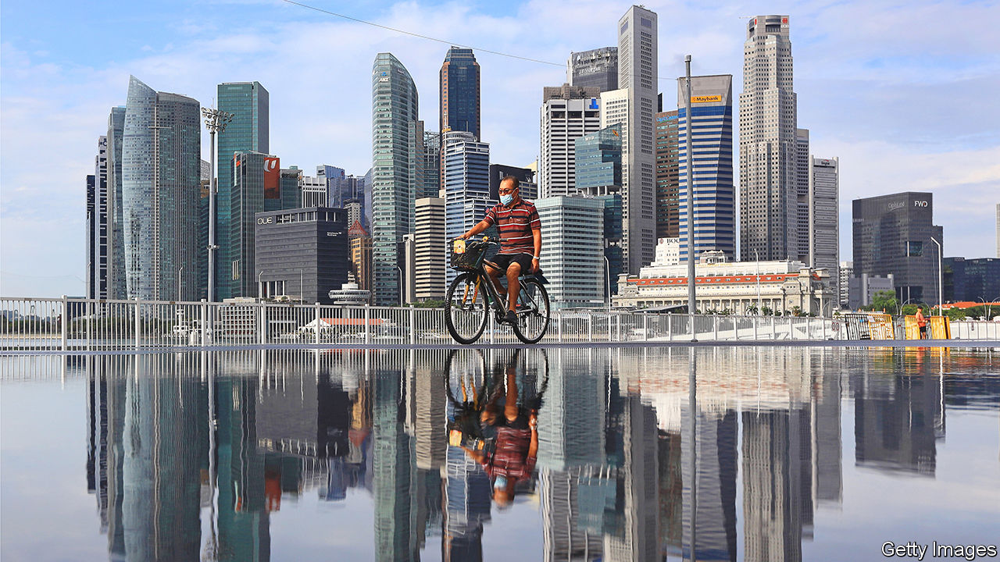

###### Open and shut

# Resentment of rich foreigners complicates Singapore’s politics 

##### The government must balance the city-state’s role as a financial hub with locals’ concerns 

 

> Jun 30th 2022 

Singapore’s finance industry is booming. Over the past year it grew by 7.2%—four times faster than the overall economy. The city-state has become Asia’s leading foreign-exchange market, and its fund managers and family offices cater to a dizzyingly high number of ludicrously rich people. The “ultra-high-net-worth individuals” based in Singapore will grow by some two-thirds between 2020 and 2026, predicts Knight Frank, an estate agent. All this means more foreign finance workers, too. 

The boom is likely to accelerate. A growing number of foreigners and locals based in Hong Kong and Shanghai, two cities subject to onerous covid-19 restrictions,  since it reopened its borders. In the race between these three Asian financial centres for pre-eminence, Singapore is in pole position. 

Yet the political foundations on which the industry was built are shifting. In April the ruling People’s Action Party (pap) announced that Lawrence Wong would succeed the current prime minister as head of the party at some point in the future (he took over as deputy prime minister on June 13th). Because the pap has been in government since 1959, Mr Wong is all but guaranteed to become the country’s fourth prime minister. He has made a point of promising change. In a speech on June 28th, he acknowledged that many Singaporeans feel “anxiety” about being forced to compete with foreigners for jobs, and vowed to put Singaporeans “at the centre of everything we do”. Placating nativists at home while ensuring the country remains open to foreign talent will be one of Mr Wong’s greatest challenges in the years ahead. 

Having been governed by the same political party for six decades, Singapore is a byword for stability. Its courts have a reputation for commercial impartiality. Opposition parties exist—yet the most influential one is not even certain it wants to be in government. Assured of its impregnable position, the ruling party by and large concentrates on governing rather than mudslinging. It has a well-deserved reputation for competent, evidence-based policymaking. Singapore is a sure thing in an increasingly turbulent world, which makes it an attractive place to do business. 

That is by design. The government has deliberately shaped its politics to be attractive to the finance industry. This ensured it had an option to fall back on as regional competitors undercut Singapore’s manufacturing base. Finance, which along with insurance contributed 14.6% of gdp in 2021, is a “pillar of the economy”, says Emmanuel Daniel, the founder of The Asian Banker, a consulting firm. 

The decision to ensure that it became one has had a profound effect on the social make-up of the city, because it meant throwing open the doors to foreigners. The proportion of overseas workers on temporary visas has risen dramatically over the past half-century, from 3.2% in 1970 to 33% in 2020. Though most of them are low-paid manual or domestic workers, locals direct their ire mostly at highly paid professionals, whom they perceive as hogging the plum jobs. “We can’t get jobs or we have lousy jobs: all the good-paying jobs go to expats,” says Gilbert Goh, who has organised two anti-immigrant rallies, a rarity in the tightly controlled city-state. Many Singaporeans agree with him. More than half of those surveyed in 2021 by the Institute for Policy Studies, a local think-tank, believe that foreigners take jobs away from Singaporeans.

Such fears have little basis in reality. The skills of foreign workers, whether professionals or low-wage manual labourers, have historically complemented those of Singapore’s native workforce. It was precisely the city-state’s openness to foreigners that convinced firms from all over the world to invest and open offices there, turning it from a poor backwater into the rich global metropolis it is today.

Yet many locals envy the highly paid, highly skilled foreigners who help make their country so dynamic. With a Gini score in 2019 of 0.4 after taxes and transfers, Singapore is about as unequal as America or China, and more so than Europe. Nearly four in five Singaporeans think that the economy is rigged in favour of the rich and powerful, according to a survey conducted by Ipsos, a pollster, in 2020. In 2018 a Singaporean sociologist published a book called “This Is What Inequality Looks Like”, which sold tens of thousands of copies. 

The government says it wants to alleviate these concerns. Though the pap handily won the most recent election, in 2020, it got the lowest number of parliamentary seats ever. Since then, it has continued to tighten the immigration regime, raising minimum salaries required to qualify for a visa and introducing a new points-based visa system. These changes will not, in fact, change much. They have been deliberately designed to ensure that companies can easily comply, according to Irvin Seah, senior economist at the Development Bank of Singapore (its controlling shareholder is one of Singapore’s two sovereign wealth funds). 

Yet Mr Wong may prove more interventionist. On June 28th he said that he wanted to shape a society and economy that would “benefit many, and not just a few”, and vowed to introduce a more progressive tax system. He plans to raise taxes on the richest. The idea of wealth taxes, “taboo” until a few years ago, is now being discussed by government, says Donald Low, a Singaporean academic at the Hong Kong University of Science and Technology who used to work alongside Mr Wong in the civil service. Mr Low reckons that he could be “a transformational prime minister”, who makes Singapore a fairer, more inclusive place. Whether he will have the opportunity to do so depends on how well the economy weathers the coming recession. It also depends on how much scope he is afforded by the current prime minister, who is likely to remain influential even after he officially steps down. 

Mr Wong has repeatedly said that Singapore needs foreign workers to keep the economy humming. Yet changes on the scale he has in mind may make Singapore less attractive to well-paid workers in financial services. Even if that is the case, Mr Wong may wager that they will stay in Singapore anyway. Where else would they go? Hong Kong and Shanghai are governed by officials who have, over the course of the pandemic, revealed a capricious streak. As Mr Low puts it, “You don’t have to be perfect, just better than your rivals.” ■

