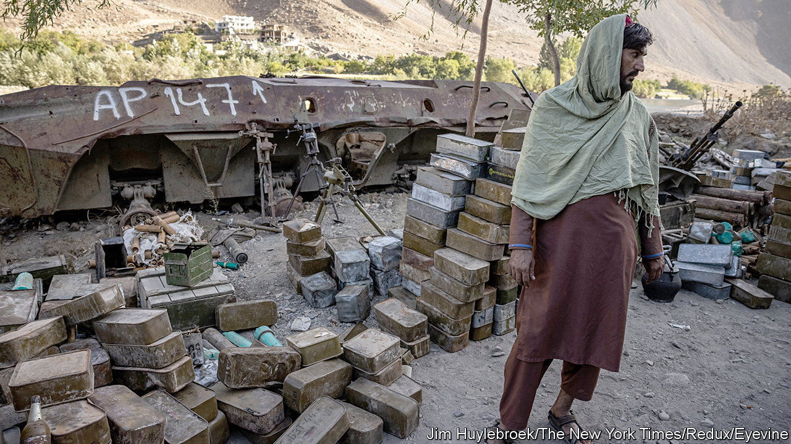

###### Indomitable valley

# Resistance to the Taliban resumes in north-eastern Afghanistan 

##### Unless the regime becomes more inclusive, unrest may spread 

 

> Jun 30th 2022 

Along the walls of a building used by the government in Bazarak in Afghanistan’s Panjshir valley, battered pick-ups are stacked on top of each other, awaiting repairs. The beige Ford trucks were once driven by the Afghan army. Now they belong to the Taliban fighters who took power last year. Some look as if they have merely had a prang on a mountain road. Others are full of bullet holes and mangled by explosions. 

Panjshir valley, a 90-minute drive north of Kabul, the capital, has a history of military resistance. A famed guerrilla leader, Ahmad Shah Massoud, used the mountains to defy Soviet invaders in the 1980s. In the 1990s he held the Taliban’s first coming at bay. Mr Massoud was assassinated by al-Qaeda two days before the 9/11 attacks in 2001. But his deputies fought in the Northern Alliance that defeated the Taliban later that year, with American help. Afterwards Panjshiris were rewarded with plum jobs in the new government.

Last summer, although fighters in Panjshir vowed to stage a last stand against the Taliban, the valley was swiftly captured. Yet recent weeks have seen a surge in reports of attacks by an anti-Taliban outfit that calls itself the National Resistance Front (nrf), led by Massoud’s son, who is also called Ahmad.

Fighting flared in early May in some of the valley’s most remote districts. The official Taliban line is that six of their own fighters and 13 from the nrf died in attacks on convoys and checkpoints. Privately officials admit that the toll on the Taliban was in the low dozens. Since then, fresh attacks have occurred on a near-daily basis, even though the Taliban sent thousands more fighters into the valley to regain control. Officials put the number of reinforcements as high as 10,000. The fighting happens deep in the mountains, and Afghan journalists say the Taliban have prevented them from reporting freely in the valley. 

The Taliban say they retain a firm grip on the area. They play down reports of fighting and claim the nrf amounts to little more than a bunch of social-media blowhards based abroad. Yet the bullet-riddled pick-ups lined up against the wall in Bazarak and the trickle of casualties from remote districts suggest otherwise.

Both Amnesty and Human Rights Watch, two watchdogs, have accused the Taliban of abusing local civilians as they try to root out the nrf. Villagers have faced collective punishment and arbitrary detention. There are reports of extrajudicial killings. In the early days of the Taliban’s takeover last year, many residents fled the valley for the relative safety of Kabul. The exodus has resumed in recent weeks. 

In an interview with in May Qudratullah Panjshiri, the Taliban-appointed governor, denied that there had been abuses. He downplayed the intensity of the fighting, arguing that the Taliban’s decision to have locals like him run the province was reducing bloodshed: “People from Panjshir do not want to fight against each other.” In June he was removed from his post and replaced by a commander from the Taliban’s southern heartland.

The nrf may struggle to spark wider resistance. Mr Massoud lacks the foreign backing and international supply-lines that made his father so formidable. Afghans are weary of war; Afghanistan’s neighbours are also reluctant to see it descend into civil strife once more. American intelligence officers predict that Taliban forces will maintain control for now.

Yet since taking power the Taliban have had to contend first with terrorist attacks carried out by the local branch of Islamic State and now with the insurgency of the nrf. Towards the end of June there was fighting in the northern province of Sar-i-Pul when the Taliban moved to crush a dissident commander from the Hazara ethnic minority. All this belies the group’s claim to have banished war and brought harmony. It is a reminder that their emirate is not inclusive, but controlled by a narrow faction in both regional and ideological terms. Unless others are invited to share power, unrest may not remain confined to remote valleys. ■

