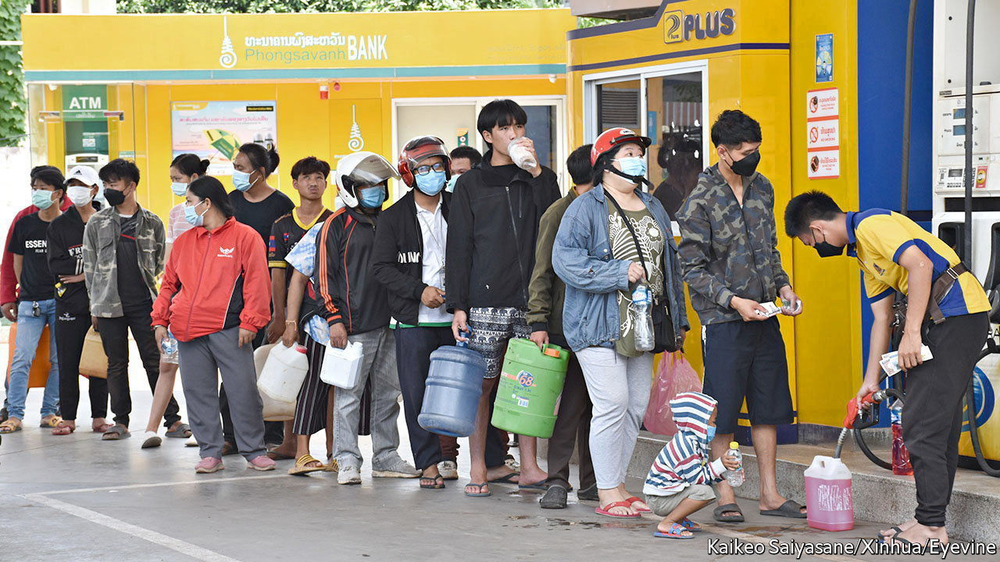
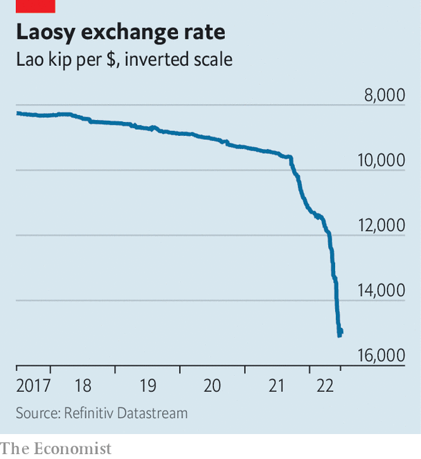

###### On the edge

# Will Laos default on its debt? 

##### The country’s finances are in trouble, but it may yet turn the corner 

 

> Jun 30th 2022 

Every day, a queue snakes out of the Ministry of Foreign Affairs in Vientiane, Laos’s capital. It is formed of Laotians hoping to apply for passports so that they can travel to neighbouring Thailand to work. But even those who obtain papers may not be able to make the trip. The Lao kip has lost 36% of its value against the dollar over the past year (see chart). Petrol is hard to find and increasingly unaffordable. Over the past six weeks Laotians have had to queue for hours to fill their tanks. 

The images call to mind Sri Lanka, which defaulted on its debt in May and whose  from shortages of fuel, food and medicine. This week the government there said that, until at least July 10th, it would supply fuel only to vehicles delivering essential services.

 


The situation in Laos does not look as catastrophic. But many of the same conditions that plunged Sri Lanka into turmoil are present. The economy was already suffering from the absence of tourists, who stayed away during the pandemic. Soaring oil prices caused by Russia’s invasion of Ukraine and exacerbated by the decline in the kip make it harder to afford fuel, all of which is imported. The price of petrol increased by more than 80% in the year to May; imported foods such as cooking oil and instant noodles were 19% more expensive in April than the year before.

Another parallel with Sri Lanka is bad policy. To finance grand infrastructure projects the government, run by the Lao People’s Revolutionary Party since 1975, has over the past decade amassed debts totalling $14.5bn or 88% of gdp, nearly half of which is owed to China. It is hard to see how it will make annual payments of $1.3bn that will come due over the next three years: it collects just twice that in revenue each year and had foreign-currency reserves worth around the same amount in December, enough for a mere two months of imports. In June Moody’s, a credit-rating agency, downgraded Laos, warning that it was likely to default.

Public rage (mostly aired online) seems to have spurred the party to act. In June it reshuffled the cabinet, replacing two deputy prime ministers and the commerce minister, as well as the central-bank governor. A new team imposed capital controls, banning money changers from serving organisations and capping transactions with individuals at around $1,000. 

The measures seem to have had some effect. The kip has stabilised in recent days, probably owing to the capital controls, reckons Heron Lim of Moody’s Analytics. Queues at petrol stations have disappeared, says an observer in Vientiane. 

Laotians have other reasons to take heart. Unlike Sri Lanka, the country has not lost access to international capital markets, issuing a tranche of bonds to the Thai market in April. In May the borders reopened, which should revive the moribund tourism industry and will allow Laotians to resume work abroad, boosting remittances. A new railway line to China has spurred trade, despite the pandemic. 

All that will encourage creditors. The government is cagey about talks, but analysts think it has a good chance of renegotiating its debt, particularly with China. “I don’t think China will let Laos default,” says Nishizawa Toshiro of the University of Tokyo, who advised the government between 2018 and 2020. Unlike Sri Lanka, Laos may yet pull back from the brink. ■

