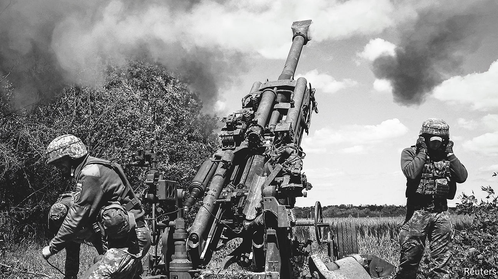
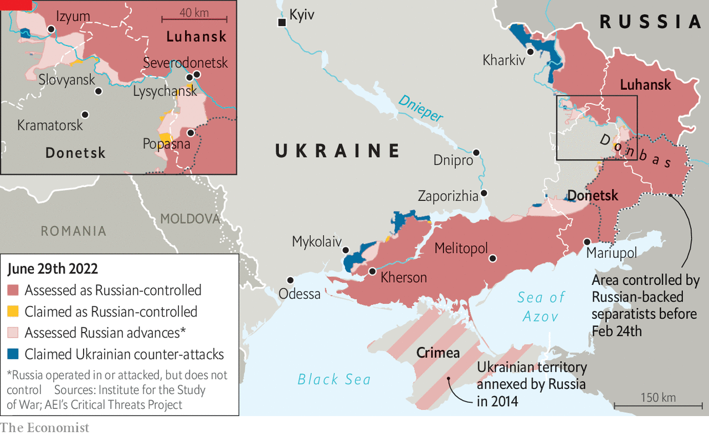
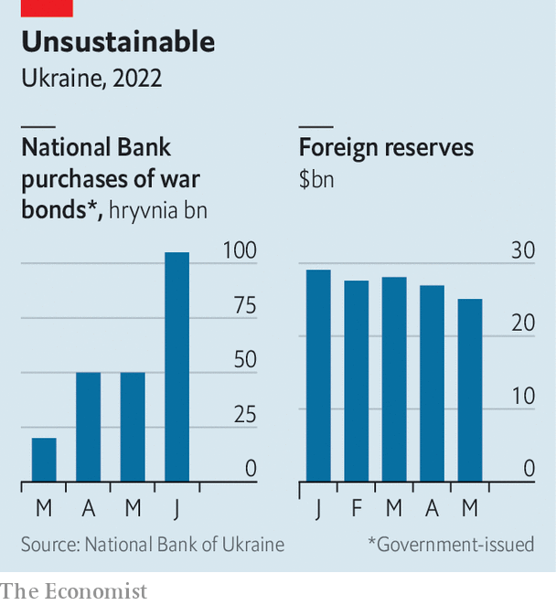

###### The long war

# Does a protracted conflict favour Russia or Ukraine? 

##### Ukraine is counting on its Western allies; Vladimir Putin is counting on them to lose heart 

 

> Jun 30th 2022 

The typical war is short. Since 1815, the median duration of wars between states has been just over three months, calculates Paul Poast of the University of Chicago. In 2003 America toppled the government of Iraq in just 20 days. The conflict that Armenia and Azerbaijan fought over the territory of Nagorno-Karabakh in 2020 was over in 44. Yet Russia’s invasion of Ukraine has entered its fifth month, and shows no sign of drawing to a close. “I am afraid that we need to steel ourselves for a long war,” wrote Boris Johnson, Britain’s prime minister, in mid-June. Jens Stoltenberg, nato’s secretary-general, echoed his warning: “We must prepare for the fact that it could take years.”

In the early days of the invasion the West worried that Ukrainian forces would be swiftly overwhelmed by Russia’s superior firepower and resistance would collapse. Now the fears are different: that Ukraine has not adjusted its strategy enough to fight a sustained war of attrition; that it will run out of soldiers and munitions; that months of pummelling will cause its economy to collapse; that the will to fight may ebb as the going gets even tougher. Russia, too, is subject to many of the same pressures, with the conflict chewing up its young men, sapping its economy and accelerating its descent into dictatorship. A protracted conflict will also test the resolve of Ukraine’s Western allies, as the price of food and energy soars, inflation riles voters and Ukraine’s requests for weapons and cash escalate. A long war, in short, will test both sides in new ways. Whether it favours Russia or Ukraine depends in large part on how the West responds.

Start on the battlefield. Russia’s army is making headway, albeit slowly. Ukrainian forces have been ordered to withdraw from the town of Severodonetsk, putting Russia within spitting distance of controlling all of Luhansk province, one of two that together form the Donbas region. Slovyansk, in the north-east of Donetsk, the other province in Donbas, is also under attack (see map).

 


Ukraine’s forces, outgunned and until recently largely outranged in artillery, have been mauled. The government says they are suffering as many as 200 casualties a day. On June 15th a Ukrainian general said that the army had lost 1,300 armoured vehicles, 400 tanks and 700 artillery systems, far more than previously thought. Many of Ukraine’s most experienced and best-trained units have been destroyed, leaving greener reservists to take their place. On June 19th British defence intelligence said there had been desertions among Ukrainian troops.

Yet this does not mean Russia will sweep through Donbas. Its advance has been slow, grinding and costly, enabled only by massive, indiscriminate bombardments. New recruits are getting just a few days of training before being thrown into battle, according to the bbc’s Russian service. Morale is low: British intelligence points to “armed stand-offs between officers and their troops”. It has taken more than two months to capture Severodonetsk, and Slovyansk and next-door Kramatorsk are better fortified. 

Russia still has plenty of munitions and equipment, says Richard Connolly, an expert on the country’s economy and defence industry. Russian arms factories are said to be working double or triple shifts, he notes. Russia also has large stockpiles of old tanks to draw on. Over time, shortages will bite, but they are more likely to lead to the deployment of outmoded or poorly maintained weapons than to a total drought, Mr Connolly believes. 

Men, not machines

Manpower is a bigger problem. Vladimir Putin, Russia’s president, has refused to call up conscripts and reservists . Instead of a general mobilisation, says Michael Kofman of cna, a think-tank, his army is creating new reserve battalions by signing up new recruits. But finding enough of them is difficult: the government has had to offer lavish pay, of almost three times the median wage. The injured and bereaved have been promised generous settlements, too. The Duma, Russia’s parliament, recently lifted the maximum age to join the army from 40 to 65. The authorities are trying to lure recently retired soldiers back into service. 

In an effort to create battle-ready forces much faster than usual, the newly enlisted are being mashed together with serving officers who have not yet deployed and residual equipment from existing brigades, Mr Kofman notes. But generating new units in this way amounts to “selling off the family silver”, says a Western official. The officers and equipment assigned to them would normally be used to train new soldiers or to relieve battle-worn troops. Russia is, in effect, cannibalising its own forces, Mr Kofman says, which will reduce “the overall sustainability of the war effort”.

Russia’s shortage of well-trained troops is one reason its advance in Donbas has been glacial. Ukraine, despite a smaller population, has a larger supply of eager recruits. Training them remains a bottleneck, but that could be overcome with a little help: on June 17th Mr Johnson proposed a scheme whereby Britain would train as many as 10,000 soldiers every 120 days.

Ukraine is also receiving ever more sophisticated Western weaponry. To begin with, it sought chiefly short-range, portable anti-tank and anti-aircraft missiles to fend off advancing armoured columns and marauding helicopters. More recently, however, America, Britain and others have been supplying modern artillery and rockets, which will be much more useful in any counter-attacks. On June 23rd Ukraine’s defence minister said that American himars rocket launchers, with gps-guided munitions, had begun to arrive.

Indeed, some Ukrainian officials, including Volodymyr Zelensky, the president, argue that if Western help arrives on a sufficient scale, Ukraine may be able to win the war before winter sets in. A military intelligence officer says that Ukraine’s best window for a counter-offensive will come in late October, when its stock of Western arms should be peaking. “We need the enemy to feel the full force of the weaponry,” he says. There is talk of pushing Russia back to its positions at the start of the war, and then negotiating a peace deal from a position of strength.

But this optimism glosses over several yawning pitfalls. For one thing, Ukraine’s forces have used most of their munitions and, without the domestic manufacturing capacity to replenish them, are now completely reliant on foreign benefactors. The recent fighting has centred on long, heavy artillery barrages that consume vast amounts of ammunition. Russia, which has huge stocks, is thought to be blasting away so indiscriminately that America’s entire annual production would be enough to keep its guns firing for only two weeks, observes Alex Vershinin, a retired us Army officer. Even though Ukraine has been trying to ration its consumption, nato countries may struggle to keep it adequately supplied with shells.

What is more, Ukraine’s backers have already handed over a big share of their stocks of certain weapons. The 7,000 Javelin anti-tank missiles America has provided, for instance, are thought to amount to about a third of its total inventory. Western armies do not want to let their own supplies run too low; in fact, many of them are hoping to add to them in light of .

Although America and Europe, with vastly larger economies than Russia, could eventually gear up to produce whatever Ukraine needs, their output of shells and missiles will not double overnight. America produces only 2,100 Javelins a year. Mr Vershinin notes that the number of American small-arms plants has shrunk from five during the Vietnam war to one today.

Maintaining all the fancy nato kit is also hard. America and Germany taught Ukrainian soldiers to use their howitzers in a couple of weeks, but learning how to fix them is another matter. The use of artillery pieces is so intense that many have already broken down and have been sent to Poland for repair. This problem will grow as complex weapons like himars arrive and Ukraine gradually moves from Soviet hardware to weapons provided by nato.

Perhaps most important is how Ukraine deploys its new arsenal. Many of the weapons that it is getting were designed in the cold war to face down precisely the adversary that Ukraine now faces in Donbas: a Soviet-style army using heavy firepower. The worry in some Western countries is that Ukraine will try to match Russia gun for gun, and so blaze through its ammunition at a prodigious rate. “If you want to use himars as an area weapon,” warned Ben Wallace, Britain’s defence secretary, on June 29th, “you’ll be running out of ammunition in 12 hours.”

The aim is to encourage Ukraine to use rocket launchers and other long-range systems in line with their original purpose of fighting a “deep battle”: hitting important Russian targets, such as command posts and railway hubs, many kilometres behind the front lines. There is evidence that Ukraine is indeed making a concerted effort to strike deep inside Donbas. Mr Wallace says that five ammunition dumps have recently been blown up, along with a number of Russian headquarters. 

This offers a path, if not to outright victory, then at least to a standoff that imposes severe costs on Russia. Western officials doubt that Ukraine will be able to take back all the land it has lost since the invasion began. After all, the war has shown how much easier it is to defend than attack, and Russian forces are well dug in. But if Ukraine can be kept supplied with arms and ammunition and uses its new firepower judiciously, it could recapture pockets of territory, sow chaos in Russia’s rear and inflict unsustainable losses in terms of men and materiel on a Russian army that is stretched thin along a huge front.

It is not just weapons that Ukraine will need to pursue such a strategy, however; the government is also desperately short of money. The war has smashed its economy: the central bank and the imf reckon that output could shrink by more than a third this year—a blow on a par with the Depression in America in the 1930s. More optimistic analyses hold that it is the occupied regions that are most afflicted, and that activity elsewhere has recovered somewhat after a plunge in March, with the current year-on-year contraction amounting to perhaps 15%. 

 


Either way, Ukraine’s public finances have been upended. The government has had to spend lavishly not only on the armed forces, but also to provide humanitarian assistance to the injured, unemployed and displaced—even as it has cut taxes to succour the limping economy. The result is a deficit of about $5bn a month.

Under the circumstances, investors are naturally reluctant to lend to Ukraine. Tax rises would be counterproductive, given the atrophy of the economy. The government is trying to cut some spending: it recently curbed unemployment benefits, for example. The West has pledged lots of aid, but it is not arriving fast enough to balance the books. So the government has been reduced to printing money. The central bank has been purchasing government bonds since the invasion began, at an ever accelerating pace (see chart). At the same time it is burning through its foreign reserves in an effort to stabilise the hryvnia. Inflation, already 18%, is rising. Should the West allow the government’s finances to spiral out of control or the economy to cease to function, the military outlook would inevitably darken, too.

Bearing up

Russia looks in much better economic shape, by contrast. After a brief wobble brought on by fierce Western sanctions, the rouble has recovered. Fears of a bank run have receded. Although Western firms have pulled out as much of the $300bn or so they have invested in local outlets and factories as they can, and many educated Russians have fled the country, most forecasters expect a relatively manageable contraction this year, thanks in part to heavy government spending. Mr Putin frequently insists that the sanctions hurt the West more than they do Russia.

In fact, sanctions are taking a toll, largely by depriving the economy of crucial imports. Car production is down by more than 80% from its pre-invasion level—a reflection, in part, of the difficulty that manufacturers have obtaining parts from abroad, but also of declining consumer demand. In May dealers sold just 26 Porsches in Russia, 95% fewer than the year before. Output of lifts has fallen by half, pointing to a slump in big construction projects.

The shortage of critical components is a worry for Russia’s generals, too. “We have reports from Ukrainians that when they find Russian military equipment on the ground, it’s filled with semiconductors that they took out of dishwashers and refrigerators”, Gina Raimondo, America’s commerce secretary, told Congress in May. Although some Russian firms do make computer chips, and are trying to boost output, their wares are more expensive and less sophisticated than imported ones.

But relatively few munitions factories seem to be affected so far, Mr Connolly notes, perhaps because Russian defence firms tend to hoard important parts, a hangover from Soviet central planning. What is more, Western sanctions are not watertight and, thanks to its oil revenues, Russia has plenty of money to spend subverting them. The government has been seeking alternative supply chains for some time. A new paper from rusi, a think-tank in Britain, points to “myriad companies based around the world, including in the Czech Republic, Serbia, Armenia, Kazakhstan, Turkey, India and China, who will take considerable risks to meet Russian supply requirements”. China has signalled willingness to supply spare parts to Russian aircraft firms.

Indeed, Mr Putin appears confident that time and money are on his side. Even if Russia’s forces fail to advance rapidly, they have succeeded in blockading Ukraine’s ports, contributing to the strangulation of its economy. And although neither the Russian public nor the elite was eager for war, Mr Putin’s ruthless security forces and energetic propagandists have kept dissent to a minimum. It helps that most of the army’s new recruits—and casualties—appear to come from small towns in poorer provinces, meaning that Russia’s big cities have been shielded from the worst effects of the war. 

But the lengths to which Mr Putin has gone to avoid a general mobilisation suggest that he is not confident that Russians are willing to put up with a long and bloody war. By the same token, the economic optimism currently displayed by businessmen and the broader population could also evaporate as the longer-term costs of the war, Western sanctions and emigration start to sink in. 

Many in Ukraine fear that Russia may resort to more ruthless tactics if the war drags on too long for Mr Putin’s comfort. It could, for instance, target the power grid and heating facilities as winter approaches—a move that would impose an enormous humanitarian cost on the general population. Ukrainians seem to be steeling themselves for such privations, however. Data from Rating, a polling agency, show that well over half of them now believe the war will last at least six months, up from 10% in a sample taken in early March. Nonetheless, fully 93% of respondents say Ukraine will prevail in the end, with varying degrees of confidence. “Ukraine has started to believe in itself,” says Alexei Antipovich, Rating’s boss. 

Ukrainians remain firmly against the idea of negotiations with Russia, with the mood against compromise shifting decisively following the reporting of Russian atrocities in the second half of March. They fear a repeat of the Minsk accords, the French- and German-brokered peace deals that drew new lines in Ukrainian sand but never satiated Russian appetites. Ukraine does not believe the Kremlin will stop at anything other than complete surrender. “We either win or we lose,” says Oleh Zhdanov, a former operational officer at Ukraine’s General Staff.

Ukraine’s allies may not take such a black-and-white view of things. Indeed, Mr Putin may find them easier to dishearten than Ukrainians. By  through the main pipeline from Russia to Germany, he recently signalled that he is willing to take Europe’s economy hostage to advance his war aims). Soaring gas prices and economically crippling shortages over the winter would almost certainly induce some European governments to lean on Ukraine to accept an imperfect truce.

Several European countries, most notably Germany, were painfully slow to start giving Ukraine heavy weapons. Many are still reluctant to describe their goal in sending arms as helping Ukraine to “win” the war. There is certainly no unanimity within nato about how to define victory. The longer the war goes on, and the higher the cost in terms of punishing energy prices and decelerating economies, the more reluctant Ukraine’s allies will become to provide endless weapons and cash. Mr Putin, for one, seems to be counting on the West’s resolve to crumble. ■


