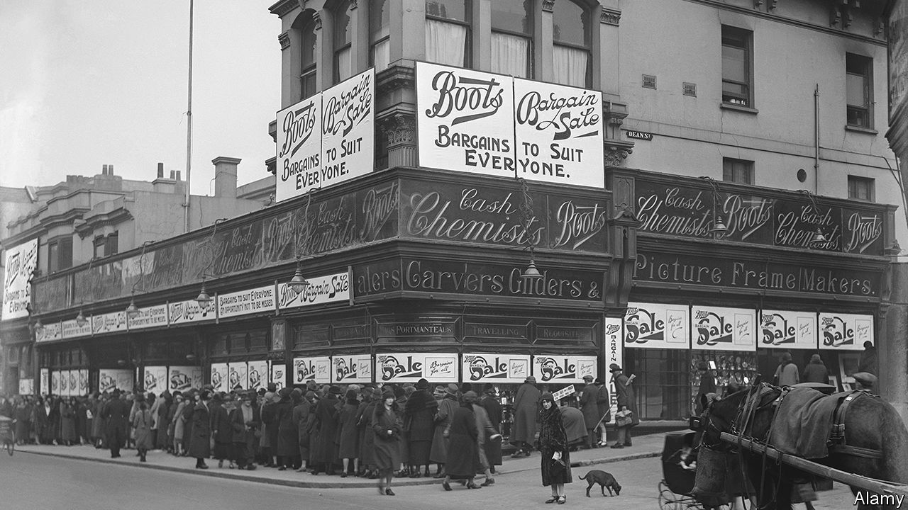

###### Off the counter

# Boots is an iconic British brand that no one really wants 

##### Walgreens Boots Alliance cannot find a buyer for the pharmacist 

 

> Jun 30th 2022 

Boots is a staple of the British high street. The retailer-cum-pharmacist is ubiquitous and trusted. Its cursive logo is immune to the fads of corporate design. Tracing its origins to a single herbal-remedies shop that opened in Nottingham in 1849, Boots has grown to employ a corps of more than 51,000 workers and reckons that 85% of the British population is within ten minutes’ drive of one of its shops. But ubiquity matters less in a world of online shopping, and as events of recent weeks have shown, its allure to potential buyers has dwindled.

Since 2014 the business has been controlled by Walgreens Boots Alliance (wba), a lumbering parent company whose flagship asset is Walgreens, an American pharmacist. In January wba began a “strategic review” of the Boots business, which is management-speak for putting up “for sale” signs. Private-equity houses lined up to take a look. An alliance comprising Apollo Global Management, an American private-equity firm, and Reliance Industries, a conglomerate run by Mukesh Ambani, an Indian billionaire, emerged as the front-runner. But in the end the tills never rang. wba concluded the review on June 28th by letting investors know both how hard it tried to sell the business and how excited it is to own Boots. 

Boots is no stranger to masters of the universe. As the global economy edged towards the financial crisis of 2007-09, Alliance Boots, as it was then known, became the first member of the ftse 100 index of large British firms to be bought by a private-equity firm. Its hard-charging new owner, kkr, completed its exit from the business in 2016, more than tripling investors’ money.

Potential buyers today were unconvinced this was a repeatable trick. Rising interest rates and falling company valuations have put pressure on the classic private-equity playbook. The piles of debt used to execute leveraged buy-outs—and to amplify returns—are increasingly difficult to raise. Banks worry about their ability to sell junk debt to the capital markets, where investors now demand a much higher return. Other tricks are off the table, too; the firm’s stores are largely leasehold, removing the option of a sale-and-leaseback transaction to raise cash. 

Without financial wizardry, growth has to come from old-school retailing—in other words, from buying and selling things. During the sales process, there were rumours of a grand strategy for international growth, possibly by taking the brand to India under the aegis of Mr Ambani. But management would be better off focusing their attention on the British high street, where the roots of Boots run far deeper. 

A high-street proxy for the National Health Service (the chain delivered more than 2m flu vaccinations last winter), the pharmacy is a powerful part of the brand’s resilience: people come in with a cold and depart with a sandwich. The Advantage Card, its loyalty scheme, has 14.6m active users and is a window on the soul of the British consumer. Data insights ought to be useful in rationalising the firm’s network of stores, closing unprofitable ones and pepping up those that pay their way. E-commerce revenues recently surpassed 15%. No7 Beauty Company, seen as the crown jewel in Boots’s own-brand offering, is another source of growth. 

The problem is that taking full advantage of these assets requires patience, attention and significant investment. Boots is deprived on all these counts. It is dwarfed by Walgreens. wba is turning inward and focusing on its core American operations. Conditions for buy-outs are likely to keep deteriorating. Boots may be waiting some time for the right shopkeeper to come along. ■

