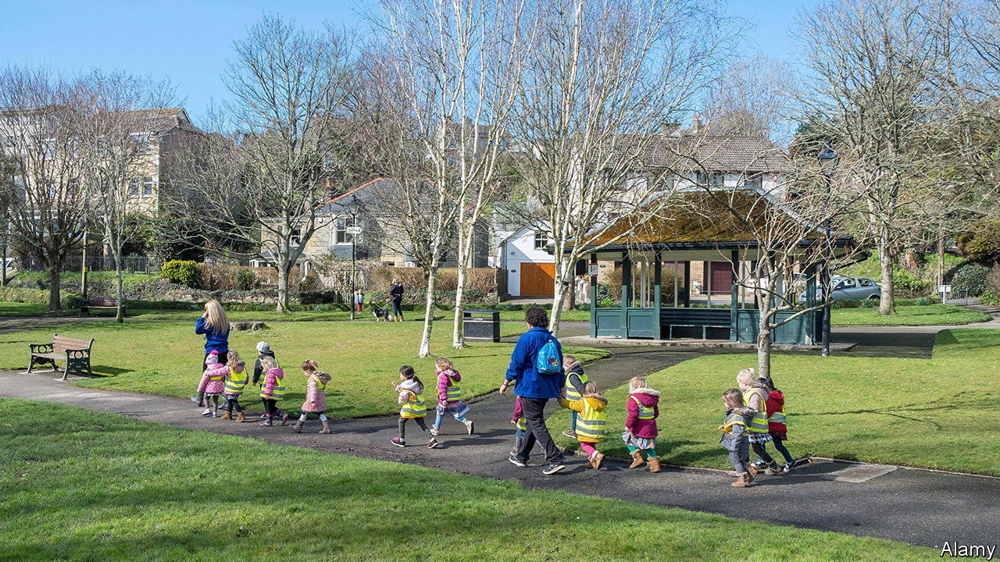
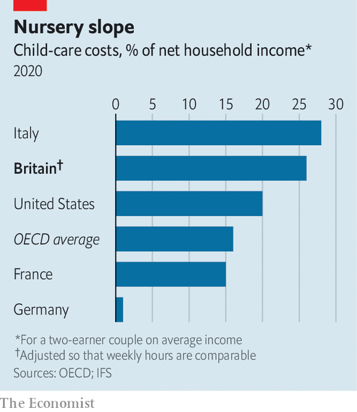

###### Britain’s growth crisis

# British child care is expensive 

##### Making it more affordable would help some mothers into paid work 

 

> Jun 30th 2022 

From the age of five, Alison Mbekeani dreamed of becoming a scientist. Following that dream took her to the University of Liverpool’s School of Tropical Medicine, then to Sierra Leone amid the Ebola outbreak in 2014, then to Durham University for her PhD. But becoming a mother to two children put a brake on her career. A couple of spots at nursery cost about as much as she was earning—more once she factored in travel costs. She does not expect to return to the lab until her children are 16.

Dr Mbekeani is not alone. One survey in 2019 found that child-care responsibilities led 29% of mothers with a child under 14 to reduce their working hours, compared with just 5% of fathers. That greatly damages their earnings. A recent report from the Institute for Fiscal Studies (ifs), a think-tank, found that in the ten years following the birth of their first child, mothers’ average hourly wage fell from 98% of average male earnings to 83%. In a recent interview with Mumsnet, a parenting website, Boris Johnson said that better access to child care “would have a massive benefit for the economy”. Would it?

In an ideal world, the government would not have to worry about any of this. Based on their preferences and potential earnings, parents would make a rational judgment over whether to outsource child care or keep it in-house; it might make sense for them to borrow to cover short-term costs, for instance. The question for policymakers is how much parental behaviour does reflect actual preferences and how much it is driven by constraints. 

 


If preferences are pulling women away from work, then government intervention to subsidise child care could just end up helping richer parents who would have paid anyway. Some data point in this direction. Three- and four-year-olds are eligible for 15 hours of state-funded child care, as well as another 15 hours when their parents work full-time. But around half of toddlers do not use their full entitlement. Despite nursery costs that are around 60% higher than in the oecd, a club of mostly rich countries (see chart), employment rates for British mothers with children under 15 are in the middle of the pack. This suggests that mothers who really want to work are finding a way to do so. 

But there is also plenty of evidence that constraints are an issue. Three in five non-working mothers say that they would prefer to work, given the right child care. Families had to fork out an average of £260 ($320) a week in 2021 for 50 hours of nursery care for a child under two, according to a survey by Coram Family and Childcare, a charity. A tenth of households with a child under five report difficulty meeting such costs. Borrowing to cover child-care bills is a nice idea in theory, but uncertainty over their future earnings puts many people off. As well as price, availability is a problem. Just 68% of local authorities in England report having enough child-care provision to serve parents who work full time. 

And the benefits that could flow from evening out the gender imbalance in child care could be pretty large. The latest data suggest that the employment rate for mothers with dependent children is around 18 percentage points lower than that for fathers. Compared with other countries, Britain has a relatively high share of mothers in part-time work. One recent study estimated the gains from shuffling men and women according to aptitude, pulling productive women into work and kicking unproductive men out. Astonishingly, it calculated that Britain’s average output per worker could be as much as 30% higher.

Cheaper child care could help growth, in other words, but policies would need to be well-designed to target genuinely constrained parents and to stop costs spiralling out of control. Generous German arrangements do not come cheap. Mr Johnson has thus far been focusing on regulatory barriers to becoming a childminder and on child-to-carer ratios. Yet deregulation may have only a marginal effect, and points to another problem. Christine Farquharson of the ifs says that helping mums into work requires child care that is flexible and offers long hours. But giving children the best start in life means shorter, structured days full of interaction. ■

