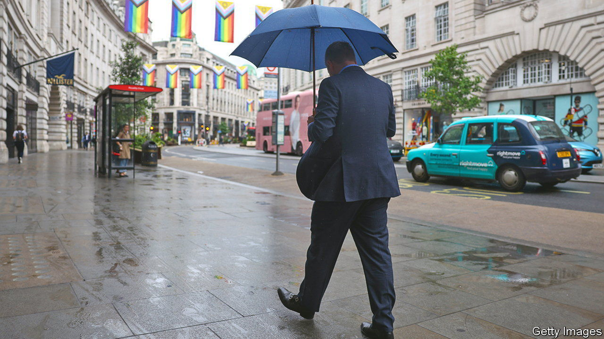
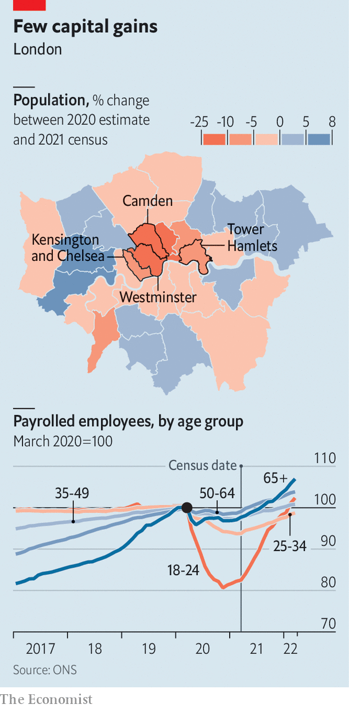

###### The 2021 census

# Inner London’s population is much lower than expected 

##### Since money follows people, that is a problem 

 

> Jun 30th 2022 

For almost as long as Britain has been conducting population censuses, people have objected to the results. “I do not believe one word of what is said about the increase of the population,” argued William Cobbett, a pamphleteer, in 1822, two decades after the first one. In the 1950s women were said to falsify their ages, lingering too long in their 20s. Manchester complained about the undercounting of its population in 2001. 

On June 28th the Office for National Statistics (ons) released the first estimates from the 2021 census of England and Wales. As expected, the population was bigger, reaching 59.6m, and older. But local authorities in London quickly complained that their populations had been undercounted. They launched a campaign on behalf of the “lost Londoners”. 

The city is used to growing quickly. Between 2001 and 2011 it added more people than any other region of England, both absolutely (gaining 851,000 people) and proportionately. Between 2011 and 2021 London is estimated to have added a more modest 626,000 people. In percentage terms it grew more slowly than East or South-West England. Three inner-London boroughs—Kensington and Chelsea, Westminster and Camden—lost people. 

 


The losses seem far more drastic when set against previous figures. In June 2021 the ons estimated that Camden had a population of 280,000 in 2020. The census found a mere 210,000 people there. Even boroughs that grew rapidly over the ten-year period, such as Tower Hamlets, are thought to have many fewer people than previous estimates suggested (see map). Other cities such as Manchester and Liverpool also undershot previous estimates, but less dramatically. 

The capital stands to lose financially unless the figures are quickly revised upwards. London’s authorities estimated in 2021 that £6.5bn ($7.9bn) in grant funding from central government was tied to population levels, either directly or indirectly. The city also looks much less deserving of infrastructure investment if its population is no longer exploding. By contrast, growing cities such as Leeds and Leicester look needier than before. 

The disappearance of so many Londoners seems to have several causes. Possibly previous estimates were wrong. London’s number-crunchers said before the census that the number of children in some boroughs had been overestimated. The census could have missed people: response rates are usually low in London. 

Almost certainly, the count was unfortunately timed. A lockdown was in effect on March 21st last year, when the census was conducted. Many commuters were working from home, starving retail and hospitality firms of custom. As a result, lots of Londoners—but especially young adults—lost their jobs (see chart). Immigrants may have gone home. Others probably returned to their parents’ digs: wealthy commuter areas like Wokingham, in Berkshire, seem to have gained population. 

That trend has largely reversed. Employment in London has recovered, as have rents, suggesting that young people have returned. But some of the disappeared may not come back. The number of 60- to 64-year-olds tallied by census-takers in Westminster is 19% lower than the 2020 estimate. The pandemic could have accelerated the drift out of London by wealthy people on the cusp of retirement. 

Londoners are unlikely to get a sympathetic hearing from the Conservative government, which regards the capital as hostile territory. In May even Westminster Council, long a Tory redoubt, fell to Labour. Residents in the capital may end up looking ruefully at cities in Scotland; the government there sensibly decided to delay the census for a year. ■

