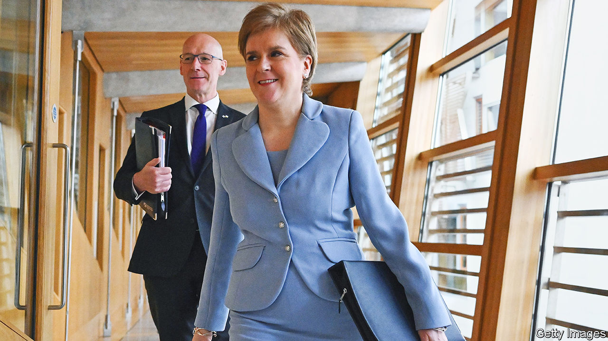

###### The neverendum

# Nicola Sturgeon sets a date for another referendum on Scottish independence 

##### The real winner is Boris Johnson 

 

> Jun 29th 2022 

On june 29th Nicola Sturgeon, Scotland’s first minister, declared that a new independence referendum would take place on October 19th 2023. Boris Johnson’s chances in the next general election have been boosted. . 

In September 2014 Scots voted against independence in a ballot sanctioned by the British government. Since then Ms Sturgeon, who leads the Scottish National Party (snp), has : first autumn 2018, then by May 2021. Both dates passed unmarked. The latest almost certainly will, too. 

The obstacle is the Scotland Act, the law that underpins the Scottish Parliament. It stipulates that the union of England and Scotland of 1707 is a matter reserved for the Westminster Parliament alone. That, the British government holds, means that no referendum can take place without Westminster’s consent.

Ms Sturgeon is under intense pressure from her party to hold a vote. But she has long insisted that any ballot must be legally sound if it is to avoid being a vanity exercise. So the Scottish government has asked the Supreme Court to rule whether holding a ballot next year would be within the Scottish Parliament’s powers.

Constitutional experts say that is a grey area. Ms Sturgeon’s proposed referendum would be consultative, rather than “self-executing”, and so it would not automatically change the constitution. But the Supreme Court has taken a rather limited view of the Scottish Parliament’s remit and emphasised the primacy of Westminster. That would make a ruling in favour of the devolved government a surprise. 

Ms Sturgeon anticipates as much. In her speech to the Scottish Parliament this week, she said that a judgment against holding the referendum would prove that the idea of Britain as a “voluntary union of nations is a fiction”. Her response would be to make the next general election, due in 2024, a “de facto” referendum on independence. An snp victory in Scotland would then, she argues, be a mandate to start negotiations on secession with the British government. (What happens if the British government disagrees, she did not say.)

This is not a breakthrough for the nationalist cause but a recognition that the British constitution is stacked against it. It is also a sign of Ms Sturgeon’s internal weakness. The snp has for years told nationalist voters that its electoral success will force the British government to grant a referendum. Ms Sturgeon’s claim that an election would serve as a “de facto” referendum, and itself constitute a mandate for independence, is a concession to hardliners in her party who have claimed that any “ballot-box event” would do the job. That is a mistake for a party that spent years trying to make independence seem less reckless to Scottish voters, says Blair McDougall, a pro-union strategist. 

Nor does the gambit place meaningful pressure on Mr Johnson. Independence is not wanted by the Conservative Party’s voters, members, mps or donors. Supporters of an independent Scotland are irrelevant to the Tories’ electoral coalition. Mr Johnson can legitimately argue his opposition to a referendum is constitutionally sound; the law grants him the right to decide. He can also argue that since Scots last voted on the question only eight years ago, and polls show few have since changed their mind or want a second referendum soon, saying “no” is democratically defensible. And Mr Johnson is hardly unusual in being a prime minister reluctant to aid the dissolution of his own country.

Indeed, the threat of Scottish independence is an asset. Mr Johnson will not have much to crow about in the next election: inflation is high and public services are straining. But since the ballot in 2014 the Conservative Party has done well on both sides of the border by declaring that only it will defend the union, and that a vote for Labour risks a coalition with the snp, a second referendum and the end of Britain. That charge is overcooked: Labour says it will not do deals on independence with the snp. But Ms Sturgeon has given the argument fresh resonance. The prime minister could not ask for a more helpful foe. ■


