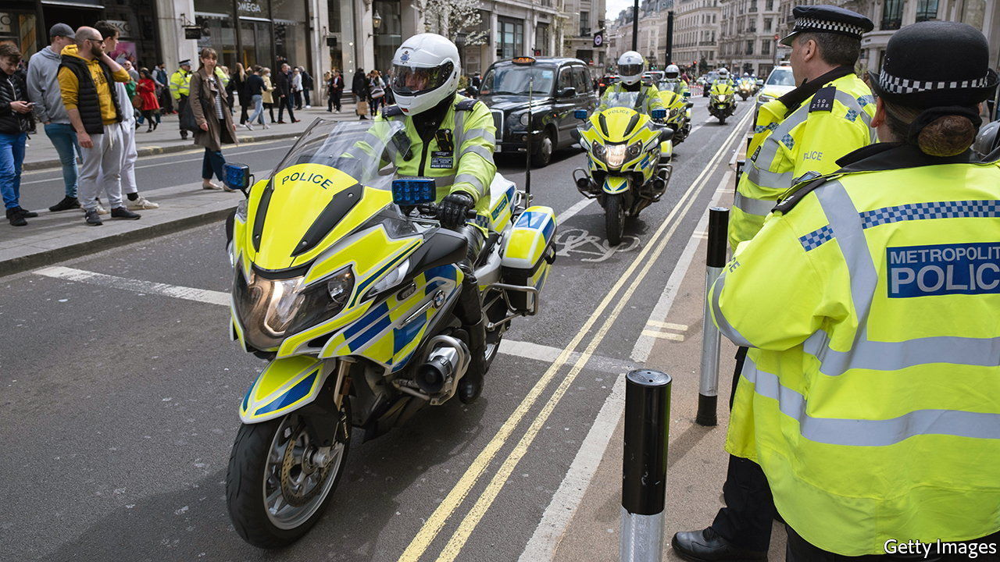
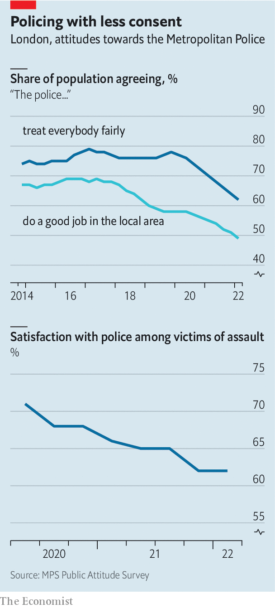

###### Ill Met

# The Metropolitan Police is put into special measures 

##### London’s police force suffers another blow 

 

> Jun 30th 2022 

 


The reputation of London’s Metropolitan Police Service was further damaged this week. The Met has been buffeted by scandal after scandal, most shockingly the murder in 2021 of Sarah Everard by a serving police officer. It has lacked a permanent commissioner since Dame Cressida Dick was forced to step down in April. On June 28th it emerged that Her Majesty’s Inspectorate of Constabulary and Fire &amp; Rescue Services, a policing watchdog, had put Britain’s largest police force into special measures. That means the Met is now subject to heightened scrutiny and must produce a remedial plan to tackle a litany of failings. Underlying this downward spiral is a steady loss of confidence in the force, among Londoners as a whole and among victims of crime (see charts). Whoever is chosen, the new commissioner has a very big job ahead of them. 

