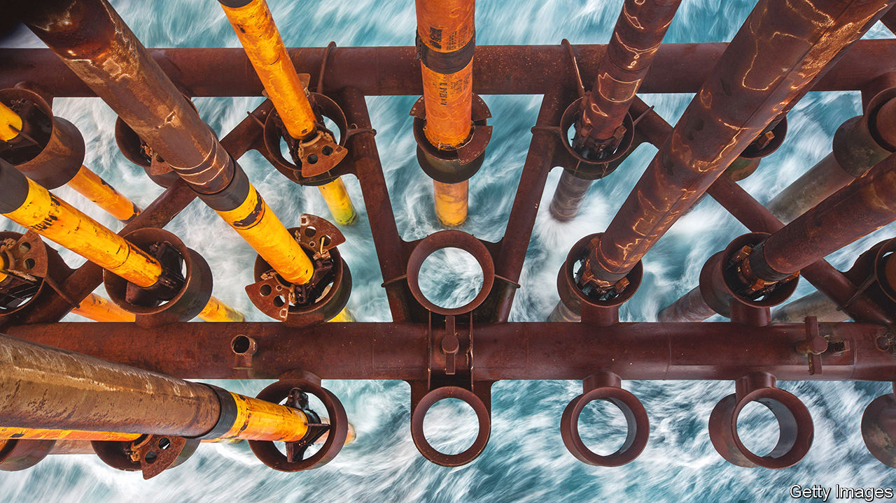
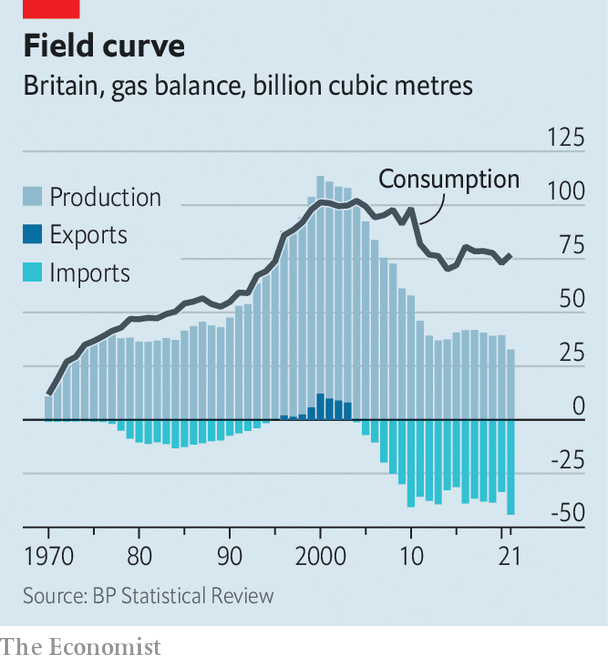

###### Under the deep green sea

# The North Sea has fuelled Britain for 50 years. What next? 

##### Its long-term future is as a high-tech carbon dump 

 

> Jun 30th 2022 

As you walk north along Scotstown beach, you might not notice the gas flare, flickering behind 20-foot sand dunes. You will definitely not see the pipelines buried beneath your feet. The energy passing through them every 30 minutes or so is equivalent to that released by the atom bomb dropped on Hiroshima. It flows in the form of natural gas, enough each day to fill 25,000 Olympic swimming pools, through a tangle of piping, tanks and valves that comprises the St Fergus gas terminal. Perched behind the dunes on Scotland’s easternmost shore, St Fergus processes some 20% of Britain’s gas every year. Its razor-wire fences are patrolled by police from the Ministry of Defence. 

St Fergus is part of a vast infrastructure which has been built beside, into and under the North Sea over the past 50 years. Oil and gas drawn up from beneath the sea floor powers cars and heats homes; about 80% of the gas used in Britain comes from these offshore fields (a big chunk of it from the Norwegian part of the sea). 

Reconciling the production of fossil fuels with the government’s climate-change commitments has long been a problem: on June 29th the Committee on Climate Change said in its annual report to Parliament that the target of reducing North Sea emissions by 50% by 2030, compared with a 2018 baseline, is too low. The war in Ukraine has made things even thornier, by shoving energy security and rising gas bills up the agenda. The North Sea must now pull off an unlikely hat-trick: achieving decarbonisation, muting the cost-of-living crisis and securing supply. 

To see how it might do so, look to the first North Sea project to be given the go-ahead since the invasion of Ukraine. On June 1st the government approved plans by Shell, a giant energy company, to develop the Jackdaw gasfield some 270km (168 miles) off the coast from St Fergus. The gas is due to start flowing by 2025. 

 


Kwasi Kwarteng, the business secretary, celebrated the new project, saying he wanted “to source more of the gas we need from British waters to protect energy security”. Britain’s demand for gas is declining slowly (see chart) but is projected to remain well above domestic production; extracting more from the North Sea gives the government greater control over supply. (Gas matters more to the government’s goals than North Sea oil, which is dirtier and dearer than imports of the black stuff.)

Domestic production also creates jobs in Britain and generates revenue for the Treasury. The go-ahead on Jackdaw came just six days after the government announced an “Energy Profits Levy”, better known as a windfall tax, which imposes a 25% surcharge on extraordinary profits being made by the oil-and-gas sector. The £5bn ($6.1bn, or 0.2% of gdp) in extra receipts that the government expects to generate will help pay for schemes to assist households with sky-high energy bills. 

An investment allowance built into the levy means energy companies save 91p in tax for every £1 they now invest in the North Sea. This is a nice fillip for Shell’s Jackdaw plans, which were already in place, but less helpful for other North Sea energy firms that have either already made investments or have no spending plans to bring forward. Many complain that the windfall tax will create uncertainty and end up stifling investment. 

This tension, between funding cost-of-living interventions and encouraging domestic energy supply, is dwarfed by another—the conflict between extracting oil and gas from the North Sea and meeting a legal requirement for Britain to hit net-zero carbon emissions by 2050. The government says it will run all new projects through a “climate checkpoint” to ensure that their emissions are suitably low. 

In general a unit of North Sea gas can already be supplied with far lower carbon emissions than a unit shipped in from abroad. But new fields may need to be powered by renewable electricity, rather than dirtier fuels as is the norm today. Natural-gas leaks, which create 25 times as much warming as carbon dioxide over a 100-year period, will be less tolerated. 

But the route to a much lower carbon future requires more than such tweaks. Shell’s plans for Jackdaw are instructive. Its gas will come ashore at St Fergus. Some of it will be sent to a new gas-fired power station being planned in Peterhead by sse, a Scottish utility, and Equinor, Norway’s state-owned energy company. The plant, which is to be online by 2026, will include a capability to capture the carbon dioxide that is emitted when gas is burned. 

This captured CO would be compressed and piped back to St Fergus, to a carbon-capture-and-storage facility Shell is building there. Shell would then send it back out to sea, to a depleted gasfield called Goldeneye, through the old pipeline which was left in place when the field was decommissioned in 2021. After injecting the CO underground Shell would have reduced the emissions associated with Jackdaw’s gas to almost zero. Electrifying operations at the extraction wellhead would take it the rest of the way, yielding a gas-to-carbon life cycle which emits little-to-no CO, helps energy security and raises revenue. 

The Goldeneye field would not be limited to storing carbon that had been captured nearby. Carbon transport networks would allow Shell to sink CO from all over Britain. Ships could carry in carbon from around the world, if the price was right. In time the plan is for facilities at St Fergus to use renewable energy to break natural gas down into molecules of carbon dioxide and hydrogen, sending the CO straight back to the seabed and piping the hydrogen on to industrial users. 

Similar gas-to-carbon loops are under construction or consideration at Teeside and Humber, around the gas terminal at Bacton in Norwich, and at Liverpool Bay. The North Sea Transition Authority, formerly the Oil and Gas Authority, has issued six licences for storing carbon. The North Sea has some two-thirds of known, available carbon-storage sites in Europe. 

It is true that carbon capture and storage has not been proved at such a large scale. Regulation, subsidies or carbon pricing are the only ways to make these new technologies economically viable. Many people will mistrust the very same companies whose emissions are the cause of climate change. But if the fields which have helped to fuel Britain for 50 years can become a store for carbon molecules, the North Sea can remain central to the country’s energy needs for decades to come. ■


