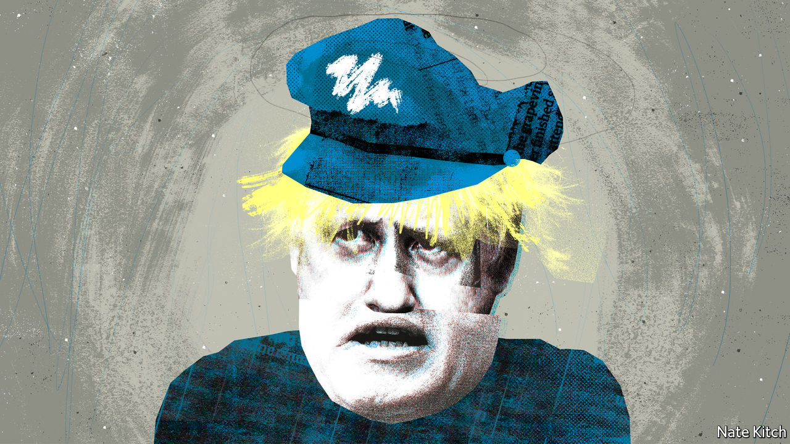

###### Bagehot

# The parallels between Boris Johnson and Jeremy Corbyn 

##### How the Conservatives became Corbynites 

 

> Jun 30th 2022 

Switch the names, change a few dates and squint a little, and the potted biographies of Boris Johnson and Jeremy Corbyn look very similar. After bohemian childhoods in the English countryside and stints at private schools, each makes his home in Islington, cycles a lot and marries thrice (to a much younger spouse on the third occasion). A career in politics is spent on the fringes of their respective parties, communicating with their most loyal fans via columns in the  (for Mr Johnson) and the  (for Mr Corbyn). 

Then, abruptly, each finds himself thrust into the leadership by party members frustrated about their wishes being ignored. In the case of Labour’s selectocracy, the desire was for unashamed socialism. Their Conservative cousins yearned for a proper Brexit. As leaders, both are written off by commentators and rivals alike before enjoying a surprise triumph in an election. In the 2017 general election Mr Corbyn was expected to be steamrollered by Theresa May, Mr Johnson’s predecessor as prime minister; instead the Conservatives lost their majority. Two years later Mr Johnson did pulverise Mr Corbyn, winning the Conservatives’ largest majority since the days of Margaret Thatcher. 

If Mr Johnson’s ascent has been oddly similar to Mr Corbyn’s rise, so too may be his demise. James Johnson (no relation), a pollster who worked for Mrs May, argues Mr Johnson is the Conservative Corbyn: an unpopular leader, dragging towards defeat a party that is split between those deluded enough to support him and those too impotent to stop him. The problems that beset Labour during the Corbyn years are now swallowing the Conservatives.

It starts with the manner of their elections to the leadership. Just like Mr Corbyn, Mr Johnson is not a creature of the parliamentary party. Mr Corbyn derived his authority from Labour members. In 2016 he lost a confidence vote among his mps, yet shamelessly stayed on. Mr Johnson claims his legitimacy from the 14m people who voted Conservative at the election in 2019. The fact that 41% of Conservative mps opposed him in a confidence vote in June can therefore be dismissed. That creates a surreal situation in which two-thirds of the House of Commons would rather the prime minister was gone. Constitutionally, it is a mess. But Mr Johnson cares little about such disorder. 

Delusion has sunk in among Mr Johnson’s remaining acolytes. In the wake of two dire by-election defeats on June 23rd, Tory flunkeys were reduced to arguing that the Conservatives won more votes across both seats, akin to a relegated football manager pointing out his team’s sturdy goal difference. Such derangement has echoes of Labour figures in 2019 who, in the wake of their worst result since 1935, claimed that the party had “won the argument”. 

The ineptitude of his internal enemies was the main reason Mr Corbyn stayed in power. When a leadership challenge was launched Mr Corbyn’s opponents alighted on Owen Smith, then the mp for Pontypridd, as a candidate. His most notable moment in the campaign came when he accidentally implied he had a 29-inch penis. He lost. Mr Johnson is similarly blessed when it comes to his enemies. Conservative plotters lumbered into a poorly timed leadership contest at the start of June, a few weeks before Mr Johnson’s electoral popularity was found badly wanting in the by-elections. Organising another crack at him will take time.

In each case, some mps stay loyal because they have no prospects under another leader. Some of the 2019 intake of Conservative mps are lucky to be employed, never mind in Parliament. Mr Corbyn introduced the world to Richard Burgon, an mp whose hidden talents remained just that during a brief foray onto the front bench. Nadine Dorries, the culture secretary and Mr Johnson’s staunchest ally, may be the most successful novelist in cabinet since Disraeli, but the comparisons end there. 

Mr Corbyn and Mr Johnson also share an ability to drive opponents to near insanity. Mr Johnson seems sometimes to be regarded as the first politician ever to tell fibs in office, when he is just the latest to do so. When home secretary, for example, Mrs May launched a salvo at the concept of human rights after someone could not be deported “because—and I am not making this up—he had a pet cat”. (Reader, she was making it up.) Likewise, Mr Corbyn threw out a range of often reasonable, if offbeat, policies such as increased provision of free school meals or free broadband, which generated disproportionately angry reactions. Rage at their faults blinded opponents to the qualities of both men; it is impossible to understand an enemy if you cannot appreciate his appeal. 

Jeremy Johnson

Yet the critics are also right to be furious. Mr Corbyn did, eventually, lead his party to electoral destruction. The Labour leader was, notoriously, the dimmest member of the party’s left-wing rump, with noxious views on everything from anti-Semitism to Russia. Voters sniffed that out. Likewise, Mr Johnson is manifestly unsuited to the job of prime minister. Brexit, which Mr Johnson did more than any other politician to bring about, has been a slow-moving disaster, throttling the British economy just as its critics warned. 

Such vindication, however, is worth little on its own. And as any Labour mp can confirm, changing leader—even an unpopular one—does not solve everything. Under his aegis Mr Corbyn’s critics argued the party would be 20 points ahead of the then wobbling Conservatives with any other leader. It is now three years since Mr Corbyn stepped down as leader. Despite the backdrop of an unpopular prime minister, police investigations into Downing Street and rocketing inflation, Labour cannot even sustain a double-digit lead in the polls. Allies of Sir Keir Starmer, Mr Corbyn’s successor as party leader, blame “long Corbyn” for this slack performance. At the dispatch box Mr Johnson brings up Mr Corbyn whenever he can. When the time comes, Labour will happily repay the favour. Long Boris may linger, too. ■


