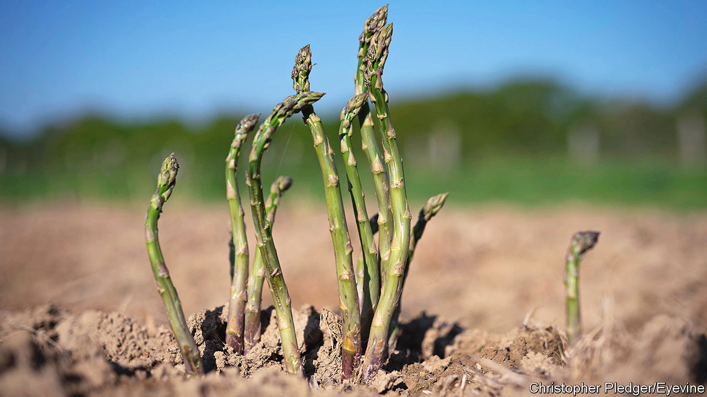

###### Getting picky

# Which vegetable is the easiest for a robot to pick? 

##### The answer has been trundling across a British field 

 

> Jun 30th 2022 

Asparagus is a very odd vegetable. Part treat, part triffid, in its pomp it can grow up to 2cm (0.8 inches) in an hour. Cut a field one afternoon, return the next morning, and with almost sinister speed it will be back. It is minimalist, too. Whereas other vegetables spend time producing accessories such as foliage, asparagus grows as single spears: an army of Excaliburs emerging from the soil. These things make asparagus strange. They also make it superbly suited to robotic pickers. 

In late June a small white object slowly makes its way along a field of asparagus in Gloucestershire. When it passes over a group of spears it pauses, whirrs then clunks: the asparagus has been sliced. This robot—a prototype called Sprout that is being developed by a London startup called Muddy Machines—is unprepossessing. It will not prompt bucolic poets to write odes to it, or painters to capture it resting by a hay wain. It is more fridge on wheels than Ex Machina android. However John Chinn, Britain’s largest asparagus producer, regards it with enthusiasm. For him, he says, it could be “fantastic”. 

The world is suffering from a shortage of seasonal workers. Those tides of toilers which for centuries have ebbed and flowed across countries with the seasons, bending and crouching and picking and sorting, were weakened by the pandemic. Last summer Mr Chinn needed 1,300 workers. He got around 800. Trying to find labour is, for a farmer, “the thing that stops you sleeping”. The shortage of workers is particularly acute in Britain, where Brexit has been spoiling harvests as well as growth. In Sussex peas rotted in fields; in Cornwall daffodils wilted where they grew. 

In Gloucestershire, Mr Chinn started up his tractor. To everything in farming there is a season: a time to plant and, if you are an English farmer post-Brexit, a time to fasten a chain to the back of your vehicle and plough the crop that you have grown for the past year back into the field. The process, appositely enough, is called “harrowing” and it was, says Mr Chinn, “devastating”. A time to weep. 

Now, it is a time to innovate. Mr Chinn is inadvertently fortunate in his crop. Moravec’s paradox states that computers find things simple that humans find hard—and vice versa. Differential calculus? Not a problem. Differentiating between a ripe strawberry and a stone? Really hard.

Harvesting is especially ripe for robotic puzzlement. Leaves confuse them; bumps baffle them; colour stymies them. In 2015 Joe Jones, a roboticist whose inventions include the Roomba, a vacuum cleaner, was considering new areas to explore, and started to make a list of which crops a robot might be able to pick most easily. He considered different variables that “would make it easy for a robot to handle” such as squidginess, colour and foliage, then scored each crop out of 12. Aubergine was bottom (it’s delicate, for one thing, and foliage gets in the way). “And what crop,” he wrote on his blog, “came out on top?”

In the fields of Gloucestershire, the answer. Sprout crawls forward; pauses. Another whirr, whoosh, clunk. It is a prototype, but Mr Chinn is optimistic. His dream would be to see a herd of 100 in his fields next year. He needs them. The stress is now so bad that “If we can’t find a solution we’ll all give up soon.” A time to plant. And a time to stop even bothering. ■

