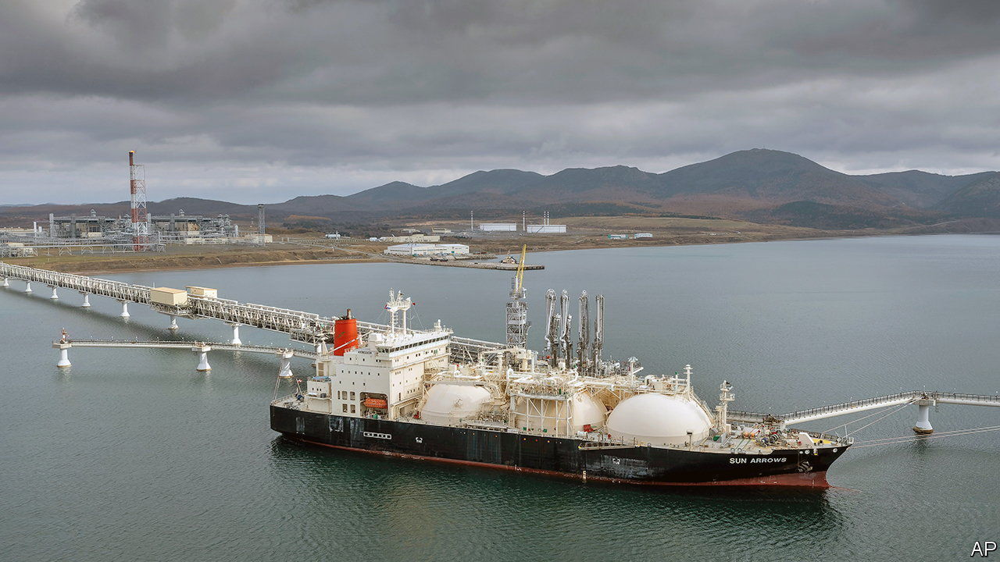

###### The Sakhalin exception

# Japanese energy firms cling on to their Russian assets 

##### That puts them in line with Japan’s government but at odds with the West 

 

> Jun 30th 2022 

The island of Sakhalin, pinned between Japan and Russia just north of Hokkaido and to the west of the Kamchatka Peninsula, has historically been the site of conflict between the two north Asian neighbours. Today, as the home of two massive fossil-fuel projects, it symbolises an uneasy Russo-Japanese peace—and, ever since Russia invaded Ukraine in February, a sore point in relations between Japan and its Western allies. 

The two projects, Sakhalin-I and Sakhalin-II, lured energy firms from America, Britain and India, as well as Japan and Russia. Shortly after Vladimir Putin’s tanks rolled into Ukraine, however, ExxonMobil, an American giant, pledged to divest its 30% stake in Sakhalin-I and Shell, a British rival, said it would offload its 27.5% stake in Sakhalin-II.

Not the Japanese. Sakhalin Oil and Gas Development Company, a public-private partnership, will hold on to 30% of the oil-producing Sakhalin-I; two big trading houses, Mitsui and Mitsubishi, will keep their 12.5% and 10%, respectively, of Sakhalin-II, which pumps out liquefied natural gas (lng). The government in Tokyo has no problem with that. In May the economy minister, Hagiuda Koichi, declared that the Japanese shareholders wouldn’t leave even if asked to by the Russian government. 

Japan’s approach seems out of character. In other instances the country’s position with respect to Russia has mirrored those of America and Europe. In June the Japan Bank for International Co-operation, a state-owned lender, extended its freeze, introduced in March, on project financing of Russian natural-gas projects in the Arctic. Private-sector financial firms have cut links with their Russian counterparties. Exports to Russia of high-performance machine tools, quantum computers, 3d printers and other items have been blocked by Japanese sanctions.

Why, then, stay in Sakhalin? For one thing, this avoids the pickle that the projects’ Western partners now find themselves in. Selling their stakes is easier said than done. ExxonMobil took a $3.4bn write-down related to the project in the first quarter and Shell took a $1.6bn charge. The war limits the number of potential buyers, mostly to state-run firms from countries which are neutral or friendly towards Russia, such as Sinopec, China’s state energy giant, or ongc Videsh, the international arm of India’s Oil and Natural Gas Corporation (which already owns 20% of Sakhalin-I). As forced sellers, ExxonMobil and Shell have a weak negotiating hand, which the Chinese and the Indians would be only too happy to exploit.

Japan’s government dislikes the prospect of disposing of the Japanese assets in such a fire sale. It is particularly loth to hand one of the world’s largest and most advanced gas projects over to a Chinese competitor for a song. And unlike ExxonMobil’s and Shell’s investments, which followed a purely commercial logic that Western sanctions and the reputational risk of remaining in Russia have severely undercut, it worries about energy security. 

Archipelagic Japan has no pipelines or electricity grids linking it to other countries. It is the world’s second-biggest importer of lng. Around 9% of its supply comes from Russia, and the bulk of that is produced in Sakhalin. This year between 50% and 69% of Sakhalin-II’s monthly gas output has headed for Japan, according to Kpler, a data firm. “When the cold light of day sets in you have to think about what impact you are having on Russia versus what impact you are having on yourself,” sums up Yuriy Humber of Japan nrg, an energy-research firm in Tokyo.

Similar considerations are being aired in Germany, which gets more than half its gas from Russia. But the German government does want to reduce its reliance on Russian oil and gas, the sale of which is bankrolling the campaign against Ukraine. Japan’s prime minister, Kishida Fumio, has talked faintly about joining a Western embargo on Russian oil and has been silent on Russian gas. To Western ears, that silence sounds increasingly deafening. ■


