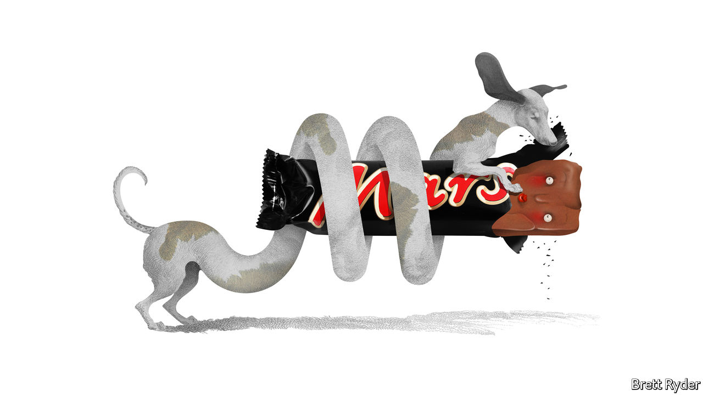

###### Schumpeter

# Mars Inc gets the purpose v profit balance right 

##### Showy corporations should learn from the low-key, family-owned mammal-feeder 

 

> Jun 30th 2022 

The spiritual home of Mars Inc is Slough, an unprepossessing town somewhere under the flight path to London’s Heathrow Airport. It is not a place that sweet dreams are made of. It serves as the British backdrop for Ricky Gervais’s “The Office”. It is also the place where Forrest Mars, in the Depression of the 1930s, came up with two business ideas and a management philosophy that are still quietly shaping the world today.

The creation story of the Mars Bar is well known. In 1920s Chicago, Forrest Sr, as he is now remembered, met his estranged father, a struggling chocolatier, over a malted milk, and came up with the brainwave of pouring malted milk chocolate as filling into a candy bar. Thus was the Milky Way born. But Forrest Sr, as irascible as he was enterprising, fell out with his father, left America and ended up in Slough. There, he rechristened the Milky Way as the Mars Bar. At a time when people needed calories at low cost, it took off. With brands like m&amp;ms, Mars, based since 1974 in McLean, Virginia, is now the world’s biggest confectioner. 

Less familiar is the origin of the dark horse of the Mars empire, pet food. In Slough, Forrest Sr noticed the Brits’ obsession with dogs. He did not like the way they ate scraps off the table. So in 1935 he bought a company that made Chappie, a tinned dog food. Today Mars reckons it caters to half the world’s pets. Royal Canin, maker of a fancy dog chow, is its biggest brand. It is one of the largest providers of veterinary care. On June 22nd the company announced that Poul Weihrauch, head of pet care, would take over from Grant Reid, its retiring ceo. Mr Weihrauch’s elevation partly reflects the growing importance of the pet business, which now generates 58% of sales, overtaking snacks (38%). Food accounts for the rest. 

The family-owned company, though fiercely private about its finances, also updated its sales figures. They showed that since Mr Reid took office in 2014, revenues have increased by more than 50%, to $45bn. That makes them bigger than Coca-Cola’s. The firm gives credit for its success to the austere business practices Forrest Sr honed in Slough, now known internally as the Five Principles: quality, responsibility, mutuality, efficiency and freedom. They may sound like managerial guff. But they strike the right balance between making money and doing good. Many more showy corporations aim for that under the trendy slogan of “stakeholder capitalism”. Few carry it off as convincingly as Mars.

To understand why, first consider the relationship between the company and its only shareholders, the family—a dynasty worth about $96bn, according to magazine. The fourth generation, known as g4, runs the board. Like shareholders everywhere, they have varying priorities, ranging from sustainability to the welfare of “associates” (Martian for employees). Yet their mandate for steering the firm puts top-tier financial performance and long-term growth on a par with positive social impact and trust. 

The shareholders reap less than a tenth of profits as dividends. That frees Mars to plough the rest back into its business, letting it keep a strong balance-sheet and a staunchly independent streak. They lead low-key lives. That fits with Mars’s egalitarian ethos and preference for privacy. They also retain some of Forrest Sr’s eccentricities. A former board member recalls factory visits with family members where everyone tried mouthfuls of canned dog food in order to check its quality. “It’s like pâté. You get used to it,” he says. The practice continues—though “we don’t come into work every day and chomp away,” a current executive insists. 

Next there is the firm itself. It has been professionally run since 2001. People who know Mars say the clan does not meddle much, provided managers do not threaten to blow up the firm’s—and hence the family’s—reputation. Delegation of responsibility runs deep. Mars has a relatively flat management structure, in which bosses have no cushy perks such as personal parking spaces. Associates are given responsibility, even at a young age, to make big decisions. If they take a calculated business risk that goes wrong, so be it. If they behave unethically there is zero tolerance.

In business, the firm is competitive but not cut-throat, rivals say. It used to be notable mostly for a strong factory culture, operational efficiencies and returns measured in relation to its physical assets. But this is changing as the veterinary-services business has grown. Now it plays up the more intangible parts of the business. “If you meet a Mars guy, they will talk about brands and people all the time,” a rival executive says admiringly, noting its high pay and good employee-retention rates. 

As for stakeholderism, or what Mars calls mutuality, it says it puts the interests of customers, workers, suppliers, communities and the environment alongside those of the family shareholders. That comes with some big investments, such as $1bn to support sustainable initiatives such as renewable energy, and a policy of paying its taxes in full. But when it talks about these publicly, it is mostly because they are germane to its business. It does not wade into political debates, nor does it pontificate on every social issue.

What about the future? With low debt, lots of cash and products resilient to economic turbulence, Mars is in a strong position to expand further. Some of its competitors, such as Kellogg, a food company, are flogging parts of their business. Mars bought Wrigley, a maker of chewing gum, during the financial crisis in 2008—not its finest acquisition, to be sure, but one it has stuck with. It may snap up more during today’s inflationary turmoil. 

Willy Wonka moment 

It won’t discuss strategy, however. Though the family is more open about its commitments to society, it keeps business matters tightly under wraps. That legacy, which also dates back to Forrest Sr, may start to change. In 2020 Mars opened the Slough factory to tv cameras for the first time. Its chocolate-makers were, anticlimactically, locals in hairnets, not Oompa Loompas. But at least some of the secrets of Snickers’ nougat filling were revealed. ■


