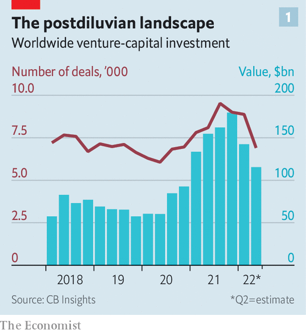
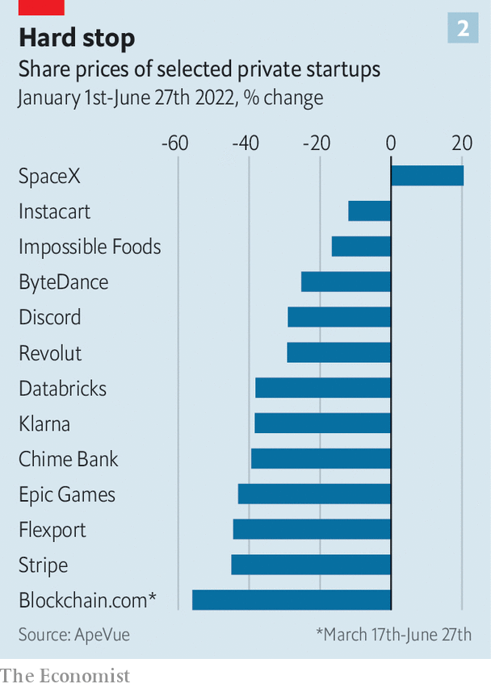
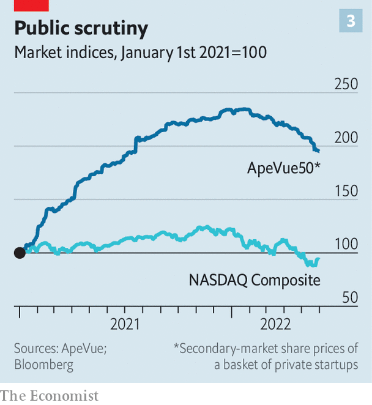
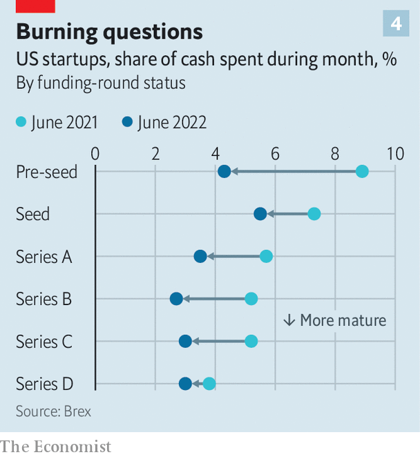
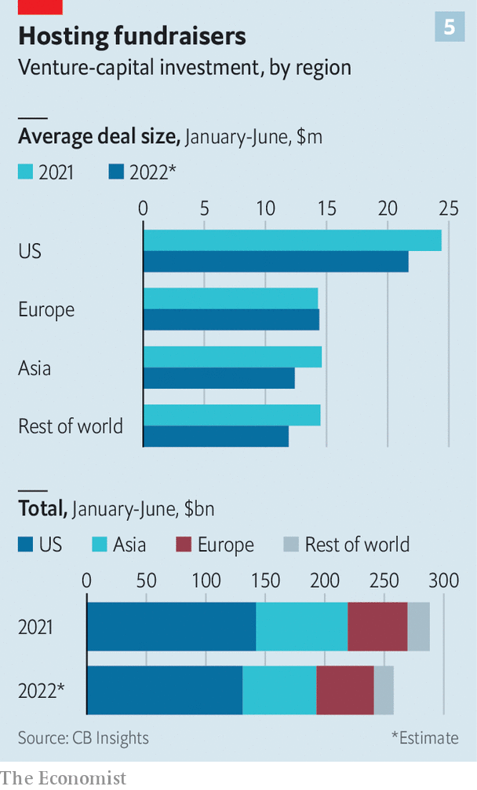

###### After the feast, the fast

# The great Silicon Valley shake-out 

##### We look at the world’s startups and identify the safe, the uneasy and the doomed 

 

> Jun 28th 2022 

On a busy street in downtown San Francisco sit the former headquarters of Fast, a maker of check-out software for online merchants. The offices look quiet; a for-let sign hangs above one of the windows. That is a departure from its management’s flashy habits. Last year at an event announcing Tampa as its East Coast hub, the firm splurged on backflipping jet-ski riders and pickup trucks straight from the nascar race track. Fast had set investors’ pulses racing, too. It raised $125m between 2019 and 2021, including from some of Silicon Valley’s most astute venture capitalists at firms like Kleiner Perkins and Index Ventures. Then, in April, having burned through its cash and being starved of fresh capital, Fast went bust. 

Fast’s demise is a sign of that the years-long startup boom is going through a sharp correction. Soaring inflation, supply-chain chaos and the war in Ukraine are causing a wave of uncertainty to wash over the global economy. It is buffeting young tech firms particularly hard as the present value of their profits, most of which lie far in the future, are being eroded by rising interest rates. “It’s like a stun grenade has hit the market,” says one Silicon Valley veteran. And the shock is rippling through the venture-capital (vc) industry, which tries to identify and nurture the next Google. 

The startup slump is only just beginning to run its course. Investors are warning their portfolio companies to keep enough money in the bank to last until 2025. Many firms will fail to do this and go the way of Fast. Others will hang on. Some may even prosper, as founders learn to go easy on the fripperies and to double down on their core business. When the dust settles, the global startup scene will look different, and possibly healthier. 

The looming lean period comes after several fat years in vc-dom. Non-traditional investors piled into speculative startups: venture arms of large companies from Salesforce to ExxonMobil, New York hedge funds such as Coatue and Tiger Global, Wall Street buy-out barons and other “tourists”, as they are derisively known in vc’s Silicon Valley heartland. New tech hubs mushroomed around the world, from Beijing to Bangalore. 

No year was fatter than 2021. According to cb Insights, a research firm, global tech startups raised $621bn in 2021. That is twice as much as the year before and ten times more than in 2012. Then the music stopped. First to feel it were publicly traded firms. The tech-heavy nasdaq Composite index has fallen by 30% from its peak last November. PitchBook, a data provider, reckons that more than 140 vc-backed firms that went public in America since 2020 have market capitalisations lower than the total amount of venture funding they raised over their lifetimes. Faraday Future, an American maker of electric cars that had raised more than $3bn, is now worth just $710m. Grab, a Singapore-based super-app, raised $14bn before its going public at a valuation of $40bn. Today its market value is $10bn. 

 


The techno beatlessness is now spreading to the private markets. Fundraising has slowed sharply compared with the second half of 2021. Between March and May the number of funding rounds was down by 7% in America, compared with the same period last year, according to PitchBook. In Asia it declined by 11% and in Europe by 19%. Things are almost certainly worse than those numbers suggest. A delay in reporting means they lag behind the reality on the ground by a few months. vc investors say that hardly any deals are being inked these days. Fewer startups are also “exiting”, vc lingo for being listed or sold on to other investors. 

Investors’ reticence is having an effect on valuations in private markets. Such drops usually only come to light during private funding rounds or public listings, when a firm raises capital in exchange for equity, or when a company changes hands. Less fundraising and fewer exits makes this harder to assess. 

 


ApeVue, a data provider, offers a hint of what is happening by tracking share prices in the secondary markets, where shares of private firms can be bought and sold. An equally weighted index of the 50 most-traded startups has declined by 17% since its peak in January. Using ApeVue’s data,  estimates that a basket of 12 big startups worth $1trn at the start of this year is now worth about $750bn. That list includes Stripe, a fintech star, which has seen its secondary-market share price collapse by 45% since January, and ByteDance, TikTok’s Chinese parent company, the shares of which trade at a quarter below their value six months ago. 

Secondary-market valuations of private firms have not yet dropped as far as public ones. ApeVue’s index is down by about ten percentage points less than the nasdaq composite so far this year. Comparing private firms with listed rivals reveals the same pattern. The share price of Impossible Foods, a private purveyor of meatless meat, has fallen by 17% since January, while that of Beyond Meat, a listed competitor, has slid by 61%. 

 


This could mean that startup valuations are more robust than market capitalisations of listed firms. Alternatively, they could have further to fall. The ultimate test will be the number of “down rounds”, where firms raise new capital at a lower valuation than before. Founders dislike these more than secondary-market dips. Down rounds are a more definitive indication of falling value. They also hurt the morale of employees, who are often compensated for their grinding hours with stock options. And they irk vc firms forced to mark down the value of their investments, which is not something that their limited partners want to hear. 

Only a few down rounds have been publicly reported. Last month, for example, the  reported that Klarna, a Swedish fintech firm, was seeking fresh funds at a valuation two-thirds lower than its previous round a year ago. In March Instacart, a grocery-delivery firm, took the even more unusual step of valuing itself down from $39bn in March last year to $24bn, without raising fresh capital.

When the rain stops

Most investors do not expect a spate of down rounds in the near term. That is partly because last year’s flood of capital has left lots of firms with healthy bank balances. Consider the 70-odd biggest startups selling business software. According to Brex, a provider of corporate-banking services to startups, mature firms in this sector are burning through cash at the average rate of $500,000 or so per month. At that pace, all but three of the 70 raised enough money in their last financing round to cover them into 2025. Even at a burn rate of $4m a month, more than half would have enough to tide them over for three years, before factoring in cash remaining from previous financing rounds and any profits they may have made.

 


To avoid having to raise capital in a rush at a depressed valuation, founders are busy trimming the fat. “Last year one dollar of growth was all the same, whether it cost 90 cents or $1.5 to acquire it,” says Hilary Gosher of Insight Partners, a vc firm. Nowadays the watchwords are capital-efficient growth. The average cash-burn rate has fallen in the past year for all types of startup, from the youngest to the more mature, according to Brex’s data. 

One way startups are containing costs is by cutting staff. According to Layoffs.fyi, a website, around 800 startups have reduced their payrolls since mid-March. Getir, a Turkish delivery app, has sacked over 4,000 people (or 14% of its workforce). Better.com, an online mortgage lender, has laid off 3,000 (33%). Another common strategy is to spend less on marketing. SensorTower, a firm of analysts, tallies how much firms spend on digital marketing. The median of the world’s 50 biggest startups has reduced such expenditures in America by 43% since January. Some categories, such as instant-delivery firms, including Getir and GoPuff, an American rival, have made even more swingeing cuts.

For some firms the cuts will not go far enough. Those most exposed to a Fast-like fate are early-stage companies. On average, their burn rate implies they have capital for about 20 months, less than the 30 months that most venture capitalists are warning founders to prepare for. 

Among mature firms, three groups stand out as higher risk. One are companies in competitive businesses, such as cybersecurity, instant delivery and fintech, which suffer from an “oversupply of venture capital”, says Asheem Chandna of Greylock Partners, one more vc firm. “Any time something starts working, vcs will go and fund ten of these,” he adds. The winners could do well. Middling firms may struggle to survive.

The second higher-risk group are unlucky companies that did not raise money in 2021, when investors were generous and valuations sky-high. Around 60 of the world’s 500 biggest startups are in this camp. Most are smaller firms, such as Yuanfudao, a Chinese education-technology provider, and OrCam, an Israeli maker of devices for the visually impaired. 

The third category are firms most sensitive to consumer demand. Besides delivery apps this includes entertainment startups such as Epic Games, a video-game developer, and ByteDance. An index of these tracked by ApeVue has underperformed the average highly traded startup. Crypto companies, which benefited from Americans betting their pandemic stimulus cheques on bitcoin and its more exotic cousins, are also in trouble as the crypto-sphere implodes. The price of shares in Blockchain.com, a big crypto platform, on the secondary markets is down by 56% since March. Many Indian and Latin American startups also tend to be more consumer-focused. Mr Chandna detects greater “anxiety” among international tech firms and investors than in America about the coming economic downturn. 

 


The money has not dried up altogether. In Europe the average deal size actually edged up a bit (see chart 5). Well-capitalised companies smell opportunities. As the red-hot market for tech talent cools off, they will find it easier and cheaper to hire. And smaller rivals may be cheaper to buy. In the past few months the vc arms of established tech firms such as ibm, Intel and Salesforce have bought startups. So have industrial giants including Shell and Schneider Electric. 

On June 27th Bloomberg reported that ftx, a deep-pocketed crypto exchange, was in talks to buy Robinhood, a day-trading app. One investor recalls a recent deal he concluded at about a third of the price discussed with a founder late last year. “The world has changed,” he notes. For many startups the change will be wrenching, maybe even fatal. For the startup scene as a whole, it will be salutary. ■


