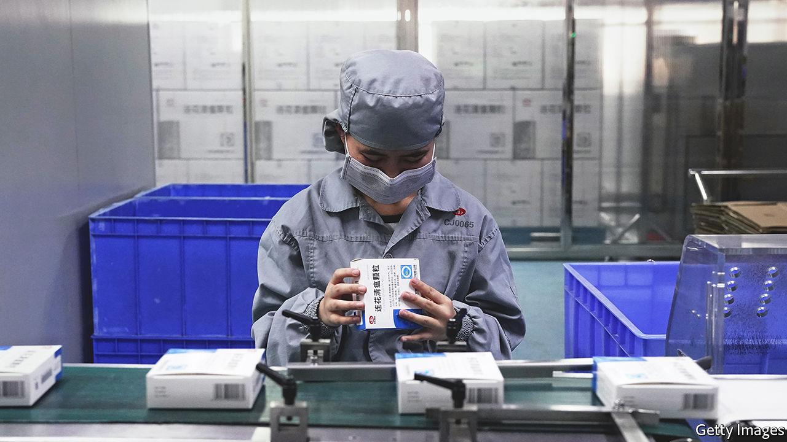
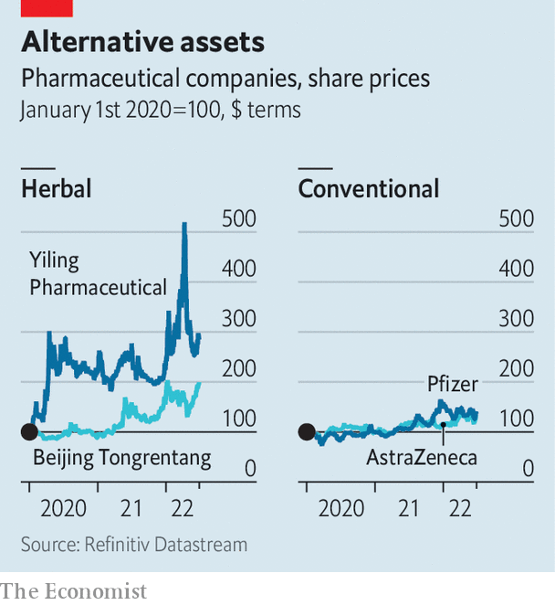

###### Traditional medicine

# The pandemic is boosting sellers of traditional medicine 

##### Whether or not they work, herbal remedies are a healthy business 

 

> Jun 30th 2022 

An economic downturn is a bad time to get sick, especially in poor countries. As conventional medicines become scarce and pricey, desperate patients turn to cheaper herbal remedies to treat even serious illnesses like diabetes, cancer and, these days, covid-19. Many doctors, of the scrub-wearing variety, doubt those treatments’ effectiveness. But the business of peddling them is in rude health.

In 2021 sales of Yiling Pharmaceutical, a big maker of traditional Chinese medicines including , used against covid, among various other ailments, exceeded 10bn yuan ($1.6bn), nearly double the figure in pre-pandemic 2019. Amid recent Chinese covid outbreaks in March and April Yiling’s market capitalisation surpassed $11bn. It has since come down but remains three times what it was before the pandemic. Beijing Tongrentang, another large manufacturer, has doubled in value since the start of 2020, also to $11bn. Both companies have outperformed Pfizer and AstraZeneca, two Western producers of indisputably effective covid-19 vaccines (see chart).

 


They have a powerful champion in President Xi Jinping. His government has praised traditional Chinese medicine’s “positive impact on the progress of human civilisation”. Between 2012 and 2019 alternative treatments’ share of medicine sales in China increased from 31% to 40%. The figure is probably higher today, given their widespread use against covid. As Hong Kong grappled with outbreaks this year, 1m packets of  were sent to the territory from the mainland. 

Since 2020 China has also promoted the supposed benefits of  in places struggling to procure covid jabs and treatments. Nearly 30 countries have approved the formulation for import, and some, including Kuwait and Laos, to treat covid. Belarus has signed an agreement with China to build a factory to churn out traditional Chinese medicine in Minsk.

Regulators in America and Singapore have warned against using  to treat covid. That has not put off investors. As earnings go, makers of traditional medicines have a big advantage: their reliance on ancient wisdom saves them billions in research-and-development costs. Pfizer and AstraZeneca funnel a fifth of their revenues, give or take, into r&amp;d, according to Bloomberg. For Yiling and Beijing Tongrentang the figures are, respectively, 7.8% and 1.2%. ■


