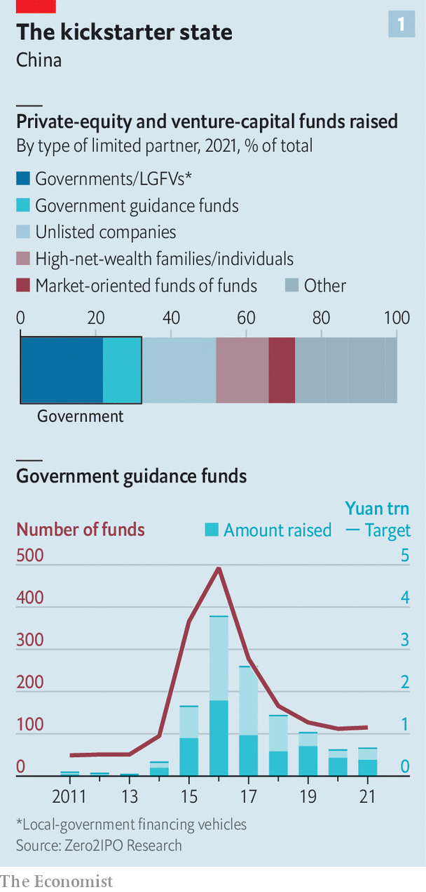
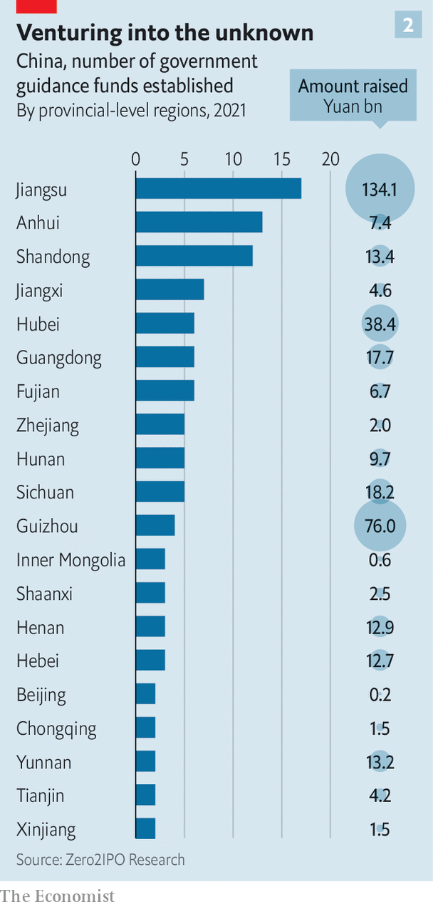

###### State capital

# The rise of China’s VC-industrial complex 

##### The state is reshaping one of the world’s biggest startup scenes—not necessarily for the better 

 

> Jun 27th 2022 

A high-tech development zone in the city of Wuhan has been abuzz since March, when the local government announced the creation of a 10bn-yuan ($1.5bn) investment vehicle. The Optics Valley Hi-Tech Venture Capital Guidance Fund aims to combine the animal spirits of private capital with the industrial objectives of the state. Its general manager, Li Yang, told state media in late May that more than 80 private investors had submitted formal proposals. Ten of these are already in the process of being approved. 

 


State cash is pulsing through China’s private-capital markets. Between 2015 and 2021 around 2,000 so-called “government guidance funds” collectively raised almost $1trn. Although the pace of fundraising has slowed since its peak in 2016, not least to allow the vehicles to deploy their copious dry powder, the government’s role has been entrenched. Last year the state (including local governments) accounted for one-third of all capital raised in Chinese limited partnerships, making it by far the country’s biggest source of venture capital (vc) and private equity (see chart 1). 

According to Bain, a consultancy, most big Chinese funds that completed fundraising rounds in 2021 were government-led. The Enterprises Reform Fund raised nearly $11bn; the National Green Development Fund brought in $14bn. Provinces set up 20 such vehicles last year, marshalling about 136bn yuan all told, four and a half times as much as they raised in 2020, according to Zero2ipo, a research firm. Cities and other local governments chipped in more (see chart 2).

 


Guidance funds have a dual aim. They are meant to counter the “disorderly expansion of capital” (Communist Party speak for China’s consumer-internet industry getting too big for its boots). And they are designed to fulfil President Xi Jinping’s desire for home-grown innovation in strategic areas such as artificial intelligence (ai), biotechnology and advanced manufacturing, notably of chips. 

On paper, combining patient capital from the state with the animal spirits and market savvy of private investors allows the guidance funds to avoid the pitfalls of conventional industrial policy. By the government’s own reckoning, failure to mobilise private capital would make the funds into just another state subsidy. In practice, the role of the private sector is fuzzy and constricted. As a result, many of the vehicles resemble old-school handouts, complete with oodles of waste and cronyism. And they bring fresh problems. 

Guidance funds are strange beasts. In a conventional vc or buy-out fund its originator acts as the general partner tasked with deploying the capital. A guidance fund, by contrast, often creates sub-funds in which it is a limited partner, and invites professional asset managers to be the general partner calling the shots. To limit the fund’s sway over the general partner’s investment decisions—and thus government meddling in where the money goes—many funds have rules dictating the maximum size of their investments. The Optics Valley fund’s stake in any one of its sub-funds must not exceed 25%, for example, and it can funnel no more than 100m yuan to any one of these sub-funds. 

In some cases these rules appear to work well enough. Shanghai Angel Guide Venture Capital, a 10bn-yuan vehicle originally launched in 2014, has created more than 65 sub-funds that invest small amounts in minority stakes at early-stage companies in partnership with non-state investors. A review by  of a sample of 20 of these sub-funds shows that their general partners and most of their remaining limited partners are indeed private-sector funds. Judging by publicly available profiles, individual executives in charge of the sub-funds on behalf of the general partners have professional experience in investment.

Beyond China’s largest cities, though, the situation is likely to look less like Shanghai and more like Shandong. In 2018 the eastern province set up the New Growth Drivers Fund. Since then the vehicle has launched more than 270 sub-funds and its cash has found its way into at least 1,000 provincial companies. Our analysis of 50 of these sub-funds reveals that about half are dominated by state capital with little private-sector co-investment. Instead, many of the remaining limited partners are other guidance funds, state-run firms or various government-linked entities. The individuals charged with managing these sub-funds also appear to have much less market experience than their counterparts in Shanghai.

The Shandong example suggests that at least in some cases state cash is crowding out private capital rather than co-opting it. One reason is the sheer number of government investors seeking to deploy capital. By 2019 there were more than 1,300 city and district guidance funds. One city in central China has at least ten of them, according to the Centre for Security and Emerging Technology, an American think-tank. With all the government money sloshing around, private investors have fewer places to park their capital.

The structure of the sub-funds, meanwhile, reduces their appeal to private investors. Many lock up money for up to ten years, in line with Mr Xi’s exhortation to think long-term, but twice too long for the typical private limited partner. State guidelines for recognising investment losses are often stricter than venture capitalists or private-equity managers would like, and less patient towards struggling firms that could be helped through a rough patch. Most frustratingly, one lawyer notes, if a guidance fund with a small stake in a sub-fund decides to pull out, its preferential terms will cause the dissolution of the entire vehicle, leaving both the portfolio firms and private investors out to dry. 

The flood of state cash is leading to other distortions, too. One is the inflating of company valuations. An analysis by  of company ownership records shows that of the 56 unicorns based in six central and eastern provinces, 32 have received state funding. Some of them belong to the herd of consumer-internet darlings whose prospects—and therefore worth—have been dented by Mr Xi’s heavy hand. The local officials in charge of these investments have little incentive to recognise those losses, regardless of what their funds’ guidelines say. 

Guiding principles

Frothy valuations are also a problem for the sort of startup Mr Xi approves of. Buy-out financiers report that hot industries such as chipmaking and ai have absorbed record levels of guidance capital in the past two years. The resulting bubbliness in the market has made it even tougher to pick out the real innovators from a sea of wannabes, notes Scott Kennedy of the Centre for Strategic and International Studies, a think-tank in Washington. 

This problem is exacerbated by another, perhaps even more consequential distortion. Venture capital typically plugs young enterprises into a network of talent and potential business partners. Guidance funds instead give them direct links to state-owned companies and other government bodies that can fast-track applications and help with regulatory problems. Both startups and private co-investors are therefore highly motivated to connect with government funds, says Catherine Chen of Zhong Lun, a law firm in Beijing. 

As Mr Xi’s state capitalism becomes more statist and less capitalist, such connections can make or break fledgling businesses. This in turn gives startups and their private backers a powerful incentive to curry favour with the government first and commercialise actual breakthroughs a distant second. 

This appears to be happening. Having for years tailored their business to qualify for local subsidies, cheap credit and land, young Chinese companies are now doing the same to attract guidance funds. They and their private backers often enlist former government officials to help them navigate the new vc bureaucracy. One prominent venture capitalist admits that his vc firm now bets not so much on the next big thing as on the next sector in line for handouts. This makes perfect investment sense in today’s China. It is not exactly a recipe for technological progress. ■


