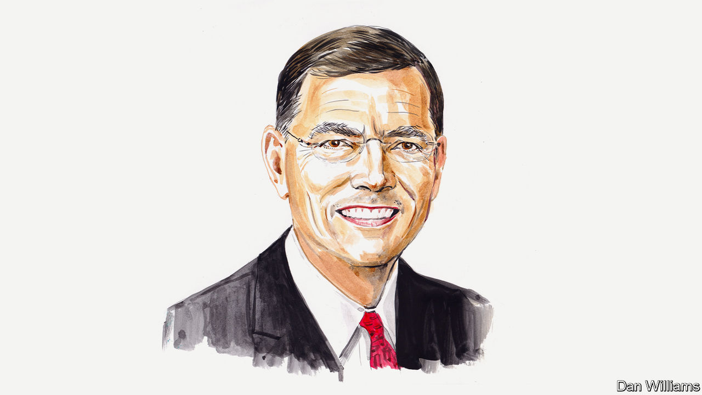

###### Nuclear energy

# John Barrasso wants America to lead the world in nuclear energy 

##### The senator says smarter subsidies and domestic production of nuclear fuel would revive his country’s sector 

 

> Jun 30th 2022 

SIXTY-FOUR years ago, President Dwight Eisenhower attended the opening of America’s first commercial nuclear power plant in Shippingport, Pennsylvania. The project was part of his programme “Atoms for Peace”, launched five years earlier, in 1953. Eisenhower’s bold decision to focus on the peaceful uses of nuclear power helped to create an entirely new American industry.

From the Manhattan Project in the second world war until the beginning of the 21st century, America was the undisputed leader in nuclear energy. For generations it was top in nuclear engineering, reactor design, nuclear services and technical expertise. Until 1980 it could also boast of having the world’s largest uranium-production industry. Today nuclear plants generate half of America’s emissions-free power. But years of neglect have weakened the entire sector. We must act now to reverse this decline.

Since 2013, 13 commercial nuclear power reactors have closed, leaving America with 92 in operation. During that time only one reactor has come online; just two more are under construction (they are also thousands of days behind schedule). The need for reliable and carbon-free power generation is growing, so nuclear energy’s prospects ought to be much brighter. It is the largest source of emissions-free power by far. And as it provides electricity without periods of intermittency, it is critical for the reliability of our grids. 

Policies weighted heavily towards renewables, including generous federal and state subsidies, have stacked the deck in favour of wind and solar power. According to data from the Energy Information Administration, the independent statistical wing of the Department of Energy, the subsidies for electrons generated from wind and solar facilities are many times greater than those generated from nuclear power. Government entities are pushing for a transition to carbon-free energy generation, but have excluded nuclear energy from the mix. The state of California—at least until recently—is one example. When the government steps in to give renewables such a massive advantage, nuclear plants find it hard to compete.

Any serious attempt to address climate change must recognise that promoting renewables at the expense of nuclear power is counterproductive. There is room for both. California seems to be getting the message at last. Officials there realise the state may lack enough electricity-generation capacity to keep the lights on. In recent months Governor Gavin Newsom has been reconsidering California’s decision to close its last operating nuclear power plant.

Nuclear power also matters to America’s foreign interests. Vladimir Putin’s invasion of Ukraine has shown the danger of relying on Russia for energy. It’s clear that a strong nuclear-energy presence makes sense when it comes to the environment and to energy security. America’s adversaries have been busy trying to corner the nuclear market. Russia and China have subsidised their government-owned nuclear companies to boost their international influence. Russia has been securing long-term deals around the world in countries such as Turkey and India. China is building and deploying at home more nuclear reactors than any other country. China is also aggressively pursuing sources of uranium by investing heavily in countries where uranium is found. Its government has made investments in countries including Namibia, Niger, Kazakhstan and Australia and is considering buying into uranium production in other nations.

Yet America remains a global leader in commercial nuclear-reactor technologies and is leading the way with innovative advanced reactors. In 2018 I wrote and passed legislation to ensure our regulators are able to license these facilities efficiently. But sustaining our nuclear industry and offering a viable alternative to Russian and Chinese suppliers requires us to produce our own nuclear fuel. We now rely on imports for well over 90% of our uranium. About 50% comes from Russia, Kazakhstan and Uzbekistan combined.

America has vast uranium reserves. Russia—which accounts for about half of the world’s enriched uranium capacity—has for years flooded the market with artificially cheap fuel. This makes American production unprofitable. Russia’s manipulation of the international market has also forced America’s only uranium conversion facility (Honeywell’s Metropolis Works facility, or MTW, in Illinois) to shut down and our only enrichment facility to operate at reduced capacity. Thanks to growing international demand, however, MTW is expected to reopen in 2023.

Without competition from American producers, Mr Putin is in the driver’s seat. Sales of Russian uranium are helping to finance his invasion of Ukraine. Russia may have pocketed as much as $1bn in sales of uranium to America alone in 2021. We have gone from “Atoms for Peace” to “‘Atoms for Putin”. It has to stop.

Uranium needs to be added to the list of banned Russian fuels. In the longer term, America must maintain secure supply chains for industries of strategic importance. A robust domestic nuclear-fuel supply chain would meet the needs of our existing fleet of reactors. America also needs to establish a strategic uranium reserve. 

As important, we need new enrichment capability to produce high-assay, low-enriched uranium, or HALEU, for advanced reactors such as TerraPower’s Natrium one, which will be built in Wyoming and is scheduled for completion by 2028. That will enable us to sell advanced reactor designs to our friends and allies. At present Russia is the only commercial supplier of HALEU. Until we have commercial-scale HALEU enrichment, we should draw from the Department of Energy‘s stockpile of the stuff. 

I have legislative proposals to deal with each of these issues. Senators and representatives from both sides of the aisle ought to be able to agree on an agenda that curbs Russia’s market power, promotes America’s energy independence and expands our supply of reliable, emissions-free energy. We have the opportunity to help secure America’s vital energy-security interests. It’s time to capitalise on new applications for nuclear power, such as for hydrogen, ammonia and isotope production, wastewater treatment and water desalination. To do this, we cannot rely on Mr Putin’s Russia or any other adversary or unstable regime. It is time to make America the world leader in nuclear power again.■

_______________


