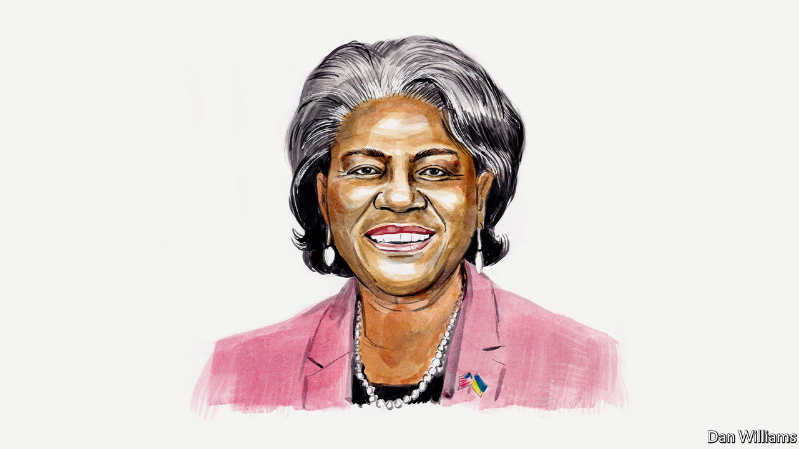

###### Tech and diplomacy

# Linda Thomas-Greenfield believes the UN Security Council should make better use of technology 

##### America’s ambassador to the UN wants to fight hunger with specialised digital tools 

 

> Jun 28th 2022 

AT THE BEGINNING of my career, I visited a Sudanese refugee camp in Uganda and saw a two-year-old girl die before my eyes. The technical term for what this girl experienced, when you are too thin and malnourished for your size, is childhood wasting. And it was, indeed, a waste. A young life—with all its potential—gone forever. There was enough food in the world to go around. There was no reason for her to die. 

That image has stayed with me for decades, and I have devoted much of my career to trying to identify and combat the root causes of . Today, I am convinced that  is a critical part of the solution—one we must pursue immediately. 

Thirty years later, people still starve every day. And much of the time, that kind of desperate hunger is driven by conflict. Some authoritarians and dictators intentionally use starvation as a tactic of war. And ever since Russia launched its unprovoked full-scale invasion of Ukraine in February—and started blocking crucial ports and destroying civilian infrastructure and grain silos—widespread hunger in Africa and the Middle East is getting more dire and the prices of staple foods are rising everywhere. 

During America’s presidency of the UN Security Council last month, we considered the causes and consequences of food insecurity. The council also discussed how technology can boost international peace and security. These topics may seem unrelated, but there is a common thread: the world has new tools to help people with severe malnutrition gain access to nutritious foods and new technologies to predict where conflict or climate will induce famine. Online platforms can connect farmers and equip them with the latest information about supply chains. Satellite imagery can improve our understanding of weather patterns and crop yields. High-quality seeds and agricultural inputs ensure farmers can produce enough food for everyone.

Innovative uses of agricultural and digital technologies abound, but the obstacles in the developing world are stubbornly analogue: low or no connectivity in rural areas, infrastructure deficits, gender inequality, and a lack of technical skills and literacy that are essential for food systems to deliver on the promise of sustainability and food security. We need to overcome these roadblocks for myriad reasons, but the most pressing reason is also the most obvious: we should use every tool in our toolbox to alleviate human suffering. 

The UN Security Council is responsible for maintaining peace and security. It has a duty to respond when, for example, conflicts threaten to cause famine. But how can we possibly expect to do that effectively in the 21st-century if we don’t employ 21st-century tools? If used responsibly, digital technologies can contribute to enormous good in the very conflicts and contexts where they are used for harm. 

The first step is using technologies to detect and adapt to the growing environmental changes that threaten global security. When it comes to food, data from satellites can identify and monitor impacts of climate change by providing early warning of droughts or extreme weather. Smart tractors are capable of GPS-driven ploughing, planting and pest management. Data integration from online portals that monitor crops, soil health and pest migration can boost precision farming and ensure the efficient use of resources. Additionally, online resources can provide the technical training needed to support smallholder farmers, while also providing access to the high-quality seeds and latest agricultural inputs. The trustworthiness and integrity of the data behind these emerging digital services are critical for helping people on the ground.

The second step is to employ technology in aid of those affected by ongoing crises. We can use social media and messaging apps to disseminate accurate information on safety, health, and financial and humanitarian assistance. Entrepreneurs are developing smartphone apps with the ability to detect malnutrition in children. Satellite imagery can document damage to civilian infrastructure and environmental destruction to enable faster emergency responses and repairs or cleanup efforts. Digital technologies are also protecting civilians by connecting those in need with aid workers and humanitarian services, or refugees with host families and employment opportunities. Conflict itself poses barriers to connectivity. For technology to be a force for peace and food security, we must widen access to reliable and affordable internet, accompanied by training in digital literacy and cybersecurity. 

The third step is to use digital technology to improve the security and the success of UN peacekeeping missions. They are one of the most effective means of preventing countries from relapsing into conflict and are critical to preventing war-related hunger. UN representatives on the ground can use specialised software on mobile devices to record evidence of human-rights abuses more easily and more accurately. Encrypting this information also protects survivors and victims. Digital dashboards and data visualisation software can be used to improve peacekeepers’ situational awareness and help missions evaluate and improve their own performance. And in extreme circumstances, GPS monitoring of deployed units could enable faster evacuation of peacekeepers.

Unfortunately, too many countries in the Security Council ignore the positive ways we can use digital technologies, or worse, are deploying them to do tremendous harm—both within and beyond their borders. It’s no secret that some of the worst abusers of digital technologies hold a veto in the Security Council. But that is precisely why we must engage in tough diplomacy. We cannot cede our digital futures to governments that would misuse and abuse these technologies. 

We are at a pivotal moment as digital technologies become increasingly ubiquitous in our lives. The decisions made today are cementing the values that will shape tomorrow’s reality. As the international community comes together to create rules for developing and deploying technology, America and its allies and partners aim to advance peace, protect human rights, promote sustainable development and defend the open internet for the benefit of all. America is driving this work forward through the Summit for Democracy, including the related Global Partnership for Action on Gender-Based Online Harassment and Abuse, and other initiatives such as the Declaration for the Future of the Internet that we recently launched with 60 partners across the world. 

Nothing we do today will bring back the two-year-old girl who took her last breath in front of me. And even with all the technological tools in the world, the UN and its members will still have to provide food and humanitarian supplies where they are needed and do the hard work of diplomacy to mitigate or stop the conflicts and climate conditions that fuel them. But we have never had more technological tools at our disposal to help with crises across the globe, and it would be a travesty for us not to use them.■

_______________


