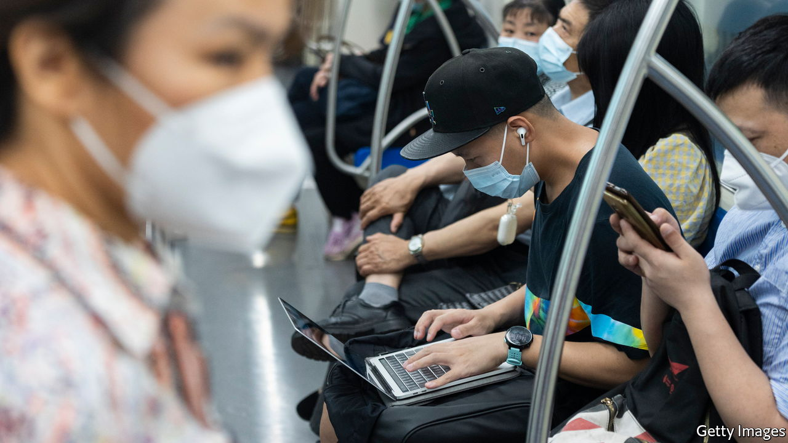

###### Holes in the great firewall

# As censorship in China increases, VPNs are becoming more important 

##### Even the government finds the software useful 

 

> Jun 30th 2022 

Li jiaqi, a popular Chinese influencer, had a talent for selling cosmetics. But his last performance was an unintentional advertisement for virtual private networks (vpns), which help Chinese netizens get around online censorship. On June 3rd Mr Li live-streamed himself with an ice-cream cake that looked like a tank. This seemed to anger the authorities, who may have viewed it as a reference to the Tiananmen Square massacre, when soldiers and tanks fired on protesters in Beijing, killing hundreds, if not thousands, in 1989. Its anniversary was a day later, something Mr Li may not have known since the government blocks online discussion of the bloodshed. Nevertheless, his show was cut off.

vpns are becoming increasingly important in China, which has grown more inward-looking since the start of the covid-19 pandemic. The country’s digital barricade against content it deems undesirable, called the “great firewall”, has been reinforced under President Xi Jinping. He has deployed an army of censors and the latest technology to combat foreign influence. A new draft rule would see all comments on Chinese social media screened before they are posted. But vpn software helps internet users in China get around all this by making it look as though their computer or mobile phone is located in a different country. They are thus able to view websites that are blacklisted by the government, such as Wikipedia, Facebook and Twitter.

The question for the government is how much of this so-called “wall climbing” to allow. Technically it is illegal to use a vpn in China without the government’s permission. In recent years the state has made it harder to find one, closing down a lot of local suppliers. Apple removed many vpn products from its Chinese app store in 2017, citing domestic regulations. Obtaining a vpn today often involves being introduced to a seller on WeChat, ​​a messaging app, by an existing customer.

Still, the government could clamp down harder if it wanted to. Those caught using vpns tend to receive a slap on the wrist. The state seems able to throttle the networks. During important political events, users say vpns often slow down.

China, though, must also stay connected to the world. Without vpns international firms could not operate in China. Foreigners would be less likely to come for work or study. Local firms would struggle, too. Chinese scientists need vpns to do research. “Essentially the Chinese government wants to have their cake and eat it too when it comes to internet access—they want to control it, but also to exploit the range of economic possibilities that digital freedom offers,” says a spokesperson for Expressvpn, a big provider of the software.

Others see a more sinister motive. “Perhaps the authorities do not completely crack down on the use of vpns because it helps them to identify those who are ‘picking quarrels’,” says a co-founder of GreatFire, a Chinese censorship watchdog. Picking quarrels is an ill-defined crime, often used to punish dissidents. Some have been arrested after criticising the state on Twitter. Officials, for their part, use authorised vpns to pick online quarrels with America.

What if the government were to loosen up a little? In a study published in 2018 researchers at Stanford and Peking Universities gave hundreds of students at two universities in Beijing temporary access to the uncensored internet. Almost none of them browsed foreign news websites (unless given incentives to do so). Most looked at pornography, which is often blocked by the great firewall. “Censorship in China is effective not only because the regime makes it difficult to access sensitive information,” said the authors. “It fosters an environment in which citizens do not demand such information in the first place.”

That seems to have been the case with Mr Li, who has not appeared online since the cake incident. Confused by his disappearance, many of Mr Li’s fans reportedly sought out information on the Tiananmen Square massacre, using vpns. ■

