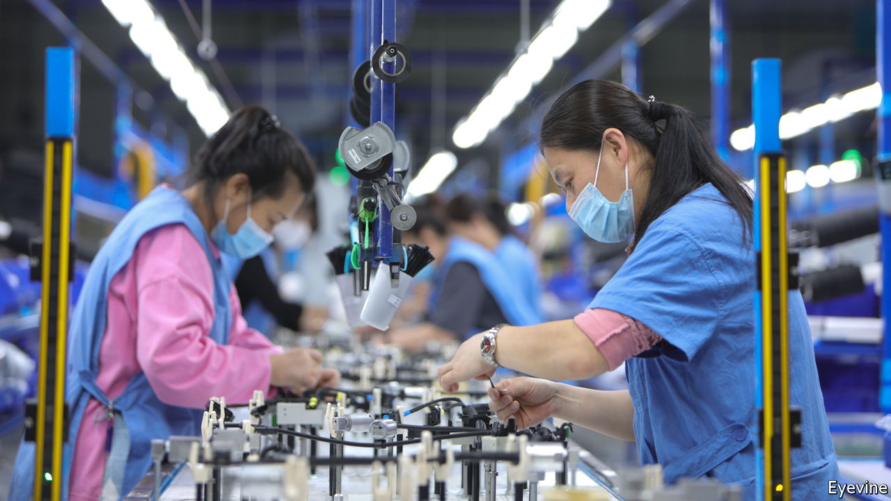
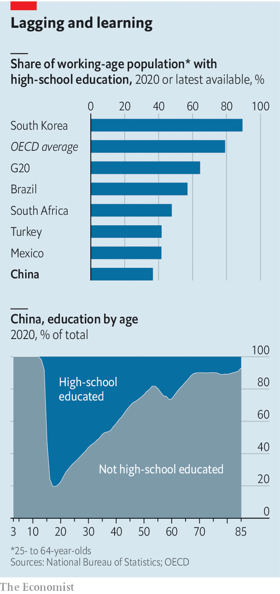

###### Low school

# China is improving its human capital. Gradually 

##### Most of its working-age population still lacks a high-school education 

 

> Jun 30th 2022 

In their book “Invisible China”, published in 2020, Scott Rozelle and Natalie Hell of Stanford University tell the dispiriting tale of Wang Tao, who grew up on the edge of Zhengzhou, the capital of Henan province. Every year he took weeks off school to help his parents harvest rapeseed and watermelon from their small plot of land. He was a class monitor in middle school and studied diligently for entry into high school (which typically begins at age 15 or 16). But his grades fell a little short and his parents could not afford the extra entrance fee the school demanded. Instead he enrolled in a new vocational high school. But the teachers were wooden or mumbly and the students absent or sleepy. The maths teacher would sometimes stop by their dorms to sell cigarettes. Mr Wang dropped out in his first year.

China’s education fever is widely reported; its educational failings less so. The book summed up China’s shortcomings with a striking statistic. Only 30% of its working-age population (aged 25-64) has a high-school education (academic or vocational) or better. Instead many Chinese workers dropped out after the compulsory nine years of schooling. Many older workers did not get even that far.

 


That 30% figure is daunting but also dated. It was based on China’s “mini-census” in 2015. How much progress has the country made in the intervening years? An answer can be found in the detailed results of China’s full 2020 census, which were recently published. (The headline results were published last year.) The census shows that the percentage of 25- to 64-year-olds with a high-school education increased to 36.6% in 2020. That is still far below the g20 average (see chart). And it remains below the comparable figure for other emerging economies such as Brazil, Mexico, Turkey and South Africa. Indeed, the proportion of people aged 25 or above who went to high school is about 20 percentage points lower than you would expect given China’s gdp per person, according to calculations by , based on data from the World Bank and unesco.

Unfortunately, lifting this percentage is not just about educating the young well—building schools, training teachers and motivating them to impart knowledge, not cigarettes. It is also about waiting for poorly educated older cohorts to retire. Today’s labour force includes people who were of high-school age in the first half of the 1970s, when Mao Zedong was still alive. Even if President Xi Jinping could wave a magic wand and get all pupils to complete high school from now on, it would take decades for these youngsters to shift the balance. According to our calculations, it would take until 2032 for the high-school educated to exceed 50% of the working-age population and until 2039 to surpass the g20 average of 64.4%. That is if we have got our high-school arithmetic right. ■

