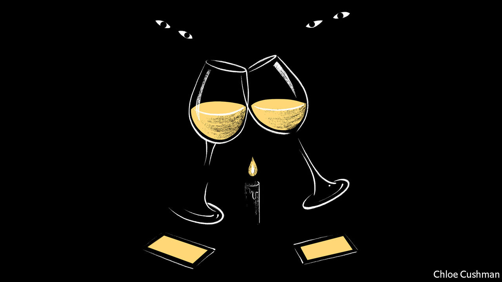

###### Speakeasies v snitches

# Getting around covid controls in Shanghai 

##### Dark restaurants and shuttered gyms are not necessarily closed 

 

> Jun 30th 2022 

For two glorious weeks at the beginning of June the residents of central Shanghai could sit in a café, sip a latte and forget about the chaos of April and May. The city’s harsh and shambolic lockdown, aimed at stemming an outbreak of covid-19, was finally over. People were able to move about again. The coffee had never tasted so good.

Then, in mid-June, Shanghai’s covid controls were suddenly tightened. Sitting inside a café was , so baristas put stools outside. Then this was banned, too. Latte-sippers could stand outside, but not sit, said the authorities.

It all feels a bit haphazard. The top official in Shanghai declared victory over covid on June 25th, and some rules have been loosened again. In the meantime, though, a bizarre, speakeasy economy has sprung up, in which restaurants, cafés, bars and gyms have learned to hide their operations from the state.

Some restaurants have asked diners to eat in the dark or by the light of their mobile phones to evade detection by the police. A joke making the rounds online suggests that restaurants should hire diners temporarily so that they can legally come inside. Some gyms have hung “closed” signs on their doors, but quietly welcome clients looking for a quick jog on the treadmill.

The situation has also given rise to a network of snitches who patrol the streets looking for rule-breakers to report. Restaurant- and bar-owners have been on the alert for people snapping photos of crowds outside their establishments. Local officials are thought to offer rewards for such information.

But the rules are so strict that, in some cases, the authorities merely pretend to enforce them. They will, for example, arrive at a bar where people are congregating, ask them to step away, then snap a photo of the empty space to show their superiors. Once the picture is taken, customers reassemble. 

Residents hope that the atmosphere will improve now that victory has been declared. Indoor dining resumed in some low-risk areas on June 29th. But people also fear a new outbreak and a return to life where dinner and cocktails must be consumed at home—or, at best, in dark restaurants.


