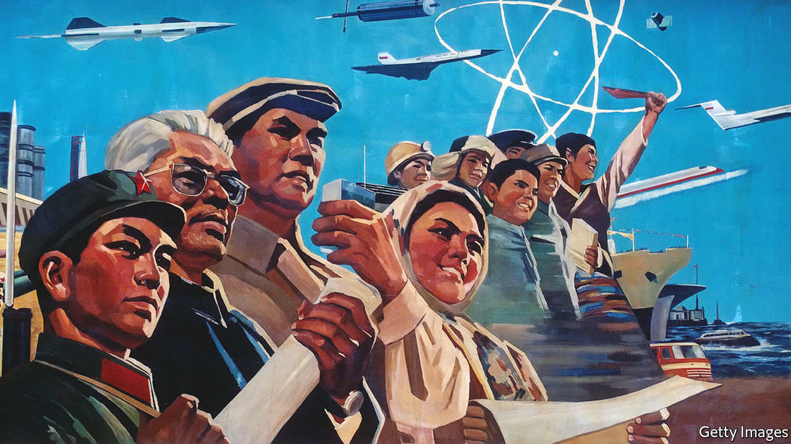

###### Three steps to heaven

# Some Chinese want their country to move closer to communism 

##### How can a wealthy China still claim to be in the “initial stage of socialism”, scholars wonder? 

 

> Jun 30th 2022 

In a poor, communist country, the phrase sounded like a truism. But in the early 1980s China’s admission that it was still only in the “initial stage of socialism” was an ideological bombshell. The use of those words meant the country had become “totally freed from the restrictions of orthodox socialist principles”, recalled Zhao Ziyang, who took over as Communist Party chief later that decade and championed the term. It allowed China to introduce capitalism (a stage Marx viewed as essential) and repudiate Maoist madness. Many Chinese were delighted by the weakening of ideology’s grip on decision-making. China’s dramatic economic growth owes much to the licence it gave. 

In today’s China, Zhao’s description of this liberating effect would sound like heresy (Zhao died in 2005 while under house arrest for being too soft on pro-democracy protesters in 1989). The current party leader, Xi Jinping, talks with great enthusiasm about orthodox principles. Far from scaling back the party’s involvement in economic affairs, as Zhao tried to do, Mr Xi has ramped it up. In businesses, party committees are flexing their muscles again. Over the past couple of years bosses of big private enterprises have been quaking as Mr Xi uses government regulators to bash their companies. Talk of the need for “common prosperity” has raised fears among the rich that the party has them in its sights.

Among Chinese academics, including the staff of party schools where officials are trained, there are some who favour a debate about when the initial stage should end and what should follow it. Their articles about these questions appear in official publications, which suggests the party sees no harm in exploring the topic. In January 2021 Mr Xi himself mentioned the goal of “forging ahead to a higher level” of socialism (meaning, apparently, another stage of it short of a communist utopia). He often urges party members to have faith in the “lofty ideal” of communism—though what a truly communist China will look like he does not spell out. 

When the party adopted the initial-stage idea, its leaders clearly hoped to clear the ideological air. Before Mao’s death in 1976 it had been filled with feverish talk of communism’s swift arrival. China’s cold war with the Soviet Union had fuelled competition to attain this nirvana. At the party’s 13th congress in 1987 Zhao (with the backing of Deng Xiaoping, the country’s paramount leader) said that “basic completion of socialist modernisation” would take at least 100 years, beginning from the mid-1950s when the newly victorious party nationalised most industry and forced farmers to pool their land into “co-operatives”. During this time, he said, China would remain in the initial stage. Communism was kicked into the long grass. 

But much has changed. China’s development was quicker than Deng envisaged. By the time he died in 1997 China had already fulfilled the economic targets he had set for the end of that century. In 1980 China’s economy was half the size of Britain’s (at market exchange rates); now it is the world’s second largest. That year most farmers were extremely poor. In 2020 China declared that extreme poverty had been eliminated. At the party’s 19th congress in 2017, Mr Xi announced that socialist modernisation would be “basically complete” by 2035, 15 years earlier than planned. 

So ideological questions that Deng preferred to avoid are bubbling up again. In an article this year Hu Angang, a staunchly pro-party scholar at Tsinghua University in Beijing, wrote that China could progress to an “intermediate stage” of socialism in 2035. China, he said, had already “basically completed the main tasks” of the initial phase. In January last year the , a newspaper in Beijing, trumpeted Mr Xi’s reference to a new stage. It also pointed to 2035, suggesting the party’s achievements by then would provide a “realistic basis” for an upgrade (though it did not make clear whether that should be the year to launch it).

Those impatient for a new label have met pushback, though. In 2018 , a newspaper published by the Central Party School, criticised “some people” who, it said, had begun to argue that the initial-stage description was no longer fitting. Apparently referring to the violence and chaos caused by Maoist utopianism, it said a “big historical price” had been paid for deviating from the initial stage. In an interview published by an academic journal in 2020, Liu Jianjun, a Marxism expert at Renmin University in Beijing, suggested the country could remain in the initial period until the end of the 21st century. 

Mr Xi, for his part, declared the start of “a new stage of development” in 2020. But he says this will last 30 years and form part of the initial stage of socialism—implying that China will not move to the next level at least until 2050. His officials keep trying to reassure private businessfolk that the party values their contributions to the economy (for good reason: their firms provide more than 80% of urban jobs today, compared with less than 4% when Zhao was purged). In November the party’s Central Committee said China’s 97m Communists must “soberly recognise” that the country will remain in the initial stage of socialism “for a long time”. This implied that capitalism would still be given room to flourish and that the party was in no hurry to move to the next stage of fulfilling Marx’s vision of a world with no private property. 

Despite Mr Xi’s reassurances, debate is likely to grow about what the next stage should be. No mainstream scholars openly suggest that it should be full-blown communism. They often propose an intermediate stage focusing on common prosperity—code for reducing the gap between rich and poor. This has always been a goal of the initial stage. Officially, common prosperity should be “basically” in place by 2050. But only recently has Mr Xi begun to stress this task. His eagerness has caused jitters among the wealthy, who fear it could mean more taxes.

They should be relieved, however, that Mr Xi shows little appetite for more radical interpretations of socialism’s next stage. Last year he denounced “welfarism”, saying that in some countries it had “raised a group of ‘sluggards’ and people who get paid for doing nothing”, draining government finances. He has not endorsed a claim in 2011 by the since-deceased party chief of Huaxi village in the eastern province of Jiangsu that its residents have already entered the intermediate phase. They live in villas and drive cars provided by the village’s business conglomerate. Last year reports circulated in local media that Huaxi was in economic trouble. ■

