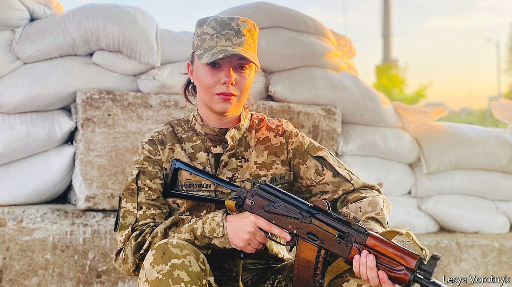
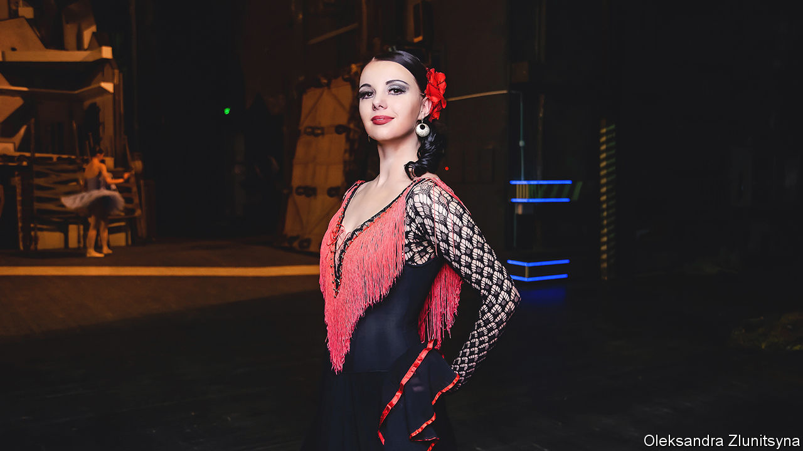

###### No more “Swan Lake”

# A Ukrainian ballerina goes to war 

##### Olesia Vorotnyk danced with the national ballet. Then Russia invaded 

 

> Jun 30th 2022 

Ukraine is protected by men with guns. They are dug into trenches and posted at the many bases that dot the front lines. They browse in shops, stroll by the sea and lie splayed across tanks. But since the war began another heroic figure has emerged: the woman with a gun. One of them is Olesia Vorotnyk, a ballerina with the National Opera of Ukraine who left the company to defend her country.

Now 30, Ms Vorotnyk has been dancing professionally since 2009. She was a child gymnast before starting ballet lessons at ten. She studied at the Kyiv Choreographic College and then joined the dance troupe of the National Opera. “A career that’s tough on the feet,” she says simply.

Military service is as much a part of her life story as dance. Her husband, with whom she had a son, was killed three years ago in the rumbling conflict in the east of Ukraine that followed the Russian-backed insurgency of 2014. When the new war began in February, she knew she had to do something, but wasn’t sure what. “I could shoot, though,” she says. “It’s my hobby. I knew that if there was a full-on invasion I wouldn’t go abroad. I would fight.”

Immediately she quit the ballet and took up a position at a checkpoint, armed with an ak-47. Those first few days were chaos, she recalls. Russian troops were said to have encircled the city. People waited for the tanks to roll in. Ms Vorotnyk decided to start evacuating civilians. “I used back roads to get people out. Mostly they were my friends, women with children.” 

Soon she resolved to join the Territorial Defence Forces, the country’s military reserve. It wasn’t easy to get in. Everyone wanted to sign up—and the preference was for men with military experience: “As a female ballerina I wasn’t top of the list.” Yet there are, she thinks, some useful similarities between ballet and military service. 

Ballet instils discipline. It cultivates strength of mind—and means tolerating pain. “The shoes hurt; staying on your toes hurts,” Ms Vorotnyk says. “Your feet bleed. But you learn to dance through it all.” She knows several women now serving in the army who studied rhythmic gymnastics, which, for similar reasons, she sees as akin to military training.

So she waited in the queue at her local recruitment office and was eventually accepted. Thus began a life of guarding her neighbourhood in Kyiv, gun slung over her shoulder, and working the checkpoints. “It was a nightmare,” she remembers. “Fear of saboteurs was everywhere.” She helped evacuate more people, once spending 19 hours driving some to (relative) safety in western Ukraine. The Russians were shelling the Zhytomyr Highway, which runs to the Moldovan border, and she was forced to use winding village lanes as the barrage roared around them.

 


But there was nowhere else she would rather have been. Along with dance and discipline, national feeling was inculcated in her from an early age in what was a devoutly pro-Ukrainian household. After the insurgency began in 2014, she took a break from dancing to travel to the Donbas region and see the situation with her own eyes. She brought books in Ukrainian to libraries in the east, on subjects of national importance such as the Holodomor, the famine Stalin inflicted on Ukraine in the 1930s. The aim was to nurture knowledge about the country, and pride in it.

For Ms Vorotnyk, the war—and the facts—are simple. Ukraine is a great sovereign nation, whose people are demonstrating their unity. “Every citizen is playing their part,” she says. “We want our children to grow up with a strong, confident Ukraine, not the lies that were sold to us during the Soviet Union.”

The stage of history

The arts have a special role in this struggle. With varying ferocity, Russian tsars and Soviet rulers stamped on Ukraine’s culture for centuries, persecuting Ukrainian artists, ridiculing their national aspirations and suppressing their language. Here culture is always political—never more than during a war in which history and identity are as contested as territory. Since it began, for instance, Ms Vorotnyk’s ballet company no longer puts on work by Russians. “There is no more ‘Swan Lake’,” she says. Tchaikovsky is out. 

In the West, arguments continue over boycotting Russian culture—how to balance outrage with engagement, whether to distinguish between classical and current artists, or between those who now support the Kremlin and those who repudiate it. For Ms Vorotnyk and others in Ukraine, the situation is straightforward. “Foreigners don’t fully understand our position because ballet is always associated with Russia,” she says. “But people in occupied Mariupol refused to take food and humanitarian aid from Russians—they chose to starve. It’s not fair for the ballet to perform [Russian works] while they suffer.”

In early June Ms Vorotnyk decided it was time to dance again. The heavy fighting had long moved far from Kyiv. Her next performance will be in “Die Libelle” (“The Dragonfly”) by Josef Strauss. Her overriding virtue as a dancer, says Viktor Lytvynov, a ballet master at the National Opera, is her courage. “It requires bravery to perform the role of an ugly woman, which she will be doing next,” he says. “It’s this that makes her such a good fighter.”

Ms Vorotnyk knows she can be called back to serve at any time. She still practises shooting almost every day. She still volunteers in her neighbourhood. Amid missile strikes on the city, she knows the violence is far from over; for her, it is always close. She shows, on her phone, a picture of her son when he was a baby. He is swaddled in her dead husband’s flak jacket.

“There was this myth of the great Russia, and its great army,” the warrior-ballerina reflects. But in the wake of all the pillage and looting, “we see the truth: they come here to steal our toilets.” These feelings will not fade soon. Ms Vorotnyk says she has “seen Russian culture in Bucha and Irpin”, places near Kyiv where the invaders committed war crimes. “I wonder if those Russians read Pushkin.” ■


