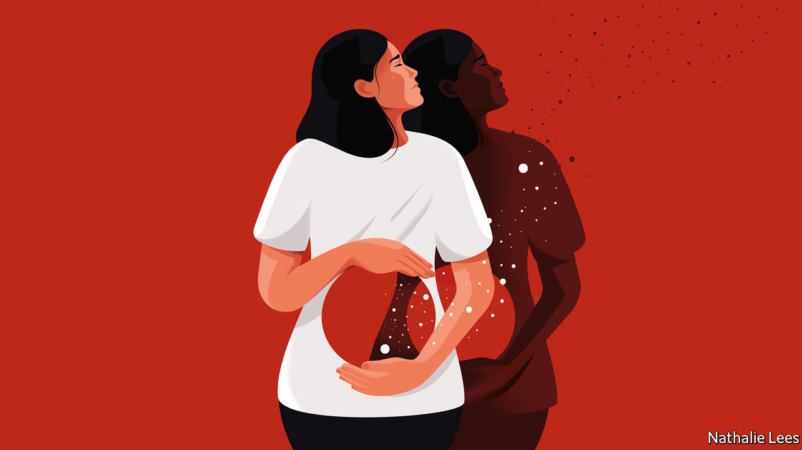

###### Mexican fiction

# A transfixing tale of motherhood and friendship 

##### Guadalupe Nettel’s new novel evokes the value of kindness and the unpredictability of life 

 

> Jun 30th 2022 

 By Guadalupe Nettel. Translated by Rosalind Harvey. 

The narrator of Guadalupe Nettel’s transfixing fourth novel makes what she calls “the best decision of her life”: she resolves to get her tubes tied. In the past Laura, now a 30-something graduate student, had been tempted by the idea of pregnancy, “just as someone who without ever having contemplated suicide, allows themselves to be seduced by the abyss from the top of a skyscraper”. After the surgery, she describes the procedure to her friend Alina as “the perfect precaution”, an inoculation against the pressures that society heaps on women.

Like Elena Ferrante’s tale of maternal ambivalence, “The Lost Daughter”, and Rachel Cusk’s unblinking memoir, “A Life’s Work”, “Still Born” evokes the darker side of motherhood. In Laura’s case, the feeling of aversion to it runs deep. As a five-year-old, she remembers, she once looked at her own mother, worn out from the kind of “incurable” exhaustion “that comes from having to deal with problems and tamping down your emotion”, and was “filled with rage”. 

Like the author, Alina and Laura are from Mexico City, but meet in their 20s while living in France, bonding over their distaste for “the human shackles” of parenthood. Years later, when they are both back in Mexico, Alina reveals that she and her partner have decided to have a baby. Laura laments a decision that, in her view, will see her friend join the “sect of mothers, those creatures with no life of their own who, zombie-like, with huge bags under their eyes, lugged prams around the streets.” 

Alina eventually becomes pregnant, but in her final trimester is warned that the infant will die as soon as she is delivered. “Still Born” unspools from this horror to convey the extremes of love and grief. An unflinching witness to her friend’s experiences, Laura is a flawed but engaging narrator. Unforgiving and indiscreet—she announces Alina’s pregnancy at a party without her permission—she also forms an unexpected bond with a neighbour’s child, a little boy “who seems dissatisfied with life” and is prone to tantrums.

Rosalind Harvey skilfully translates the original Spanish into precise and plain, but deeply moving, prose. Without resorting to sentimentality, the novel charts its characters’ halting efforts to understand and comfort one another. It is a piercing reflection on the ways acts of care can bind people together, and on the unpredictability of life. You make decisions, but as Alina tells Laura, “whatever has to happen will happen. No one gets out of that.” 

