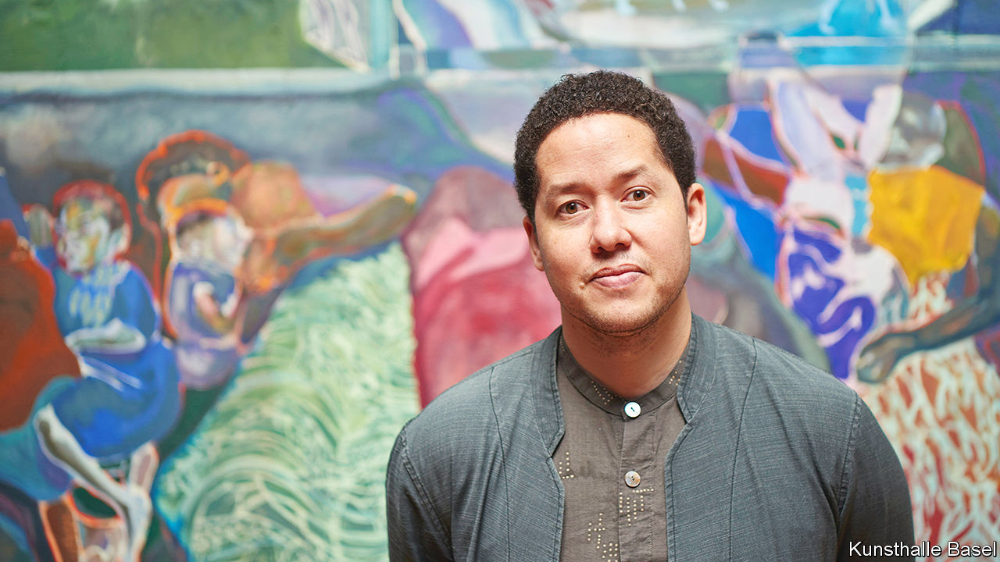

###### Eyes wide shut

# Michael Armitage tells urgent stories in art 

##### The use of colour and perspective in his new show is startling 

 

> Jun 30th 2022 

Invited three years ago to create a body of work for the Kunsthalle in Basel, where a seminal early Picasso show was put on in 1914, Michael Armitage quickly decided to fill one of its galleries with paintings of people with their eyes shut. They are variously daydreaming, fast asleep or comatose after sniffing glue. “It was just a very simple idea,” he explains. “It ended up being somewhere between death and life and something imagined.” 

The title of his newly opened show, “You, Who Are Still Alive”, came to him as lockdown ended; and, indeed, only one of his subjects is no longer living. It is the first picture you see, and also the smallest, depicting the head of Koitalel Arap Samoei, a hero of the Kenyan resistance against British colonialists who began to build a railway across his tribal lands. In 1905 Koitalel was invited to a discussion with the authorities, only to be shot and decapitated by a notorious colonel called Richard Meinertzhagen. Koitalel’s bloodied head was dispatched to London and has never been returned. In the background of Mr Armitage’s painting a man has taken off his shoes as he bathes in the river, as if washing away his dirty work.

Now 38, Mr Armitage has always been interested in how stories get told. The son of a Kenyan mother and British father, he learned about colonial history at school in Nairobi. At the same time he was introduced to local painters and sculptors whose work evoked a sexual freedom that was almost never publicly discussed in conservative Kenyan society. A course at the Slade School of Fine Art in London and postgraduate studies at the Royal Academy introduced him to dozens more artists who broke rules and confounded norms. Discovered by Irene Bradbury, a curator at White Cube gallery (to which the new show will move in September), his work reflects the influence of Cézanne, Gauguin, Goya and Manet, among others.

Mr Armitage’s habit is first to tease out ideas in Kenya, making photographs, informal videos and preparatory sketches, then to return to his studio in London to work these up into finished paintings. A major stylistic breakthrough came with his discovery of , the outer layer of bark from a ficus tree that is commonly used as a shroud in southern Uganda, but also makes for an unusual artist’s canvas. Torn, scrunched or thickly stitched to form scars on the surface,  offers endless compositional possibilities. In one picture Mr Armitage has used a long line of horizontal stitching to help trace the branch of a tree, in another he paints an imagined Boschean anus around a hole in the material. 

Bark and bite

Smooth industrial canvas carries thick paint without trouble; by contrast, to avoid clogging on the rough , colour must be added in thin layers, almost like a glaze, which allows the artist to experiment with different hues. Notwithstanding those closed eyes, his uses of colour and perspective are the show’s most interesting features. “I was thinking about the narrative effect of colour,” he explains; “being able to talk about specific things by the way that colour changes.”

Some of the brightest and most vivid works are drawn from imagery originally made in black and white. The famed diagram of the , a British slave-ship that transported enslaved Africans to the Caribbean, offers inspiration for a painting of a police holding-cell in Nairobi where waves of prisoners, rendered in turquoise and aubergine, lie cheek by jowl. In the title painting, “You, Who Are Still Alive”, a man lies on a gurney, his head on a pillow. A hole in the  canvas could be a bullet wound in his side. The work recalls a photo of Dedan Kimathi, a Mau Mau general, whose capture in 1956 gave rise to one of the most powerful black-and-white images of 20th-century Kenyan history.

In “Curfew (Likoni March 27, 2020)” the artist plays boldly with perspective. The title marks the date that Kenya introduced an all-night curfew to help combat covid-19. Mr Armitage has painted workers, one with a black face and candy-pink arms, flooding onto the quayside in Mombasa to catch the last ferry home. Police beat them back with swirling red whips. Figures in the foreground seem tiny, while images at the back appear huge, an inversion of perspective that adds to the atmosphere of unease and dysfunction. “One way of expressing that thought through perspective,” Mr Armitage observes, “would be to distort the way in which one sees it, like the way one’s memory is distorted by an event.”

His work is in increasing demand among both private collectors and institutions. In May he was asked to design Britain’s new £1 coin, which is due to be released next year. His title in Basel, “You, Who Are Still Alive”, seems to interrogate the viewer. Who are you and what do you stand for? How have you contributed to the oppression of others? What have you done—and what will you do now? As Elena Filipovic, director of the Kunsthalle, says: “It’s almost a call to arms.” ■

