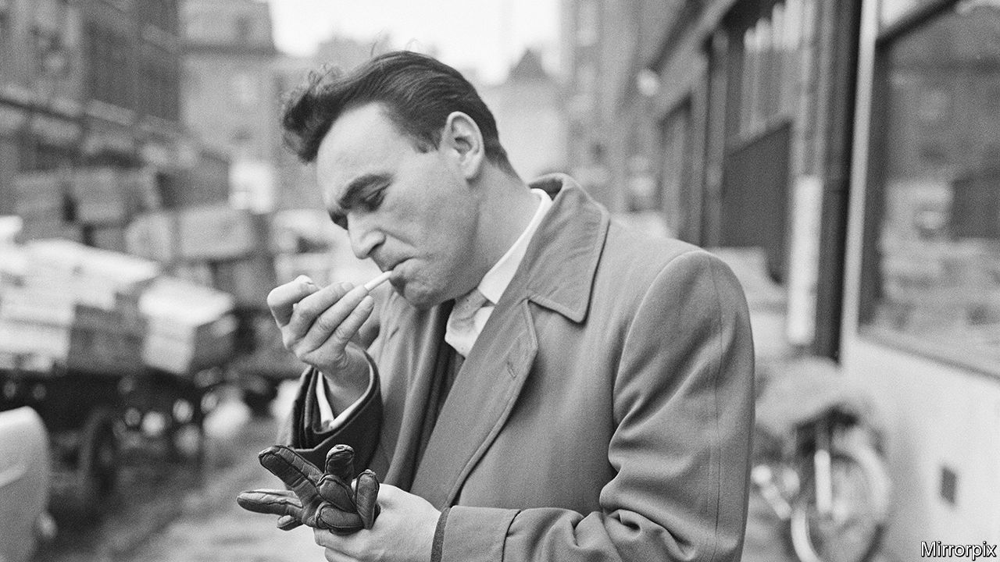

###### Survivor’s rage

# Rudolf Vrba escaped from Auschwitz to warn the world 

##### Not everyone listened, as Jonathan Freedland brilliantly recounts in “The Escape Artist” 

 

> Jun 30th 2022 

By Jonathan Freedland.

One day in 1978 Rudolf Vrba was in a restaurant in New York when he spotted a number tattooed on a waiter’s arm. Vrba (pictured) told him that he must be a Jew from Bedzin, Poland, who had arrived in Auschwitz in the summer of 1943. The waiter, amazed, confirmed this deduction.

Vrba’s extraordinary memory was his curse and a salvation. His curse, because he could never forget the columns of terrified Jews on the ramp at Birkenau, the corpses he had to carry or the smoke spiralling out of the crematoria. A salvation, because the details he memorised eventually helped stop the deportation trains. 

Born Walter Rosenberg in Slovakia in 1924, he arrived in Auschwitz in June 1942. Daringly and desperately he escaped with Alfred Wetzler, a compatriot, in early April 1944. They made their way back to Slovakia, finding shelter with the remnants of the Jewish community. The two men’s account of the camp was typed up and edited into a 32-page forensic report on the inner workings of the Nazi death machine.

Jonathan Freedland is both a columnist at the  and a thriller writer, and he tells this harrowing and astonishing story with pace and verve. Vrba (as he became after the escape) wound up as a clerk in Auschwitz, so was fairly free to roam the camp. He had also been posted to the section known as Kanada, where inmates unpacked the suitcases of those recently gassed, quickly forcing down any food they might find: “The lemons, the tins of sardines, the bars of chocolate…they had all been packed by anxious mothers and worried grandfathers.” By the spring of 1944, the ss guards were joking about the “Hungarian salami” that would arrive with the Jews of Hungary, the last surviving community in Nazi-occupied Europe.

Vrba and Wetzler hoped that by alerting the Hungarian Jewish leadership—and the world—to the reality of Auschwitz, they would save Hungary’s Jews. Their report reached Budapest at the end of April 1944. Yet between May and July Hungarian officials enthusiastically deported almost 440,000 Jews from the provinces to Auschwitz, most of whom were killed on arrival. 

The behaviour of Hungary’s Jewish leaders remains controversial. Rezso Kasztner, a prominent Zionist, presented the report to the country’s Jewish Council on April 29th. Kasztner negotiated with the Nazis for the lives of nearly 1,700 Jews; whether he smoothed the path to destruction for others has always been fiercely debated. Echoing Vrba’s judgment, Mr Freedland thinks that, by not doing more to publicise the report, Kasztner gave the Nazis “the one thing they deemed indispensable…order and quiet”. Arguably, though, the Jewish Council itself, which had far more influence, deserves more blame. 

The underlying point about the report’s reception is wider, and profound. Vrba was sure, says Mr Freedland, that “facts could save lives”. Yet, he observes, “only when information is combined with belief does it become knowledge.” If the facts are unpalatable or outlandish—as the hell of the camp seemed to many Jews, and some Allied leaders—denial and cognitive dissonance can stifle the urge to act.

The Vrba-Wetzler report made its way to Allied capitals, the Vatican and the offices of Admiral Horthy, Hungary’s regent. In the summer of 1944, after entreaties from the pope and warnings of punishment from President Franklin Roosevelt, Horthy halted the deportations. The 200,000 Jews of Budapest were safe—until the Hungarian Nazis, the Arrow Cross, took power in October, after which many perished. 

After the war Vrba trained as a biochemist and moved to Canada, forever raging against the Hungarian Jewish leadership’s failures. Mr Freedland’s vivid, compassionate book brings out the horror and tragedy of his experiences: the Nazis’ depravity, the caprices of death and survival, the toll of violence, exhaustion and incomprehension on the doomed deportees. An important addition to Holocaust historiography, it honours the memory of two brave and determined men who helped save some of the last Jews of Europe. ■

