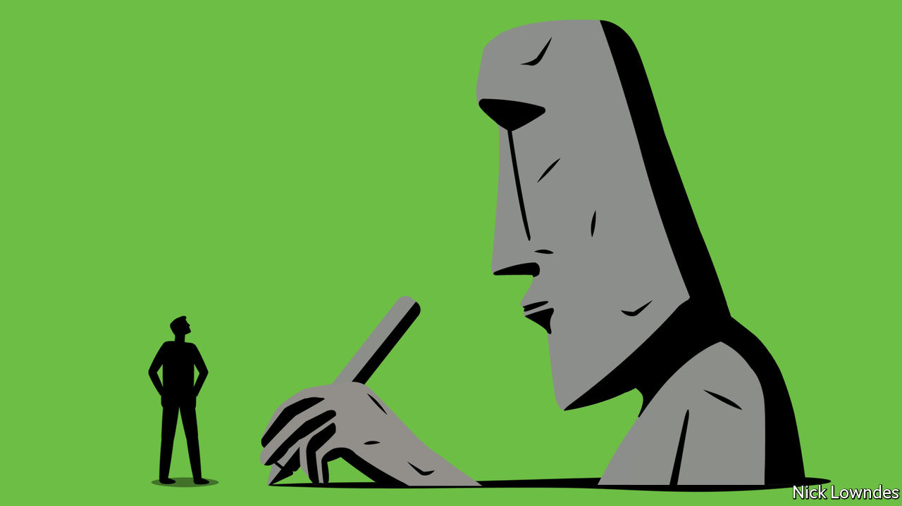

###### Johnson

# The everyday miracle of writing 

##### Give thanks to the people who resolved to make pictures stand for sounds 

 

> Jun 30th 2022 

If you are reading this column, a combination of 26 squiggles on a page or screen is putting the sounds and meaning of this sentence into your head almost without effort on your part, though you have almost certainly never met the writer. If you are listening to this on ’s audio edition, a reader who has also never met the author has turned a copy of those squiggles into intelligible sound waves for you. 

Writing is such an everyday miracle that it is easy to take for granted. People who can read cannot stop themselves, as studies have shown in which subjects are told to ignore a word flashing on the screen while attending to another task, but are unable to do so. Reading is the prime goal of education everywhere. Writing seems so fundamental that it is hard to believe just how recent, and contingent, it really is. 

Estimates differ widely on when language was developed, from 50,000 years ago to as many as 1.9m years. On even the most recent hypothesis, humans spent 45,000 years talking before it occurred to a few to make their words into durable visual signs. Writing was then independently invented just four (proven) times, in Mesopotamia, Egypt, China and Mesoamerica. Most people lived without it for a few more millennia. Only in the 1940s did humankind pass a literacy rate of 50%.

“The Greatest Invention”, a new book by Silvia Ferrara of the University of Bologna, restores a sense of wonder at the imaginative leaps required to invent writing. Part of her story (translated by Todd Portnowitz) is familiar: the procession from drawings (a picture of a bull is just that, a bit of art) to visual icons (just a couple of lines to indicate, say, “house”), to symbols. The leap to symbols is crucial: these are distinct from the original referent, allowing them to stand for abstract things, including the many verbs that are hard to picture. Think of the floppy-disk icon meaning “save”, even when no floppy disk is involved. 

Ancient cultures could have stopped at the symbolic phase, using stylised, stripped-down images to stand for important things and ideas, without intending to represent full sentences. Several, including the Indus Valley civilisation split between today’s India and Pakistan, may have done just that; its script, if indeed it is one, remains undeciphered. But at some point—the Sumerians of the third millennium bc are usually awarded first prize, though Ms Ferrara makes a case for Egypt—people stumbled on the “rebus principle”. This is familiar from modern children’s games in which a bee stands for the verb “be”. In languages like Sumerian that have a small set of simple syllables, a few hundred symbols can represent anything you can say. 

It may be that all those who invented writing independently relied on the rebus (though Mayan shows scant clear evidence of it). Some moved past it to alphabetic writing, with characters representing sounds, not syllables. But the rebus remains the core of the story, bootstrapping societies from complete ignorance of the very idea of writing to lives that cannot be imagined without it. 

Ms Ferrara dissents from the narrative in which civilisation and writing advanced in lockstep, to serve increasingly bureaucratic states. She thinks the script of Easter Island is another candidate for independent invention, despite the absence of a state. And some states, like the Inca empire, did without writing (though the Incas developed an extraordinary system of knots called , still only partly understood). Her book is a joyful tale of writing as a means of self-expression, showing off and play. 

She describes experiments in which participants played a Pictionary-like game that got them to draw things including “Brad Pitt”. Though barred from talking, they could share and revise their solutions. Initially they produced bad pictures of Mr Pitt and his famous then-wife Angelina Jolie. But a few souls stumbled on the rebus principle, sketching either a pit in the ground or a stick-man with an arrow pointing to his armpit. Before long, even these were stripped down, until a circle (for the head), an angle (a raised arm) and a line (no longer even an arrow) were all that was needed to depict one of the world’s most handsome men. Anyone can invent writing.

But no one did, for aeons of humankind’s linguistic existence. Everyone who loves to read and write today owes a debt of gratitude to those who, whether out of play or necessity, finally had the idea, obvious only in retrospect, of making pictures stand for sounds.


