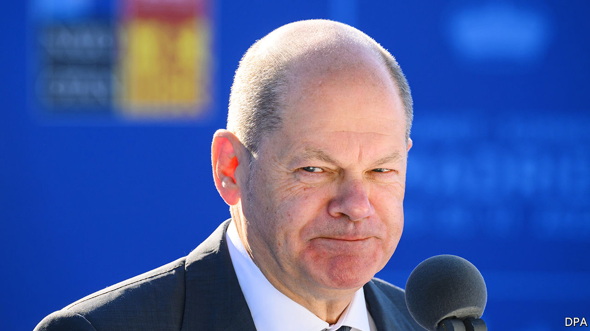

###### The quiet German

# Chancellor Olaf Scholz takes taciturnity to new levels 

##### Some like it like that 

 

> Jun 30th 2022 

The voice of Olaf Scholz, the German chancellor, seldom rises above a murmur. His pinched expression suggests a doctor with bad news, not a politician. When a journalist recently asked if Mr Scholz could add some detail on a burning foreign-policy matter, the reply was a cryptic, “Yes, I could,” and that was all. Germans chuckled, but few were surprised when Markus Söder, the minister-president of Bavaria, tweeted an image of the g7 meeting in his state that showed just six of the leaders’ portraits against an Alpine backdrop. The ever-grey face of Mr Scholz, the host, was somehow forgotten. 

The former Hamburg mayor may have been elected last September precisely because his modesty echoes that of his famously taciturn predecessor, Angela Merkel. But Russia’s invasion of Ukraine has thrust Mr Scholz into a tougher predicament in his first few months than the former chancellor faced during 16 years. His ultra-low-key style makes him look to some as if he is shying from power, just when Germany needs most to exercise it. “We have a chancellor who refuses leadership,” says Stefan Meister of the German Council on Foreign Relations, a think-tank. “He says he will only act in the context of our alliances, but he makes no effort to lead those alliances.”

It does not help that members of Mr Scholz’s inner circle, let alone his coalition government, have often conveyed contradictory messages. Jens Plötner, the chancellor’s top foreign-policy adviser, recently raised eyebrows by questioning the “feverishness” of the debate over sending arms to Ukraine, when more thought should be given to future relations with Russia. Such slips have often forced Mr Scholz to repeat and restate what look like wobbly policies.

But although polls show the chancellor losing popularity compared with more forthright coalition partners such as Annalena Baerbock, the foreign minister, Germans seem to be forgiving; even some of his critics commended his handling of the g7 talks. “Mr Scholz may not be the greatest storyteller,” admitted Joe Kaeser, a former boss of Siemens, in a recent interview. “But the chancellor is matter-of-fact, level-headed and tries to de-escalate, which is a gift these days.” 

