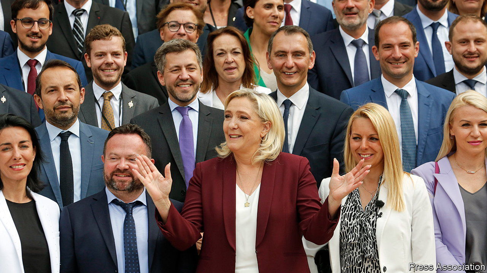

###### Jacket, tie, nationalism

# Fresh faces on the far right and left fill France’s parliament 

##### Newcomers will test Emmanuel Macron’s government 

 

> Jun 30th 2022 

Before marine le pen led her 89 freshly elected deputies through the gates of the National Assembly, she gave them an order: dress smartly, with jackets and ties for the men. Sure enough, the biggest group of deputies that her populist-nationalist party, the National Rally (rn), has ever taken into the chamber turned up as instructed. As parliament opened on June 28th, members of a movement that once struggled to shake off its thuggish image took their seats in a sober uniform of navy suits or unicolour jackets.

Ms Le Pen’s ambition is not merely stylistic. A party once banished to the fringes of political life now finds itself the biggest single opposition party to President Emmanuel Macron. His centrist alliance, Ensemble, lost its majority in last month’s general election, and now faces a buoyant, if fragmented, opposition. As part of Ms Le Pen’s strategy of “normalisation”, she wants to show that her deputies can work efficiently in parliament and form an “elite” ready to take over in 2027. Whereas Jean-Luc Mélenchon’s radical-left deputies turned up to parliament clenching their fists and promising to cause trouble, Ms Le Pen said coolly that she does not want “to be in systematic obstruction”. 

Just weeks ago, many of the newly elected rn deputies hardly dared to imagine that they would be leaving their desks or fields for the opposition benches in Paris. Among them are long-time staffers, former local councillors, and defectors from other right-wing nationalist groups. They also include veterans once close to Jean-Marie Le Pen, Ms Le Pen’s father, such as José Gonzalez. At 79 years old, he is the  of the house and so opened parliament this week, a surreal moment of “normalisation” if there ever was one. The rn also has political debutants, including a delivery driver (Jorys Bovet) from central France, a retired grocer (Daniel Grenon) from Burgundy and a farmer (Christophe Barthès) from the south-west. “The vines won’t wait,” Mr Barthès wrote on Twitter beside a photo of his tractor at work on the eve of the opening of parliament.

In 2017 it was Emmanuel Macron who led electoral novices from his centrist party into parliament. He has a fair few this time. But the more noteworthy now sit on the opposition benches. On the left, Mr Mélenchon’s new crop includes Rachel Kéké, a former chambermaid who describes herself as “the voice of the voiceless”. Another is Mathilde Hignet, a 29-year-old farm worker from Brittany, who beat Mr Macron’s candidate by just 328 votes. 

As the president scrapes around for a majority to pass his bills, which he looks set to try to do one by one, the new parliament will be a noisy theatre. First-timers in opposition seeking to make a name will be in no mood to give Ensemble an easy time. Once the buzz has worn off, they may also find their new lifestyles taxing. “Let’s see over time how many keep turning up to sittings,” says one of Mr Macron’s deputies.

For all the sense of novelty, parliament has in fact seen less of a clear-out than it did in 2017. Then, 75% of deputies were new; this time the figure is 52%. Their average age remains just under 49 years. There are slightly fewer women, although one, Yaël Braun-Pivet, was elected speaker, the first woman ever to hold the job. And despite the symbolic exceptions, on average 58% of all deputies now come from senior management and professional jobs, a figure that is higher among deputies from both Mr Macron’s and Mr Mélenchon’s alliances than it is for Ms Le Pen’s party. ■

