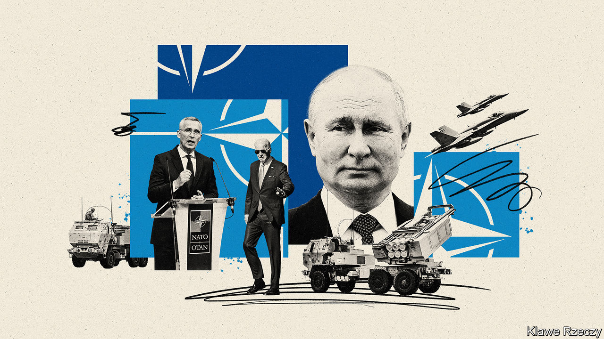

###### Back in business

# NATO holds its most important summit for decades 

##### The alliance is fortifying its eastern borders 

 

> Jun 26th 2022 

Recep tayyip erdogan, Turkey’s president, wore his usual morose expression. It was mirrored by the stony faces of Magdalena Andersson, Sweden’s prime minister, and Sauli Niinisto, Finland’s president. Only a gentle smile from Jens Stoltenberg, the secretary-general of nato, hinted at the diplomatic breakthrough that had just occurred. After four hours of intense wrangling in Madrid on the eve of a nato summit, Mr Erdogan had lifted his veto on Finland’s and Sweden’s bid to join the alliance in return for assurances about their links to Kurdish militants.

That was just one among several far-reaching decisions taken by leaders at the summit, which concluded on June 30th. Russia’s invasion of Ukraine has upturned European security. In response, nato is growing bigger and beefier, adopting what Mr Stoltenberg described as “the biggest overhaul of our collective deterrence and defence since the cold war”.

One sign of that was a new “strategic concept”, a sort of vision statement for nato, and the alliance’s first such document in over a decade. It warned, unsurprisingly, that Russia was “the most significant and direct threat” to allies and that the possibility of attack could not be excluded. But it also noted that China was challenging allies’ “interests, security and values”—and often doing so in concert with the Kremlin. “Russia and China are developing a strategic partnership and are at the forefront of an authoritarian pushback against the rules-based international order,” it warned, using language that European allies could not have agreed on just a few years ago. 

The summit’s most important outcome, however, is a wholesale reorganisation of the allies’ military posture. After Russia’s invasion of Ukraine in 2014 nato established four battlegroups in the Baltic states and Poland. These were so-called tripwire forces, designed not to halt a Russian invasion but to guarantee that big powers would be forced to respond. The battlegroups were hurriedly reinforced in the weeks before Russia’s invasion, and its aftermath. Four new ones have also been established in Bulgaria, Hungary, Romania and Slovakia.

But the whole concept of the tripwire is now being torn up and replaced with the cold-war philosophy of forward defence. Rather than absorbing Russian blows and then striking back, the point is to stop an invasion in its tracks. To that end, Mr Stoltenberg says that the battlegroups will be enhanced “up to” the levels of brigades, much larger formations with around 3,000 troops apiece. The old forces amounted to a “lick and a promise”, says Jim Townsend, who oversaw many of those deployments as the Pentagon’s top official for Europe at the time. Now, he says, “we’re now going to make this really painful [for] the Russians.”

There is, however, some sleight of hand involved in this. Ben Wallace, Britain’s defence secretary, told reporters in Madrid that his country would “allocate”—rather than physically deploy—a full brigade to Estonia, though he committed to dispatch a brigade headquarters that would allow forces to move east quickly in a crisis. 

A similar arrangement is playing out to the south. Gabrielius Landsbergis, Lithuania’s foreign minister, told  on the sidelines of the summit that Germany had agreed to dedicate a brigade to Lithuania. But a German official says that this, too, is only a “part” deployment, with much of the unit remaining on German soil and only exercising in Lithuania. “The most important thing is: are we getting an actual brigade?” asks Mr Landsbergis. “If we don’t, then very little changes.”

The announcements from Joe Biden, America’s president, were meatier, but they also involved some trickery. A permanent brigade promised to Romania is already there on a temporary basis. Parts of v Corps, a high-level formation that can command several divisions, will stay in Poland, but the main headquarters remain in Kentucky. Other American forces are bound for Britain, Germany and Italy, far from the eastern front. All in all, says Justyna Gotkowska of the Centre for Eastern Studies, a think-tank in Poland, “the announcements…fall short of expectations in the Baltic states and Poland.”

Even so, the new deployments in the east will have more back-up. The number of nato’s high-readiness forces will grow from 40,000 to over 300,000. A portion of this will be ready within ten days, and the rest within 30. Particular units will be pre-assigned to potential hotspots. Some countries are already committing forces. Mr Wallace says that Britain will probably offer an aircraft-carrier strike group. Germany says it will contribute a division of 15,000 soldiers and 65 planes. The plan, says Mr Stoltenberg, is to have it in place by next year. 

 


Many of the details need to be worked out. Christopher Cavoli, a Russian-speaking American general, is due to take up the post of Supreme Allied Commander Europe (saceur), in the coming days. He will write a series of “regional plans”—remarkably, the alliance’s first proper defence plans for the eastern front since the cold war. These will need to take into account nato’s already extensive frontiers, with a Russian threat from Norway’s Finnmark in the north to the Black Sea in the south, as well as the looming accession of Finland, which will more than double the length of the alliance’s border with Russia. 

In many ways, the decisions made in Madrid amount to a belated admission that the defences built up after 2014 were never up to the task of reassuring eastern allies and deterring Russia. But the idea of getting European leaders to pony up 300,000 ready troops would have been implausible back in 2014, says Mr Townsend, “because people weren’t scared enough”.

It is Mr Putin’s invasion that has transformed the politics of European defence. A new survey, the Munich Security Index, shows that attitudes to Russia have hardened dramatically across the g7 (see chart). “For the politicians and for a lot of people in the West, it was [in 2014] still a bit of a stretch that the Russians were going to do something,” says Mr Townsend. They need little convincing now. ■


