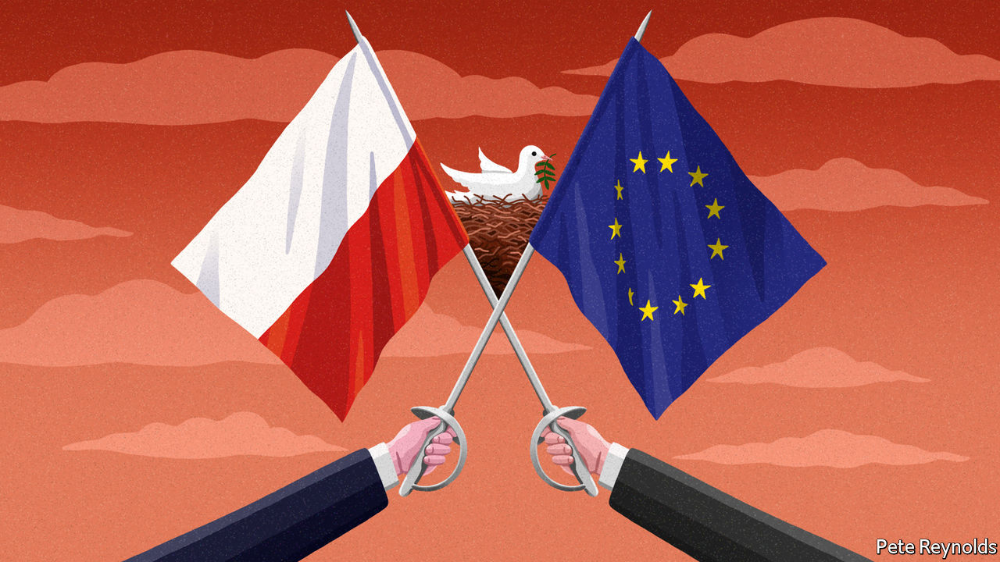

###### Charlemagne

# Poland is being given an opportunity to matter in Europe 

##### It has not seized past ones 

 

> Jun 30th 2022 

In late january, as energy prices soared across Europe, billboards across Poland offered peeved bill-payers a familiar narrative: blame Brussels. Fully 60% of the rise in power prices was the fault of the European Union’s green policies, insisted the state-owned utilities behind the campaign. This was, to put it mildly, a gross exaggeration. In any case, the campaign was quietly shelved after Russia invaded Ukraine a few weeks later, sending energy prices higher still. Poland’s bigwigs have switched to blaming someone scarier than any eurocrat for the rising cost of living. The new slogan is “Putinflation”.

For years Poland has tussled with the eu. The European Commission in Brussels, egged on by some member states, castigates it for flouting the norms of liberal democracy; Poland is in the dock for letting politicians pick and sack judges, for bashing gays and for muzzling the media. It has also attracted brickbats for its restrictive abortion laws—terminations are banned except in cases of rape or a threat to the mother’s life. All this criticism has riled the conservative-nationalist government headed by pis (Law and Justice), which has been in power since 2015. It accuses Brussels of seeking to impose its politically correct views on a population wedded to tradition; pis grandees have likened the eu to Poland’s former Soviet overlords and raised doubts over whether its laws ought to apply to Poland. The commission has in turn throttled some of the subsidies that flow to Poles.

But that was then. As an actual war has convulsed the continent, a metaphorical peace has broken out within the eu. All sides are playing nice. In June the commission announced it would soon unlock €35bn ($37bn) it had once withheld from Poland, part of a €750bn eu pandemic-recovery fund that other countries have already been spending. The money had been frozen amid concerns that Poland’s judiciary has been undermined by pis, which has bent the courts in its favour (it says a self-serving judicial deep state needed to be brought to heel). Money was meant to flow only once Euro wallahs had been satisfied that much of what has been done to the courts had been reversed. Critics, though, argue that the changes so far put forward by Poland are largely cosmetic.

The fact that the eu has promised to unblock the funds anyway is a reflection of Poland’s newfound status. Once the captain of the eu’s awkward squad, the war in Ukraine turned it into a star player. The country has been the hub for shipping arms and aid to Ukraine, and a haven for millions of Ukrainian refugees, many of whom have settled there. Warsaw’s warnings that Vladimir Putin’s Russia posed an existential threat to Europe were long dismissed as shrill. Now they seem prescient. Poland was beefing up its defences and building facilities to import liquified natural gas even as Germany was scrimping on its military spending and building gas pipelines to Russia, making it vulnerable to Mr Putin’s whims.

Improved relations between the eu and Poland help explain the recent mood of unity in Europe. But this is unlikely to last. For one thing, Poland is as distant as ever from the countries that still dominate eu affairs: France and Germany. The “old Europe” duo have concluded the crisis in Ukraine shows that Europe must find ways to ensure its own security. Poland, by contrast, thinks it reinforces the case for nato (and thus America) as the guarantor of Europe’s borders. Both Poland’s president, Andrzej Duda, and its prime minister, Mateusz Morawiecki, have suggested that Emmanuel Macron’s diplomatic phone calls to Mr Putin are akin to cutting deals with Adolf Hitler. This is an odd way to maintain cordial ties with France’s president, or anyone else for that matter. 

Brussels may soon tire of Poland, too. The eurocrats’ recent conciliatory approach has partly been aimed at isolating Hungary, which for years formed an illiberal axis with Poland. The pair’s relationship soured after Viktor Orban, the Hungarian strongman prime minister, proved too close to Russia for Poland’s taste. But even when isolated, Mr Orban can cause trouble: after Poland dropped its objections to a global corporate-tax deal the eu would like to sign, Hungary applied its own veto. 

The best hope for rapprochement between Europe and Poland is for a change of government in Warsaw, where much of the opposition is solidly pro-eu. Yet the war in Ukraine has bolstered pis, which has bounced back in the polls ahead of an election due in autumn 2023. Jaroslav Kaczynski, the party’s boss, is in effect running the country and will probably continue to do so. This will limit Poland’s influence within the eu. The club’s leaders spend a lot of time trying to build a personal rapport with each other, not least at regular summits. They cannot easily do this with Mr Kaczynski, who has no formal role in government and seldom meets foreigners. European leaders must make do with meeting his underlings, who have fancier job titles but less power. 

PiS in our time

Poland has long fallen short of the ambitions others have had for it. Once, the eu’s big thinkers hoped that the Franco-German axis would be replaced by a Franco-Germano-Polish triangle, with Poland carrying the interests of the club’s eastern fringe. That never really took off, even before pis. It often preferred local alliances, such as the Visegrad Group that links it with Hungary, Slovakia and the Czech Republic, which Poland could dominate, but which ultimately matters little to Europe’s overall direction. More-Europhile governments once gave Poland a greater say in the bloc’s affairs, says Pawel Zerka of the European Council on Foreign Relations, a think-tank. But staying on the club’s fringes, for example by not joining the euro, ultimately capped its clout. 

A wiser government would use its newfound centrality to become a player with eu-wide influence, not just a local giant. Poland has played its cards well in recent weeks. More of the same could give it real heft, given time. But pis’s track record is one of picking fights, not partners. ■


