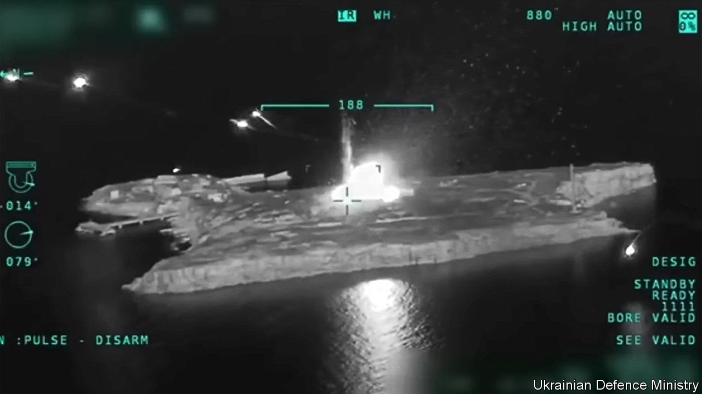
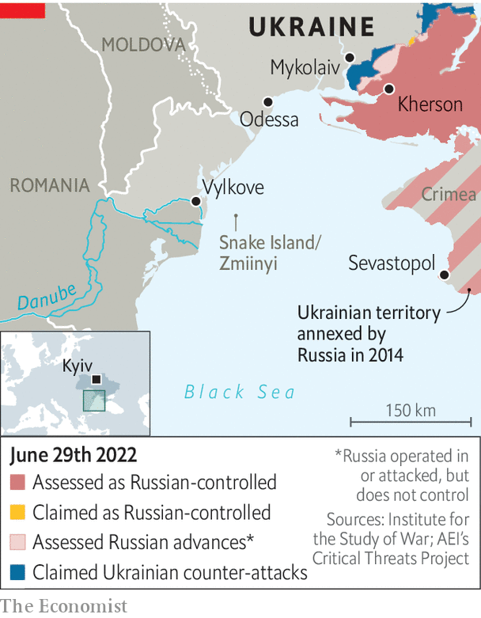

###### Nest of vipers

# The battle for Snake Island 

##### Russia is reportedly withdrawing from Ukraine’s strategically important rock 

 

> Jun 27th 2022 

For a rock just twice the size of Alcatraz, Snake Island has played a surprisingly big role in the war in Ukraine. The fortress was a target from day one, when Russia’s Black Sea flagship, the , arrived at its shores to request the surrender of its tiny guardpost. The garrison’s famously impolite refusal became a  for the country. The  in April, in turn, saw the rock take on a new defensive significance for Russian vessels in the Black Sea. In the days that followed the sinking Russia fortified the island with new anti-aircraft, missile and radar systems. Ukraine responded when it could, using what it could: fighter jets, Bayraktar drones and anti-ship missiles. But the Russians did not budge. 

Ukraine may now have succeeded in a new offensive to wrest back control of the island, with reports from the Ukrainian side as  went to press on June 30th that the Russians were in retreat, and a report from Russia that it was withdrawing as a “goodwill gesture” to facilitate the export of grain from Odessa. Not many people will believe that is the real reason, and there are still many obstacles to reopening the port, a crucial part of the global food supply-chain. 

The assault had been going on for at least ten days. An early-morning attack on June 20th had targeted the island and nearby gas platforms that Russia has reportedly been using as radar and surveillance stations. The explosions were so loud they woke residents of Vylkove, the nearest settlement, 35km away on the mainland. Nikolai Izotov, who lives there, says that “we’re used to sleepless nights, but this was something new.” In the days since then, Ukraine stepped up attacks, hitting the rock with new, long-range artillery. The Russians responded by targeting Odessa with dozens of long-range missiles. 

 


Snake Island, known in Ukrainian as Zmiinyi, is only 45km from Romania, a member of nato. Its location overlooking the Danube delta and shipping channels to Odessa and other Black Sea ports makes it a strategic prize. It could also serve as a bridgehead for an amphibious attack on Odessa, some 140km away. Russia had set up a reconnaissance station with a group of marine commandos from the 388th division, says Andrii Ryzhenko, a former Ukrainian navy captain now at the Centre for Defence Strategies, a think-tank in Kyiv. 

The shoreline around Vylkove has been long mooted as a potential first stop for any amphibious attack on Odessa. The Ukrainian army this week closed off access to several islands surrounding the town. The islands had been a source of subsistence for some of the increasingly impoverished locals; they would head there to pick apples, figs, grapes and berries. The ban has added to a tense mood in the city. “We see these huge ships and imagine the horrors of a thousand Russian soldiers landing on our shore,” says Mr Izotov. He jokes that he is personally worried because he has a cellar full of homemade wine and moonshine. “You know what drunks they are.” 

Ukraine has launched several daring raids on the island since the sinking of the . The most audacious came in May, when the Ukrainians used a combination of fighter jets and Bayraktar drones to destroy landing ships and a helicopter. There was then a long pause, until June 17th, when reports came of the apparent sinking of a Russian supply ship, the . Local media said the vessel was hit by two Western anti-ship missiles, and was in the middle of unloading a Tor air-defence system that had not yet been set up to protect against the attack. Unconfirmed reports suggest as many as 33 men were on board. 

The battle for Snake Island has been all about logistics: which side is able to get the right equipment to the right place first. Russia was in a stronger position for most of the war. But Ukraine has lately started to take delivery of some advanced Western artillery systems and long-range rockets. These are mobile, precise and have a long enough range to strike the island from the mainland. They allow Ukraine to attack without risking its remaining fighter jets, and may well have tipped the balance. 

Ukraine will be in no rush to put its forces back on the rock; it simply hopes to make it impossible for Russia to make any use of the island. “With their superiority in the air and with the ships of the Black Sea, it is easier for them to kill us on Snake Island than it is for us to kill them,” says Mr Ryzhenko, the former Ukrainian captain. But that, he adds, is why forcing Russians off the island will be only the beginning of a long story. “We need to be sinking their ships if we are to stand a chance.” ■


