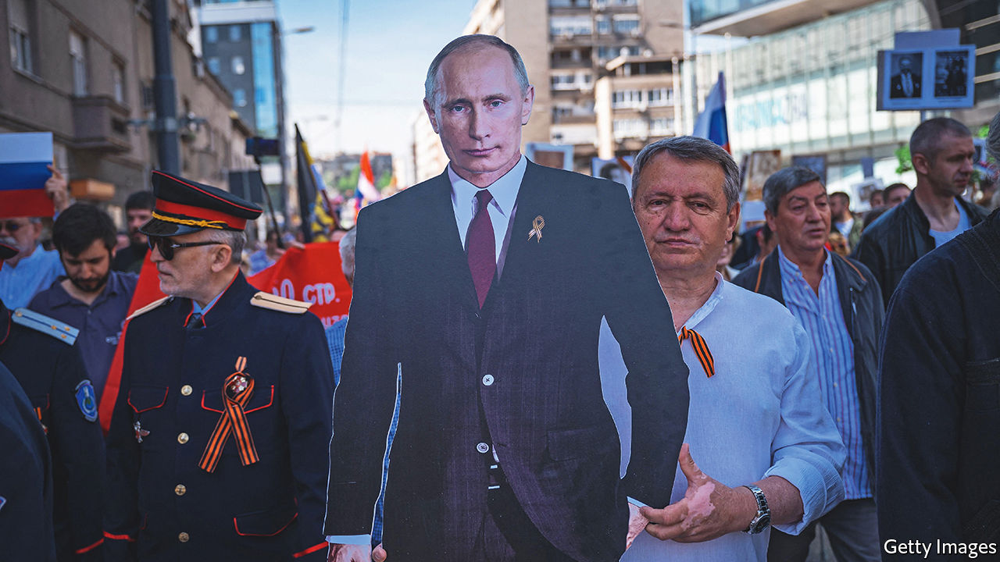

###### Changing priorities

# The war is forcing Russia’s Balkan friends to recalibrate 

##### Even Serbia is uneasy about Vladimir Putin’s aggression 

 

> Jun 30th 2022 

Sounding very sad, Aleksandar Vucic, Serbia’s president, says he has talked to Vladimir Putin but not tried to influence him over the war in Ukraine. “I am a small guy…I have to take care of small issues for my small country.” The war has sent shock waves through the Balkans, but for the leaders of the generally pro-Russian Serbs, it has elevated the political art of ducking and weaving to new heights. 

Three weeks ago Belgrade was bedecked with German flags in preparation for a visit of Chancellor Olaf Scholz. Then Sergei Lavrov, Russia’s foreign minister, announced that he too would be dropping by to visit Russia’s only remaining friend in Europe apart from Belarus. Mr Vucic moaned to Western diplomats that he had invited himself. Next, the Lavrov visit was scuppered when three nato neighbours refused Mr Lavrov permission to fly over their territory. Mr Vucic complained that, unable “to do anything to Russia”, they, meaning Western countries, were “taking it out” on Serbia. 

Serbian troops are trained by American ones and exercise with both nato and Russia. Serbia depends on Russian gas, but does far more trade with Germany and China. Resisting Western pressure, Serbia has declined to impose any sanctions on Russia; but in April Western military equipment destined for Ukraine was reported to be crossing its territory. At the United Nations Serbia aligns itself with Western countries in votes condemning Russia. In May, though, Serbia signed a three-year deal with Moscow for cheap gas. 

Maxim Samorukov, a Russian analyst now in exile in Belgrade, says Serbia can get away with all this because Russia “does not want to give Serbia a public beating” as it would look bad given the country has “been such great fans of Russia”.

For years the Serbian media, which mostly support the government, have been full of unfiltered Russian propaganda. That has not changed since the beginning of the war. According to one poll, 60% of Serbs blame America for the war, and only 26% blame Russia. In Belgrade Putin t-shirts are on sale alongside baseball caps sporting Russia’s wartime z logo. 

Mr Vucic is in an awkward position. He condemns the Russian invasion and says he supports Ukrainian territorial integrity just as much as he “loves” Serbia’s own. Western countries are hypocritical for supporting Ukraine’s territorial integrity, he implies, at the same time that most recognise the independence of Kosovo, which Serbia regards as its own. When Mr Putin recognised the two breakaway parts of eastern Ukraine, citing the Kosovo “precedent”, much of the Serbian media briefly switched to denouncing a stab in the back.

According to Vuk Vuksanovic, an analyst, Mr Vucic wants to “score domestic mileage” by showing Russophile voters that he is the one nourishing the partnership with Moscow, while at the same time “he is constantly blackmailing the West, saying ‘Look, I am the only one who is reasonable, and I’m surrounded by Russian agents, so prop me up!’” 

Russia has for years worked on deepening ties with the Orthodox Serbs of the region, many of whom like Russia for historical reasons even if they choose to work, study and holiday in Western countries. Bitterness over nato’s bombing of Serbia in 1999 plays a big role. There is no evidence that Russian policies in the Balkans have changed, but other politicians in the region are also adapting their policies to suit the changing realities. 

Last year Milorad Dodik, the leader of the Serbs in Bosnia, began procedures to take back powers that his entity had ceded to the Bosnian state. This provoked the worst crisis in the country since the end of the war in 1995. On June 6th those plans were suspended for six months. “We are being realistic,” says Mr Dodik. “We are too small to aggravate any impassioned leaders from the West.” Last October he had boasted that if there were any military attempts to thwart his plans, he would expect help from his “friends”, widely interpreted as meaning Russia. 

In Montenegro, too, the landscape has shifted. In April a new government was formed, now shorn of support from parties widely deemed “pro-Russian”. But Slaven Radunovic, a leader of one of them, denies his party is any such thing, saying that, despite widespread historical sympathies for Russia and its high-spending tourists, many of whom are still coming despite sanctions, this is a slur used by his party’s opponents in a bid to secure Western support. 

Meanwhile, thousands of Russians have found a haven in Serbia. According to official statistics there are 6,465 Russians there, but there could be a lot more. Russians feel welcome. Mr Samorukov appreciates being able to open a bank account, for example, even if he must also listen to tiresome lectures from taxi drivers “on how Putin is a great leader”. ■

