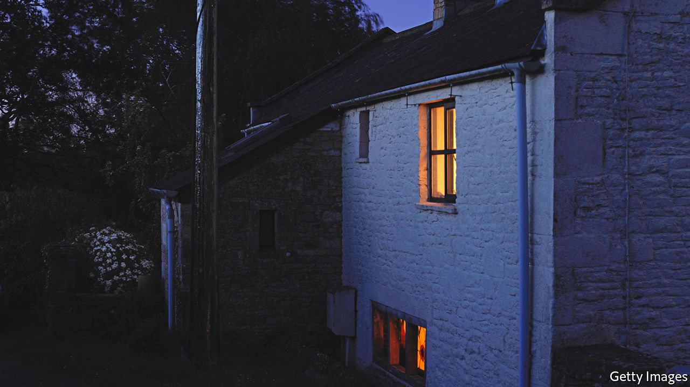
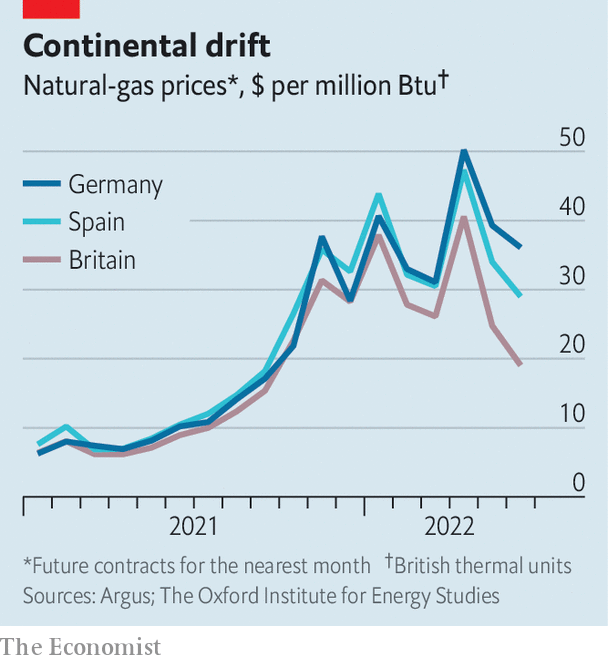

###### Power outrage

# Can Europe keep the lights on this winter? 

##### The energy crunch intensifies 

 

> Jun 30th 2022 

Europe’s energy war is becoming total. Having already banned or promised to ban imports of Russian oil, leaders of the g7 group of countries said on June 28th that they would explore ways to cap its price, as well as that of Russian gas. Populations are being prepared for pain. Britain has hinted that it will reform its power market to curb the influence of natural gas on domestic prices. French utilities have called on consumers to cut energy use “immediately”. One goal of such manoeuvres is to deprive Russia of much-needed revenue. Another is to try to ward off the energy crunch that looms over Europe. 

Only a month ago it looked like a crisis might be avoided—just. As America cranked up its exports of liquefied natural gas (lng), its share of Europe’s total gas imports rose from 6% in September to 15% in May, even as Russia’s slumped from 40% to 24%. What gas Europe needed from its troublesome neighbour still flowed. Russia did turn off the taps to Bulgaria, Finland and Poland after they refused to pay in roubles, as it had demanded, but they bought little in the first place. The continent’s reserves were building up at a record pace.

Then two things happened. On June 8th a fire shut down the Freeport gas-liquefaction facility in Texas. The outage, which is expected to last 90 days, has deprived Europe of 2.5% of its gas supply. A week later Gazprom, a Russian energy giant, said that supply to Europe through the Nord Stream 1 pipeline would fall to just 40% of capacity, ostensibly because of the delayed return of a turbine being serviced in Canada (Gazprom blames sanctions). That took another 7.5% off Europe’s supply. 

There are few other sources. lng terminals are running at full tilt. Little more can flow through pipelines from Algeria, Azerbaijan or Norway. Restarting the Dutch gas field of Groningen, which once supplied as much as Nord Stream but was phased out after causing earthquakes, is politically tricky. The result, reckons Rystad Energy, a consultancy, is that the eu’s gas-storage facilities will be two-thirds full by the end of October, short of the bloc’s target of four-fifths. There is even a fear that Nord Stream, which is due for regular servicing in July, will not restart once the maintenance ends. If so, Europe may enter the winter with storage levels at just 60%. 

That raises questions about the continent’s ability to stay warm this winter. Moreover, gas-fired power generation has become the marginal source of electricity supply over the past year in western Europe, implying that its cost is what sets power prices across the region. Last year this was partly because renewable-power generation was hampered by droughts (and thus feeble rivers) and insufficiently strong winds. This time the problem is that nuclear reactors in France require maintenance and are running at less than half their capacity. That is draining Europe’s power supply—just as a heatwave in the south is boosting demand for cooling. France’s spot power prices averaged €197 ($206) per megawatt-hour in May, compared with €15 a year ago. 

 


One way Europe copes with imbalances is through trade. France, once the region’s largest exporter of power, is now buying electricity from its neighbours. Wholesale gas is now dearer in Germany and eastern Europe, because of the reduction of supply through Nord Stream (see chart). That will incentivise flows from Britain and Spain, which have lng terminals. But it will not increase the aggregate supply of fuel and power. And there are signs that, in a crunch, unity could fray. On June 29th it emerged that one of Britain’s first steps in an emergency would be to cut off gas to mainland Europe. 

eu countries are thus scrambling to find alternatives to gas. Germany has reversed plans to retire more than one-fifth of its coal-fired power stations this year. Austria, Britain, France and the Netherlands have said they may either delay closures of, or reopen, coal plants. Some of the seven European nuclear plants that are due to be shut by the end of winter may also be kept operating a bit longer. Yet even if all of this is done, gas will probably continue to set electricity prices. A futures contract for Germany’s “baseload” (ie, non-renewable) power in December currently trades at 25% above gas-fired power-generation costs, suggesting that the market is pricing in a gas crunch, plus a premium. 

A persistent supply shortfall means demand will have to adjust. High prices might do part of the job. But rationing may also have to be imposed on gas- and power-hungry companies, such as producers of fertiliser, glass and steel. How drastic those curbs are, and whether they end up being extended to households, will in turn depend on two wild cards: winter temperatures on the continent; and the extent to which China bounces back from covid-19 lockdowns and soaks up more lng. Europe has so far been unlucky in its energy war with Russia. If it is to keep the lights on until the spring, that needs to change. ■


