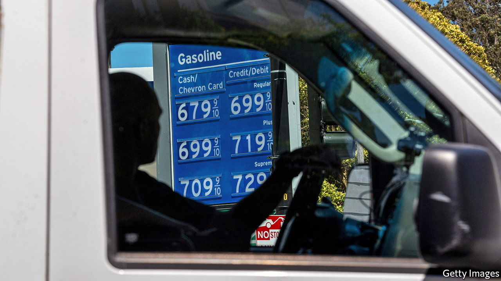
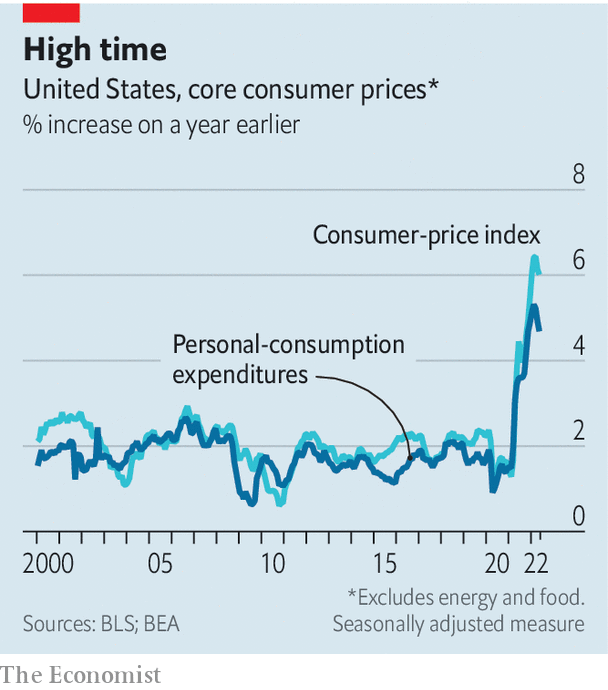

###### CPI v PCE

# Inflation in America soars to 8%. Or is it more like 6%? 

##### The Fed’s preferred price gauge is more benign but also more obscure 

 

> Jun 30th 2022 

The federal reserve’s “preferred measure of inflation” is a phrase that often crops up in reporting on the American economy. It stands in for a verbose official name: the personal-consumption-expenditures price index (pcepi). Most discussion of inflation, however, focuses on its better-known and pithier relative, the consumer-price index (cpi).

That usually does not matter much. But the gap between cpi and pcepi has recently widened, hitting 2.3 percentage points in May, the largest divergence since 1981. So while headlines blare out that cpi inflation is running at more than 8% annually, it is just over 6% in the pcepi world. To be sure, the lower pcepi figure is not cause for celebration. Just like cpi, it is also at a four-decade high. But it is nonetheless instructive to consider why the gap has grown so wide. 

The simple explanation is weighting. Housing, for instance, is 33% of cpi but just 16% of pcepi. Petrol also has a slightly higher share in cpi. The pcepi gauge is broader, encompassing things purchased on behalf of consumers (such as medical care, even if paid for by the government or an employer). When rents and oil prices soar, cpi inflation tends to outstrip pcepi inflation. 

 


The Fed prefers pcepi because it reflects how money is actually spent. If people stop buying expensive cars and spend more on bus tickets, that shift shows up in pcepi; cpi, by contrast, just registers the higher car prices. “cpi doesn’t allow for immediate substitution, which exacerbates the divergence,” says Julie Smith of Lafayette College. 

In theory that might tempt the Fed to highlight pcepi now. The latest figures, out on June 30th, showed that core pcepi (excluding food and energy) rose by 0.3% in May, compared with April, slower than the 0.6% jump in cpi. But Jerome Powell, the Fed’s chairman, instead highlighted cpi when explaining the central bank’s jumbo interest-rate rise on June 15th. Partly that is because cpi was published just before its decision. The fact that cpi is more widely discussed, even if less accurate, also recommends it. The central bank’s concern is that inflation expectations are becoming unmoored. If people pay more attention to cpi, the Fed will feel obliged to do so too. 


