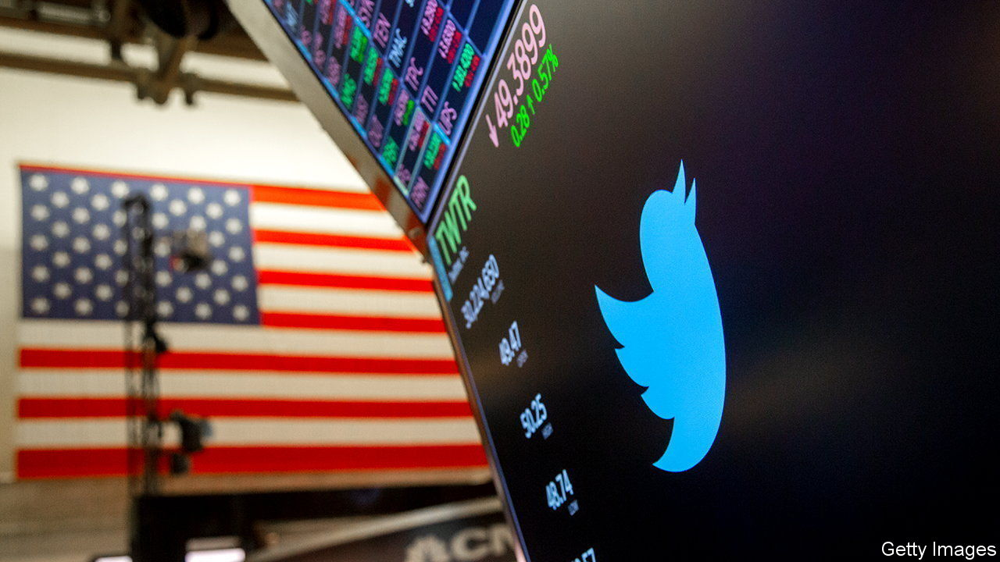

###### Sweet deals

# The allure of betting on mergers 

##### A niche trading strategy is proving popular—and not just because of Elon Musk 

 

> Jun 30th 2022 

Big deals rarely happen without big personalities. If Elon Musk were an uninteresting tycoon with a low public profile and a puritanical approach to promises, then shares in Twitter, a social-media platform, would be trading within a whisker of his $54.20 per share offer. The difference, or “spread”, between this offer and Twitter’s current trading price, of below $40, is a reminder that he is not. 

The wider the spread, the lower the chance investors assign to a deal completing. To Mr Musk and Twitter’s management, the spread is a live opinion poll in a fractious situation. But to a group of specialised hedge-fund managers, it is their bread and butter. 

Merger arbitrage, also known as risk arbitrage, involves purchasing the shares of a target firm during the risky interval between a deal’s announcement and its completion. The arbitrager first identifies a merger that the market is relatively gloomy about—ie, a spread that they believe overestimates the chance of a deal’s failure. Then they buy shares in the company, and wait until the deal closes and the acquirer pays the offered price per share. The amount of capital dedicated to this strategy has quadrupled during the past decade to more than $100bn, despite some patchy returns. For several reasons, its star will continue to rise. 

For a start, big deals are in plentiful supply. It is no coincidence that this strategy came of age during America’s buyout boom of the 1980s. After a white-hot 2021, more than 50 deals with a value exceeding $5bn have been announced so far this year. Companies’ balance-sheets are stocked with cash and tumbling valuations have created bargains. The arbitragers are not yet seeing any signs of recession. 

The deals themselves also need to have some controversy associated with them. Ideally, someone should be trying, and failing, to kill them. Here lies another tailwind: that regulators are in an interventionist mood. Corporate synergies are coming up against national-security and antitrust concerns. Shares in Avast, a Czech cyber-security firm, were edging towards the price offered by NortonLifeLock, its bigger American competitor, before Britain’s Competition and Markets Authority said it was taking a closer look at the deal in March. More than $1bn was wiped off the market value of a firm that was being bought for around $8bn. Arbitragers were not far behind: around a quarter of Avast’s stock is currently in the hands of hedge funds that bought only after the deal was announced. 

Warren Buffett, a celebrated investor who became an active and successful arbitrager early in his career, is returning to the action. In January Microsoft announced a blockbuster takeover of Activision Blizzard, a video-game developer. A gaping spread cause by internal strife and competition worries was enough to tempt Berkshire Hathaway, the conglomerate run by Mr Buffett, to increase its stake in the game-maker, to nearly 10%. Mr Buffett was already a shareholder. But some arbitragers have been known to screen investments by hiring translators, lawyers and even courtroom spies. 

The final bump comes from rising interest rates. Spreads are widened by an increase in the risk-free rate, since investors demand a higher rate of return for holding shares; those piling their capital into merger-arbitrage funds salivate at the thought of inflation-proof returns largely uncorrelated with the wider stockmarket. 

The catch is that not every merger is completed. “If the deal goes through, we make some money. And if the deal doesn’t go through, who knows what happens,” ruminated Mr Buffett recently. The “who knows” part is also now more complicated. The price shares would trade at following a deal’s collapse, a crucial determinant of the risk-reward calculation for an arbitrage strategy, becomes harder to assess when markets are volatile and valuations uncertain. But arbitragers have, at least, been given a heady cocktail of dealmaking, corporate complexity and rising rates. ■


