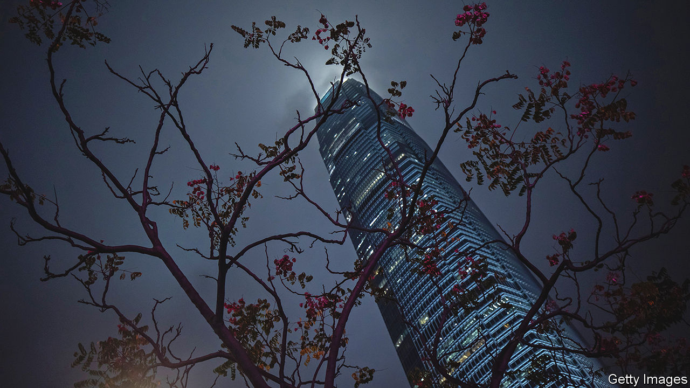
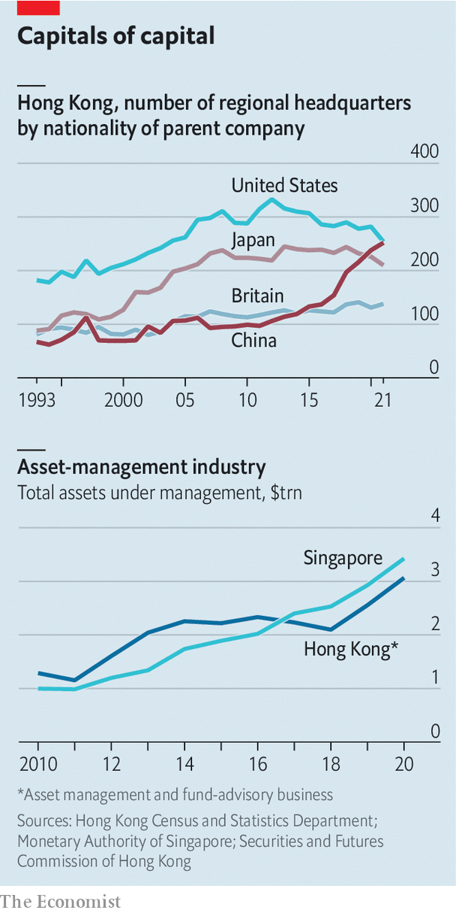
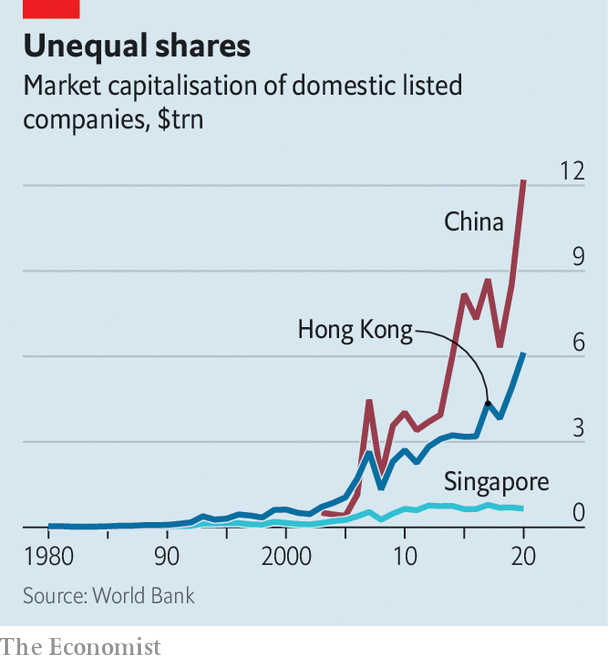

###### A tale of three cities

# The battle between Asia’s financial centres is heating up 

##### Hong Kong, Singapore and Shanghai each bring different advantages—and costs 

 

> Jun 29th 2022 

“Another one!” was how a Singaporean manager of serviced apartments greeted your correspondent, fresh off the plane from Hong Kong. The response tells you which of the two cities is currently enjoying an influx of people and business. The latest impetus has been their contrasting approaches to the pandemic. Singapore began opening up to the rest of the world last year; by comparison, although the quarantine periods for arrivals to China and Hong Kong have been shortened, there is no sign yet of their end. 

Hong Kong is widely seen as the third-most-important city for global finance and business, after New York and London, and ahead of Shanghai and Singapore. Most historians trace its rise as a financial centre to the early 1970s, when it became a hub for Asian offshore financing. Its importance then increased dramatically after China began to open up under Deng Xiaoping in 1978. Hong Kong was where Western bankers could mingle with Chinese businessmen while private-sector activity in the mainland was still finding its feet. The deals they made were governed by the territory’s reliable regulatory framework and courts that made use of English law. 

Yet even before the pandemic, the established order of Asia’s global hubs was being thrown into doubt. Over the quarter-century since Hong Kong was returned to Chinese sovereignty, the mainland has tightened its grip on the territory’s institutions. Under its influence, Hong Kong has introduced a sinister national-security law; the city’s independent judiciary, long valued by foreign investors, has been weakened by political intervention. That has tarnished its appeal relative to Singapore, another entrepot with a common-law legal system, business-friendly regulation and low taxes. Moreover, South-East Asia has become an increasingly desirable place for Western companies to do business, which, by virtue of proximity, further burnishes Singapore’s allure. For firms intending to operate in China, meanwhile, the benefits of setting up in Hong Kong, rather than Shanghai, are diminishing. 

How will the roles of these cities evolve in the face of such forces? To answer the question, consider three measures of the importance of a city for global business and finance: its use as a base for conducting regional or global business; its position as a centre for wealth made elsewhere to be managed and invested; and the size of its capital market and the banking activities associated with it.

 


Start with where business is. Hong Kong’s status as a regional base for global firms was always tied to China, but that relationship has become more intimate still in recent years. The number of Chinese firms with regional headquarters in the territory has doubled since 2015, even as the number of American firms using the city as a base for their Asian or greater China operations has steadily declined (see chart).

Singapore does not produce similar statistics, but a flurry of recent openings by big firms is illustrative. Sony Music, an American entertainment company; Dyson, a British home-appliance maker; and VinFast, a Vietnamese maker of electric vehicles, have all set up regional or global headquarters there in recent years. Chinese tech firms including Alibaba, TikTok and Tencent have done so, too, led by their need to be outside China’s “great firewall” in order to run their global operations.

Singapore has publicly been ambivalent about stealing business from Hong Kong. Lee Hsien Loong, the city-state’s prime minister, has welcomed expats, but said that he would be just as happy if they felt able to remain in Hong Kong, contributing to the region’s dynamism. In the background, however, the approach is less magnanimous. The city’s sharp-elbowed investment-promotion agency works to help would-be migrants with visas and business registrations. 

Shanghai had attracted Western outposts before the pandemic. Some firms, such as Coca-Cola, had moved their Asia headquarters there from Hong Kong. Regulatory changes in 2020 allowed foreign investment banks to run majority-controlled businesses in China. Several have consequently expanded their operations in Beijing and Shanghai. Foreign asset managers including Amundi and BlackRock have also scaled up their onshore presence. 

The city’s grim lockdowns may have cooled that ardour in the near term. In a recent survey by the American Chamber of Commerce in Shanghai, only one American firm out of 133 planned to increase its investment in China. Yet for firms intending to have some exposure to the mainland, Shanghai may ultimately prove unavoidable. The more Hong Kong comes under China’s thumb, the less unattractive being based on the mainland becomes. 

China may be more draconian in its approach both to governance and covid-19, but it is at least home to vast numbers of suppliers and customers. “If you want to be in China, it will be increasingly important to be onshore and close to your clients and companies,” says Christian Brun of Wellesley, an executive-recruitment firm for the financial-services industry. Mr Brun predicts job growth on the mainland and in Singapore, with fewer roles for expats in particular in Hong Kong. (He himself has moved from Hong Kong to Singapore.)

A second gauge of the cities’ relative dominance is wealth management. It is here that the competition between Hong Kong and Singapore has been fiercest. By one measure, Hong Kong’s pot of assets under management and fund advisory rose from nearly $1.3trn in 2010 to more than $3trn in 2020. But a comparable measure for Singapore shot up from around $1trn to $3.4trn, with the city overtaking Hong Kong as long ago as 2017. Its simple laws for establishing trusts and its tax efficiency have attracted wealth to it. A new form of investment vehicle launched in 2020, the variable-capital company, has also proved popular with fund managers. 

 


Hong Kong has been squeezed in other areas of investment management, too. Of the 20 largest managers of venture-capital funds globally, measured by capital raised in the past decade, seven were in Beijing, Shanghai or Shenzhen. Venture capitalists hoping to cash in on South-East Asia’s boom have chosen Singapore as a base. The city’s closer links with Indian firms are also an attraction.

When it comes to capital markets and investment banking, our third gauge of the cities’ importance, though, Hong Kong retains its crown. With China’s government showing no sign of allowing capital to flow freely in and out of the mainland soon, the territory’s value as a gateway remains. It hosts the Connect programmes that allow foreign investors to trade onshore bonds and equities, and Chinese punters to trade stocks in the territory. Three-quarters of all transactions in yuan made through the swift interbank-messaging system are booked in Hong Kong. The territory has been a hub for Chinese firms to list in recent years, including Alibaba and jd.com in 2019 and 2020 (though few have come this year). Overall, the value of the city’s listed stocks runs to nearly $5trn, compared with $7trn in Shanghai and $700bn in Singapore. That in turn has helped Hong Kong sustain an edge in global banking, even though some desks have moved to Singapore to skirt the territory’s quarantine rules. 

Hong Kong, then, will remain a route to investing in China. But it may be less likely to attract other sorts of new business. The companies that do move there are more likely to be Chinese. To others, Hong Kong’s delay in reopening seems to typify its indifferent approach to its global status. Faced with it, firms seeking to do business in Asia more broadly may choose Singapore. And those wanting to do business in China may expand their presence onshore instead. Where Hong Kong alone used to suffice, some firms may start to see a Shanghai-and-Singapore strategy—which uses the first for operations in China and the second for those in the rest of Asia—as an attractive long-term bet. ■


