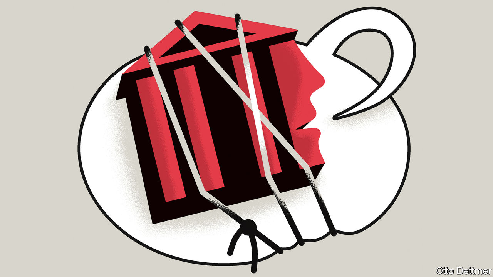

###### Free exchange

# The case for strong and silent central banks 

##### The second in our series on the central-bank pivot 

 

> Jun 30th 2022 

Late on june 13th, a curious article appeared in the . It said that the Federal Reserve was “likely to consider” raising interest rates by 0.75 percentage points at its meeting on June 15th. The article was unusually silent about its sources. And it proved uncannily prescient. Two days later the Fed did indeed raise interest rates by that amount, its biggest increase in 28 years. Many investors believe the central bank had used the press to warn financial markets about what it would do in advance (albeit not very far in advance). That would make the  story an unconventional example of “forward guidance”.

Central banks often telegraph what they might do before they do it. This kind of forward guidance is as old as central banking itself, according to Willem Buiter, a former rate-setter at the Bank of England. It is certainly as old as inflation targeting. The Reserve Bank of New Zealand (which was the first to adopt a formal inflation target in 1990) quickly learned that it could move markets with its utterances (what it called “open-mouth operations”). It now publicly forecasts its own decisions. If you want to know where it thinks its policy interest rate will be in the future, you do not have to look out for mysteriously sourced stories in the press. You can just download the central bank’s spreadsheet.

This kind of guidance is intended as no more than a prediction, based on the central bank’s fallible forecasts of the economy. It is sometimes called “Delphic” guidance, after the oracle of Delphi in ancient Greece. If the economy defies the forecast, as it usually does, the central bank may well defy its prophecy of its own behaviour. In a paper published in 2012, Jeffrey Campbell, then of the Chicago Fed, and his co-authors distinguished Delphic forward guidance from another kind, “Odyssean”. Odyssean guidance is more than just a prediction. It includes a promise or commitment of some kind. Central bankers use it to tie their own hands, like Odysseus lashing himself to the mast of his ship. 

Why would they do that? The aim, as the paper put it, is to change public expectations about what central banks will do tomorrow, so as to improve the economy today. In a slump, a central bank might not have room to cut short-term interest rates by enough to revive the economy. (Rates cannot easily be cut below zero.) It might then promise to keep rates low for longer than it otherwise would, even after hearing the siren call of an economic recovery. If its promise is believed, expectations of inflation will rise. That will magically reduce the real cost of borrowing even when the central bank’s policy rate can fall no further. 

Odyssean language crept into central-bank guidance after the financial crisis of 2007-09. In April 2009, for example, the Bank of Canada promised, with some qualifications, not to raise interest rates for 14 months. In 2016 the Bank of Japan said it would keep easing until inflation had durably overshot its 2% target. Similar commitments were made in the pandemic. When a central bank is stuck close to the zero lower bound, it can at least say what it will do—or refrain from doing—when economic conditions warrant it moving again. Its words speak louder than inaction.

But when a central bank is not so constrained, the case for Odyssean forward guidance becomes less clear. If a central bank is free to act, why rely on words rather than deeds? In particular, why bother with forward guidance during a tightening cycle? There is, after all, no upper bound on interest rates. That question was recently posed on Twitter by Jason Furman, a former chairman of the White House’s Council of Economic Advisers. 

If the central bank knows that interest rates should be higher in the future, there is nothing to stop it raising them now. Indeed, it could increase them up to the point where it is no longer sure if the next move should be up or down. In 2004 Ben Bernanke, a former chairman of the Fed, called this the “bang bang” approach. If a central bank were to adopt it, it would have little need to offer advance guidance about its future actions, because everything it is committed to do, it would have done already. In one go.

One reason why central banks nonetheless like to offer guidance is precisely because they dislike the bang-bang approach. They prefer to change interest rates in small increments. Forward guidance allows them to move gradually, while signalling that the first small step will not be the only one. But if investors heed the guidance, the future steps will be priced in to longer-term interest rates straight away. Thus gradual moves in the policy rate can be accompanied by big swings in broader financial conditions.

In principle, a central bank could abandon gradualism while still offering non-binding forecasts of what it might do in the future. But such Delphic utterances can be more trouble than they are worth. Financial markets often treat them as promises, not predictions. “People don’t hear the caveats that well,” says Mr Furman. Knowing this, central banks may feel unduly constrained by their past prophecies. That can make it harder than necessary to adjust when their predictions inevitably go awry. The Fed found itself in precisely such a predicament on June 10th, when surprisingly bad consumer-price inflation figures invalidated its recent prediction that it would raise interest rates by no more than half a percentage point at a time.

The strong, silent type of monetary policy

Markets react badly when they think a central bank has broken a promise. That may add to volatility in itself. It may also erode the central bank’s credibility, so that when it does need to make a commitment its words are no longer believed. Because promises are hard to keep, a central bank should make no more than necessary.

The Fed could not adopt a closed-mouth monetary policy overnight, Mr Furman points out. Preparing markets for such a shift would take time. But the Fed could start considering it for its next tightening cycle. Even better, he jokes, perhaps a pioneer like the Reserve Bank of New Zealand could try it for a year first. ■


