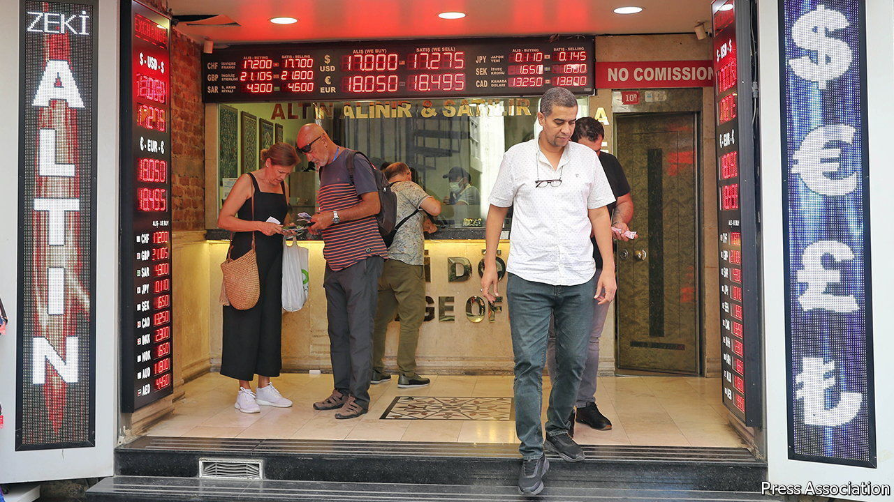

###### Creeping controls

# The latest desperate attempt to prop up the Turkish lira 

##### Recep Tayyip Erdogan will support anything but raising interest rates 

 

> Jun 30th 2022 

In turkey, the abnormal is the new normal. If official figures are to be believed, annual inflation now exceeds 73%. If Turkish consumers are to be believed, it is much higher. Measured against the dollar, the lira resembles a black-diamond ski slope. The currency has lost a fifth of its value against the greenback since the start of the year. The obvious solution would be a dramatic increase in interest rates. But the country’s president, Recep Tayyip Erdogan, refuses to allow the central bank to tighten monetary policy.

The shock value of the zany economic theory Turkey’s leader has peddled for some time, namely that the solution to high inflation is low interest rates, has worn off. What has investors and Turkish companies spooked now are the lengths to which Mr Erdogan may go to keep the current monetary settings in place. The spectre of capital controls has begun to loom over the country. 

On June 23rd the central bank decided to keep its benchmark interest rate unchanged for the sixth month in a row. That much was expected. The surprise came the next day, courtesy of Turkey’s banking authority, known as the bddk. Turkish companies, it ruled, would no longer be eligible for loans in lira if their foreign-currency holdings exceeded 15m lira (roughly $900,000) and if the amount exceeded a tenth of their assets or yearly sales.

By forcing companies to sell dollars and euros, the government hopes to breathe some life into the lira. (Turkish exporters already have to convert 40% of their foreign revenues, according to an earlier decision made by regulators.) But the move may also hamstring companies and trigger capital outflows. The more the government penalises foreign-currency holdings, the less able firms are to protect their savings against inflation, undermining confidence. They will also find it harder to buy goods and services from abroad. Some will look for ways to circumvent the new directive, says Durmus Yilmaz, a former governor of the central bank, and will park more money abroad.

Turkey’s increasingly unorthodox attempts to support the lira have already taken a heavy toll on the economy and the public finances. Since 2019 the central bank has burned through at least $165bn in foreign reserves by intervening in currency markets. Late last year the government unveiled a scheme to compensate holders of special lira deposits for the currency’s depreciation against the dollar, in an attempt to stop a further lurch. Turks have since poured 963bn lira into the special accounts. Because the currency has nonetheless continued to slide, the treasury owes them billions of dollars. 

The government’s latest move does not meet the textbook definition of capital controls (measures to stem the flow of foreign capital into and out of the country). But it suggests more severe interventions might be in store if the lira continues to plummet. Analysts say Mr Erdogan would much sooner impose capital controls than allow rate increases. “I’m 100% sure he will not use interest rates as a tool,” says Ozlem Derici Sengul of Spinn, a consultancy in Istanbul. The country is sliding down a slippery slope. ■


